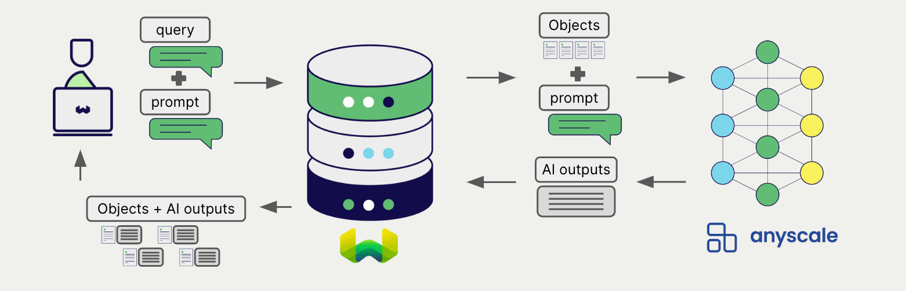

import BetaPageNote from '../_includes/beta_pages.md';

<BetaPageNote />

Anyscale offers a wide range of models for natural language processing and generation. Weaviate seamlessly integrates with Anyscale's Endpoints APIs, allowing users to leverage Anyscale's models directly within the Weaviate database.

These integrations empower developers to build sophisticated AI-driven applications with ease.

## Integrations with Anyscale

### Generative AI models for RAG

Anyscale's generative AI models can generate human-like text based on given prompts and contexts.

[Weaviate's generative AI integration](./generative.md) enables users to perform retrieval augmented generation (RAG) directly within the Weaviate database. This combines Weaviate's efficient storage and fast retrieval capabilities with Anyscale's generative AI models to generate personalized and context-aware responses.

[Anyscale generative AI integration page](./generative.md)

## Summary

These integrations enable developers to leverage Anyscale's powerful models directly within Weaviate.

In turn, they simplify the process of building AI-driven applications to speed up your development process, so that you can focus on creating innovative solutions.

## Get started

You must provide a valid Anyscale API key to Weaviate for these integrations. Go to [Anyscale](https://www.anyscale.com/) to sign up and obtain an API key.

Then, go to the relevant integration page to learn how to configure Weaviate with the Anyscale models and start using them in your applications.

- [Generative AI](./generative.md)

import DocsMoreResources from '/_includes/more-resources-docs.md';

<DocsMoreResources />
