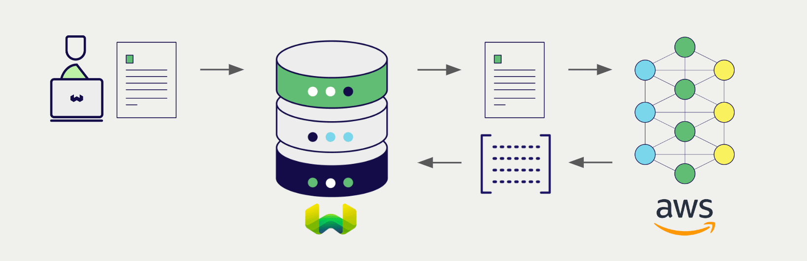
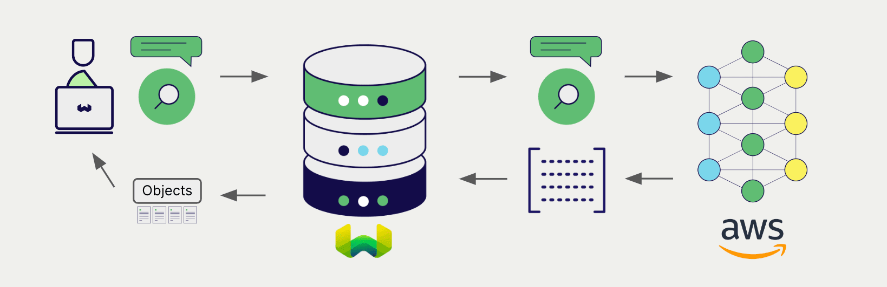

# AWS Embeddings with Weaviate

import BetaPageNote from '../_includes/beta_pages.md';

<BetaPageNote />

import Tabs from '@theme/Tabs';
import TabItem from '@theme/TabItem';
import FilteredTextBlock from '@site/src/components/Documentation/FilteredTextBlock';
import PyConnect from '!!raw-loader!../_includes/provider.connect.py';
import TSConnect from '!!raw-loader!../_includes/provider.connect.ts';
import PyCode from '!!raw-loader!../_includes/provider.vectorizer.py';
import TSCode from '!!raw-loader!../_includes/provider.vectorizer.ts';

Weaviate's integration with AWS's [SageMaker](https://aws.amazon.com/sagemaker/) and [Bedrock](https://aws.amazon.com/bedrock/) APIs allows you to access their models' capabilities directly from Weaviate.

[Configure a Weaviate vector index](#configure-the-vectorizer) to use an AWS embedding model, and Weaviate will generate embeddings for various operations using the specified model and your AWS API credentials. This feature is called the *vectorizer*.

At [import time](#data-import), Weaviate generates text object embeddings and saves them into the index. For [vector](#vector-near-text-search) and [hybrid](#hybrid-search) search operations, Weaviate converts text queries into embeddings.

## Requirements

### Weaviate configuration

Your Weaviate instance must be configured with the AWS vectorizer integration (`text2vec-aws`) module.

  
For Weaviate Cloud (WCD) users

This integration is enabled by default on Weaviate Cloud (WCD) serverless instances.

  
For self-hosted users

- Check the [cluster metadata](../../config-refs/meta.md) to verify if the module is enabled.
- Follow the [how-to configure modules](../../configuration/modules.md) guide to enable the module in Weaviate.

### API credentials

You must provide [access key based AWS credentials](https://docs.aws.amazon.com/IAM/latest/UserGuide/id_credentials_access-keys.html) to Weaviate for these integrations. Go to [AWS](https://aws.amazon.com/) to sign up and obtain an AWS access key ID and a corresponding AWS secret access key.

Provide the API credentials to Weaviate using one of the following methods:

- Set the `AWS_ACCESS_KEY` and `AWS_SECRET_KEY` environment variables that are available to Weaviate.
- Provide the API credentials at runtime, as shown in the examples below.

<Tabs groupId="languages">

 <TabItem value="py" label="Python API v4">
    <FilteredTextBlock
      text={PyConnect}
      startMarker="# START AWSInstantiation"
      endMarker="# END AWSInstantiation"
      language="py"
    />
  </TabItem>

 <TabItem value="js" label="JS/TS API v3">
    <FilteredTextBlock
      text={TSConnect}
      startMarker="// START AWSInstantiation"
      endMarker="// END AWSInstantiation"
      language="ts"
    />
  </TabItem>

</Tabs>

### AWS model access

#### Bedrock

To use a model via [Bedrock](https://aws.amazon.com/bedrock/), it must be available, and AWS must grant you access to it.

Refer to the [AWS documentation](https://docs.aws.amazon.com/bedrock/latest/userguide/models-regions.html) for the list of available models, and to [this document](https://docs.aws.amazon.com/bedrock/latest/userguide/model-usage.html) to find out how request access to a model.

#### SageMaker

To use a model via [SageMaker](https://aws.amazon.com/sagemaker/), you must have access to the model's endpoint.

## Configure the vectorizer

[Configure a Weaviate index](../../manage-data/collections.mdx#specify-a-vectorizer) to use an AWS embedding model by setting the vectorizer as follows. Note that the required parameters differ between Bedrock and SageMaker models.

### Bedrock

For Bedrock, you must provide the model name in the vectorizer configuration.

<Tabs groupId="languages">
  <TabItem value="py" label="Python API v4">
    <FilteredTextBlock
      text={PyCode}
      startMarker="# START BasicVectorizerAWSBedrock"
      endMarker="# END BasicVectorizerAWSBedrock"
      language="py"
    />
  </TabItem>

  <TabItem value="js" label="JS/TS API v3">
    <FilteredTextBlock
      text={TSCode}
      startMarker="// START BasicVectorizerAWSBedrock"
      endMarker="// END BasicVectorizerAWSBedrock"
      language="ts"
    />
  </TabItem>

</Tabs>

### SageMaker

For SageMaker, you must provide the endpoint address in the vectorizer configuration.

<Tabs groupId="languages">
  <TabItem value="py" label="Python API v4">
    <FilteredTextBlock
      text={PyCode}
      startMarker="# START BasicVectorizerAWSSagemaker"
      endMarker="# END BasicVectorizerAWSSagemaker"
      language="py"
    />
  </TabItem>

  <TabItem value="js" label="JS/TS API v3">
    <FilteredTextBlock
      text={TSCode}
      startMarker="// START BasicVectorizerAWSSagemaker"
      endMarker="// END BasicVectorizerAWSSagemaker"
      language="ts"
    />
  </TabItem>

</Tabs>

## Data import

After configuring the vectorizer, [import data](../../manage-data/import.mdx) into Weaviate. Weaviate generates embeddings for text objects using the specified model.

<Tabs groupId="languages">

 <TabItem value="py" label="Python API v4">
    <FilteredTextBlock
      text={PyCode}
      startMarker="# START BatchImportExample"
      endMarker="# END BatchImportExample"
      language="py"
    />
  </TabItem>

 <TabItem value="js" label="JS/TS API v3">
    <FilteredTextBlock
      text={TSCode}
      startMarker="// START BatchImportExample"
      endMarker="// END BatchImportExample"
      language="ts"
    />
  </TabItem>

</Tabs>

:::tip Re-use existing vectors
If you already have a compatible model vector available, you can provide it directly to Weaviate. This can be useful if you have already generated embeddings using the same model and want to use them in Weaviate, such as when migrating data from another system.
:::

## Searches

Once the vectorizer is configured, Weaviate will perform vector and hybrid search operations using the specified AWS model.

### Vector (near text) search

When you perform a [vector search](../../search/similarity.md#search-with-text), Weaviate converts the text query into an embedding using the specified model and returns the most similar objects from the database.

The query below returns the `n` most similar objects from the database, set by `limit`.

<Tabs groupId="languages">

 <TabItem value="py" label="Python API v4">
    <FilteredTextBlock
      text={PyCode}
      startMarker="# START NearTextExample"
      endMarker="# END NearTextExample"
      language="py"
    />
  </TabItem>

 <TabItem value="js" label="JS/TS API v3">
    <FilteredTextBlock
      text={TSCode}
      startMarker="// START NearTextExample"
      endMarker="// END NearTextExample"
      language="ts"
    />
  </TabItem>

</Tabs>

### Hybrid search

:::info What is a hybrid search?
A hybrid search performs a vector search and a keyword (BM25) search, before [combining the results](../../search/hybrid.md#change-the-ranking-method) to return the best matching objects from the database.
:::

When you perform a [hybrid search](../../search/hybrid.md), Weaviate converts the text query into an embedding using the specified model and returns the best scoring objects from the database.

The query below returns the `n` best scoring objects from the database, set by `limit`.

<Tabs groupId="languages">

 <TabItem value="py" label="Python API v4">
    <FilteredTextBlock
      text={PyCode}
      startMarker="# START HybridExample"
      endMarker="# END HybridExample"
      language="py"
    />
  </TabItem>

 <TabItem value="js" label="JS/TS API v3">
    <FilteredTextBlock
      text={TSCode}
      startMarker="// START HybridExample"
      endMarker="// END HybridExample"
      language="ts"
    />
  </TabItem>

</Tabs>

## References

### Vectorizer parameters

The following examples show how to configure AWS-specific options.

The AWS region setting is required for all AWS integrations.

- Bedrock users must set `service` to `bedrock` and provide the `model` name.
- SageMaker users must set `service` to `sagemaker` and provide the `endpoint` address.

<Tabs groupId="languages">
  <TabItem value="py" label="Python API v4">
    <FilteredTextBlock
      text={PyCode}
      startMarker="# START FullVectorizerAWS"
      endMarker="# END FullVectorizerAWS"
      language="py"
    />
  </TabItem>

  <TabItem value="js" label="JS/TS API v3">
    <FilteredTextBlock
      text={TSCode}
      startMarker="// START FullVectorizerAWS"
      endMarker="// END FullVectorizerAWS"
      language="ts"
    />
  </TabItem>

</Tabs>

### Available models

#### Bedrock

- `amazon.titan-embed-text-v1`
- `amazon.titan-embed-text-v2:0`
- `cohere.embed-english-v3`
- `cohere.embed-multilingual-v3`

Refer to [this document](https://docs.aws.amazon.com/bedrock/latest/userguide/model-usage.html) to find out how request access to a model.

### SageMaker

Any custom SageMaker URL can be used as an endpoint.

## Further resources

### Other integrations

- [AWS generative models + Weaviate](./generative.md).

### Code examples

Once the integrations are configured at the collection, the data management and search operations in Weaviate work identically to any other collection. See the following model-agnostic examples:

- The [how-to: manage data](../../manage-data/index.md) guides show how to perform data operations (i.e. create, update, delete).
- The [how-to: search](../../search/index.md) guides show how to perform search operations (i.e. vector, keyword, hybrid) as well as retrieval augmented generation.

### External resources

- AWS [Bedrock documentation](https://docs.aws.amazon.com/bedrock/)
- AWS [SageMaker documentation](https://docs.aws.amazon.com/sagemaker/)

import DocsFeedback from '/_includes/docs-feedback.mdx';

<DocsFeedback/>
