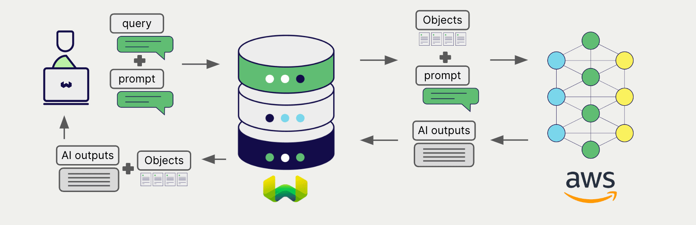
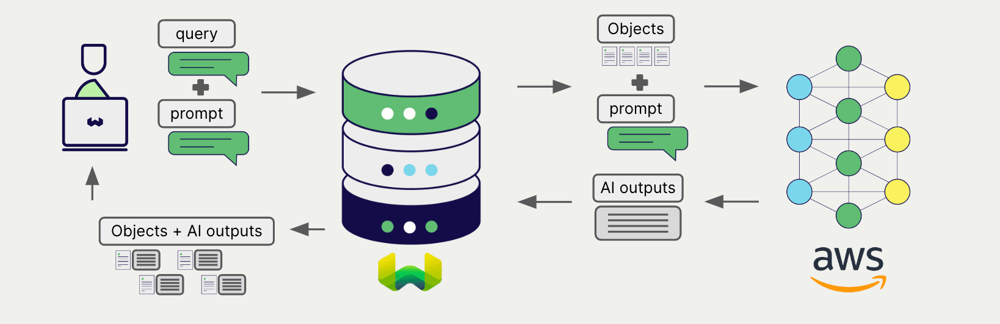

import Tabs from '@theme/Tabs';
import TabItem from '@theme/TabItem';
import FilteredTextBlock from '@site/src/components/Documentation/FilteredTextBlock';
import PyConnect from '!!raw-loader!../_includes/provider.connect.py';
import TSConnect from '!!raw-loader!../_includes/provider.connect.ts';
import PyCode from '!!raw-loader!../_includes/provider.generative.py';
import TSCode from '!!raw-loader!../_includes/provider.generative.ts';

# AWS Generative AI with Weaviate

Weaviate's integration with AWS's [SageMaker](https://aws.amazon.com/sagemaker/) and [Bedrock](https://aws.amazon.com/bedrock/) APIs allows you to access their models' capabilities directly from Weaviate.

[Configure a Weaviate collection](#configure-collection) to use a AWS generative AI model, and Weaviate will perform retrieval augmented generation (RAG) using the specified model and your AWS API credentials.

More specifically, Weaviate will perform a search, retrieve the most relevant objects, and then pass them to the AWS generative model to generate outputs.

## Requirements

### Weaviate configuration

Your Weaviate instance must be configured with the AWS generative AI integration (`generative-aws`) module.

  
For WCS (serverless) users

This module is enabled by default in Weaviate Cloud Services (WCS) instances.

  
For self-hosted users

- Check the [cluster metadata](../../config-refs/meta.md) to verify if the module is enabled.
- Follow the [how-to configure modules](../../configuration/modules.md) guide to enable the module in Weaviate.

### API credentials

You must provide [access key based AWS credentials](https://docs.aws.amazon.com/IAM/latest/UserGuide/id_credentials_access-keys.html) to Weaviate for these integrations. Go to [AWS](https://aws.amazon.com/) to sign up and obtain an AWS access key ID and a corresponding AWS secret access key.

Provide the API credentials to Weaviate using one of the following methods:

- Set the `AWS_ACCESS_KEY` and `AWS_SECRET_KEY` environment variables that are available to Weaviate.
- Provide the API credentials at runtime, as shown in the examples below.

<Tabs groupId="languages">

 <TabItem value="py" label="Python (v4)">
    <FilteredTextBlock
      text={PyConnect}
      startMarker="# START AWSInstantiation"
      endMarker="# END AWSInstantiation"
      language="py"
    />
  </TabItem>

 <TabItem value="js" label="JS/TS (Beta)">
    <FilteredTextBlock
      text={TSConnect}
      startMarker="// START AWSInstantiation"
      endMarker="// END AWSInstantiation"
      language="ts"
    />
  </TabItem>

</Tabs>

### AWS model access

#### Bedrock

To use a model via [Bedrock](https://aws.amazon.com/bedrock/), it must be available, and AWS must grant you access to it.

Refer to the [AWS documentation](https://docs.aws.amazon.com/bedrock/latest/userguide/models-regions.html) for the list of available models, and to [this document](https://docs.aws.amazon.com/bedrock/latest/userguide/model-usage.html) to find out how request access to a model.

#### SageMaker

To use a model via [SageMaker](https://aws.amazon.com/sagemaker/), you must have access to the model's endpoint.

## Configure collection

[Configure a Weaviate collection](../../manage-data/collections.mdx#specify-a-generative-module) to use an AWS generative AI model as follows:

### Bedrock

For Bedrock, you must provide the model name in the vectorizer configuration.

<Tabs groupId="languages">
  <TabItem value="py" label="Python (v4)">
    <FilteredTextBlock
      text={PyCode}
      startMarker="# START BasicGenerativeAWSBedrock"
      endMarker="# END BasicGenerativeAWSBedrock"
      language="py"
    />
  </TabItem>

  <TabItem value="js" label="JS/TS (Beta)">
    <FilteredTextBlock
      text={TSCode}
      startMarker="// START BasicGenerativeAWSBedrock"
      endMarker="// END BasicGenerativeAWSBedrock"
      language="ts"
    />
  </TabItem>

</Tabs>

### SageMaker

For SageMaker, you must provide the endpoint address in the vectorizer configuration.

<Tabs groupId="languages">
  <TabItem value="py" label="Python (v4)">
    <FilteredTextBlock
      text={PyCode}
      startMarker="# START BasicGenerativeAWSSagemaker"
      endMarker="# END BasicGenerativeAWSSagemaker"
      language="py"
    />
  </TabItem>

  <TabItem value="js" label="JS/TS (Beta)">
    <FilteredTextBlock
      text={TSCode}
      startMarker="// START BasicGenerativeAWSSagemaker"
      endMarker="// END BasicGenerativeAWSSagemaker"
      language="ts"
    />
  </TabItem>

</Tabs>

You can [specify](#generative-parameters) one of the [available models](#available-models) for Weaviate to use. The default model (`gpt-3.5-turbo`) is used if no model is specified.

## Retrieval augmented generation

After configuring the generative AI integration, perform RAG operations, either with the [single prompt](#single-prompt) or [grouped task](#grouped-task) method.

### Single prompt

To generate text for each object in the search results, use the single prompt method.

The example below generates outputs for each of the `n` search results, where `n` is specified by the `limit` parameter.

When creating a single prompt query, use braces `{}` to interpolate the object properties you want Weaviate to pass on to the language model. For example, to pass on the object's `title` property, include `{title}` in the query.

<Tabs groupId="languages">

 <TabItem value="py" label="Python (v4)">
    <FilteredTextBlock
      text={PyCode}
      startMarker="# START SinglePromptExample"
      endMarker="# END SinglePromptExample"
      language="py"
    />
  </TabItem>

 <TabItem value="js" label="JS/TS (Beta)">
    <FilteredTextBlock
      text={TSCode}
      startMarker="// START SinglePromptExample"
      endMarker="// END SinglePromptExample"
      language="ts"
    />
  </TabItem>

</Tabs>

### Grouped task

To generate one text for the entire set of search results, use the grouped task method.

In other words, when you have `n` search results, the generative model generates one output for the entire group.

<Tabs groupId="languages">

 <TabItem value="py" label="Python (v4)">
    <FilteredTextBlock
      text={PyCode}
      startMarker="# START GroupedTaskExample"
      endMarker="# END GroupedTaskExample"
      language="py"
    />
  </TabItem>

 <TabItem value="js" label="JS/TS (Beta)">
    <FilteredTextBlock
      text={TSCode}
      startMarker="// START GroupedTaskExample"
      endMarker="// END GroupedTaskExample"
      language="ts"
    />
  </TabItem>

</Tabs>

## References

### Generative parameters

Configure the following generative parameters to customize the model behavior.

<Tabs groupId="languages">
  <TabItem value="py" label="Python (v4)">
    <FilteredTextBlock
      text={PyCode}
      startMarker="# START FullGenerativeAWS"
      endMarker="# END FullGenerativeAWS"
      language="py"
    />
  </TabItem>

  <TabItem value="js" label="JS/TS (Beta)">
    <FilteredTextBlock
      text={TSCode}
      startMarker="// START FullGenerativeAWS"
      endMarker="// END FullGenerativeAWS"
      language="ts"
    />
  </TabItem>

</Tabs>

For further details on model parameters, please consult the [relevant AWS documentation](#further-resources).

### Available models

#### Bedrock

Refer to the [AWS documentation](https://docs.aws.amazon.com/bedrock/latest/userguide/models-regions.html) for the list of available models, and to [this document](https://docs.aws.amazon.com/bedrock/latest/userguide/model-usage.html) to find out how request access to a model.

### SageMaker

Any custom SageMaker URL can be used as an endpoint.

## Further resources

### Other integrations

- [AWS embedding models + Weaviate](./embeddings.md).

### Code examples

Once the integrations are configured at the collection, the data management and search operations in Weaviate work identically to any other collection. Accordingly, please refer to the following examples, which are model-agnostic:

- The [how-to: manage data](../../manage-data/index.md) guides show how to perform data operations (i.e. create, update, delete).
- The [how-to: search](../../search/index.md) guides show how to perform search operations (i.e. vector, keyword, hybrid) as well as retrieval augmented generation.

### References

- AWS [Bedrock documentation](https://docs.aws.amazon.com/bedrock/)
- AWS [SageMaker documentation](https://docs.aws.amazon.com/sagemaker/)

import DocsMoreResources from '/_includes/more-resources-docs.md';

<DocsMoreResources />
