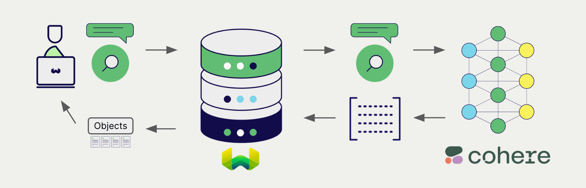

import Tabs from '@theme/Tabs';
import TabItem from '@theme/TabItem';
import FilteredTextBlock from '@site/src/components/Documentation/FilteredTextBlock';
import PyCode from '!!raw-loader!../_includes/provider.collection.config.vectorizer.py';
import TSCode from '!!raw-loader!../_includes/provider.collection.config.vectorizer.ts';

# Cohere Embeddings with Weaviate

Weaviate integrates with Cohere's APIs to provide convenient access to their models from within Weaviate.

See the [Cohere integrations page](./index.md#requirements) for a list of requirements to use Cohere with Weaviate.

## Configuration

You can configure Weaviate to use Cohere embeddings for each index in a collection.

Weaviate will then generate embeddings for various operations with the specified Cohere model. More specifically, Weaviate will generate text objects at import time to save them into the index, and convert text queries into embeddings for vector and hybrid search operations.

### Example

To configure a collection to use Cohere embeddings, set it as follows:

<Tabs groupId="languages">
  <TabItem value="py" label="Python (v4)">
    <FilteredTextBlock
      text={PyCode}
      startMarker="# START VectorizerCohere"
      endMarker="# END VectorizerCohere"
      language="py"
    />
  </TabItem>

  <TabItem value="js" label="JS/TS (Beta)">
    <FilteredTextBlock
      text={TSCode}
      startMarker="// START VectorizerCohere"
      endMarker="// END VectorizerCohere"
      language="ts"
    />
  </TabItem>

</Tabs>

### Available models

The `embed-multilingual-v3.0` embedding model is set as the default model. You can also specify one of the available models manually.

  
Available models

- `embed-multilingual-v3.0` (Default)
- `embed-multilingual-light-v3.0`
- `embed-multilingual-v2.0` (previously `embed-multilingual-22-12`)
- `embed-english-v3.0`
- `embed-english-light-v3.0`
- `embed-english-v2.0`
- `embed-english-light-v2.0`

  
Deprecated models

The following models are available, but deprecated:
- `multilingual-22-12`
- `large`
- `medium`
- `small`

## API key

For the integration to work, you must provide a valid Cohere API key so that Weaviate can work with the Cohere API. You can provide the API key to Weaviate in one of two ways:

- Set the `COHERE_API_KEY` environment variable that is available to Weaviate.
- Provide the API key at runtime.

Please see [this section for more details](./index.md#api-key).

## Data import

Where the index is configured with an embedding model, Weaviate will generate embeddings for text objects using the specified model from the model provider.

<Tabs groupId="languages">

 <TabItem value="py" label="Python (v4)">
    <FilteredTextBlock
      text={PyCode}
      startMarker="# START BatchImportExample"
      endMarker="# END BatchImportExample"
      language="py"
    />
  </TabItem>

</Tabs>

:::tip Re-use existing vectors
If you already have a compatible Cohere vector available, you can provide it directly to Weaviate. This can be useful if you have already generated embeddings using Cohere and want to use them in Weaviate, such as when migrating data from another system.
:::

## Searches

On these indexes, any text queries will be converted into embeddings using the specified Cohere model.

### Vector (near text) search example

When you perform a [vector search](../../search/similarity.md#search-with-text), Weaviate will convert the text query into an embedding using the specified Cohere model. Then, it performs a vector search against the index and returns the most similar objects from the database.

<Tabs groupId="languages">

 <TabItem value="py" label="Python (v4)">
    <FilteredTextBlock
      text={PyCode}
      startMarker="# START NearTextExample"
      endMarker="# END NearTextExample"
      language="py"
    />
  </TabItem>

</Tabs>

### Hybrid search example

When you perform a [hybrid search](../../search/hybrid.md), Weaviate will convert the text query into an embedding using the specified Cohere model. Then, it performs a vector search and a keyword (BM25) search against the indexes, before [combining the results](../../search/hybrid.md#change-the-ranking-method) to return the most similar objects from the database.

<Tabs groupId="languages">

 <TabItem value="py" label="Python (v4)">
    <FilteredTextBlock
      text={PyCode}
      startMarker="# START HybridExample"
      endMarker="# END HybridExample"
      language="py"
    />
  </TabItem>

</Tabs>

## Further resources

### Generative model integration

To learn how Cohere's generative models integrate with Weaviate, see [this page](./generative.md).

### Code examples

Once the integrations are configured at the collection, the data management and search operations in Weaviate work identically to any other collection. Accordingly, please refer to the following examples, which are model-agnostic:

- The [how-to: manage data](../manage-data/index.md) guides show how to perform data operations (i.e. create, update, delete).
- The [how-to: search](../search/index.md) guides show how to perform search operations (i.e. vector, keyword, hybrid) as well as retrieval augmented generation.

### References

- Cohere [Embed API documentation](https://docs.cohere.com/reference/embed)

import DocsMoreResources from '/_includes/more-resources-docs.md';

<DocsMoreResources />
