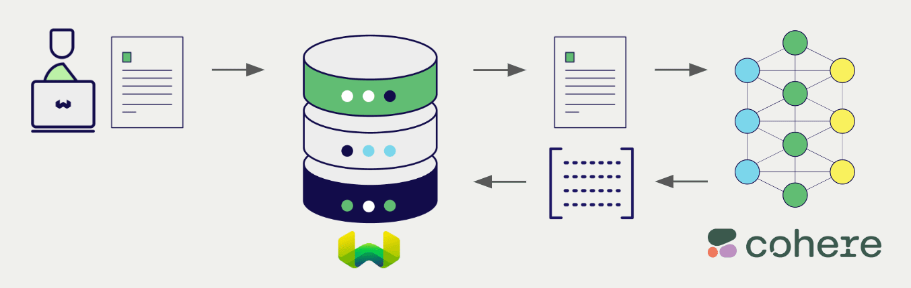
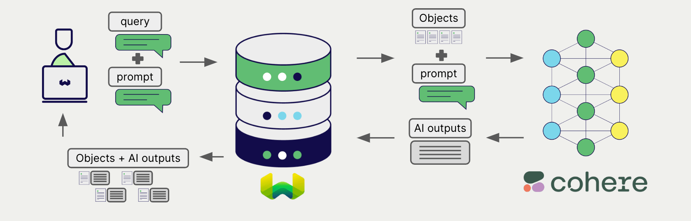

import BetaPageNote from '../_includes/beta_pages.md';

<BetaPageNote />

Cohere offers a wide range of models for natural language processing and generation. Weaviate seamlessly integrates with Cohere's APIs, allowing users to leverage Cohere's models directly within the Weaviate database.

These integrations empower developers to build sophisticated AI-driven applications with ease.

## Integrations with Cohere

### Embedding models for semantic search

Cohere's embedding models transform text data into high-dimensional vector representations, capturing semantic meaning and context.

[Weaviate integrates with Cohere's embedding models](./embeddings.md) to enable seamless vectorization of data. This integration allows users to perform semantic and hybrid search operations without the need for additional preprocessing or data transformation steps.

[Cohere embedding integration page](./embeddings.md)

### Generative AI models for RAG

Cohere's generative AI models can generate human-like text based on given prompts and contexts.

[Weaviate's generative AI integration](./generative.md) enables users to perform retrieval augmented generation (RAG) directly within the Weaviate database. This combines Weaviate's efficient storage and fast retrieval capabilities with Cohere's generative AI models to generate personalized and context-aware responses.

[Cohere generative AI integration page](./generative.md)

### Reranker models

Cohere's reranker models are designed to improve the relevance and ranking of search results.

[The Weaviate reranker integration](./reranker.md) allows users to easily refine their search results by leveraging Cohere's reranker models.

[Cohere reranker integration page](./reranker.md)

## Summary

These integrations enable developers to leverage Cohere's powerful models directly within Weaviate.

In turn, they simplify the process of building AI-driven applications to speed up your development process, so that you can focus on creating innovative solutions.

## Get started

You must provide a valid Cohere API key to Weaviate for these integrations. Go to [Cohere](https://cohere.com/) to sign up and obtain an API key.

Then, go to the relevant integration page to learn how to configure Weaviate with the Cohere models and start using them in your applications.

- [Embeddings](./embeddings.md)
- [Generative AI](./generative.md)
- [Reranker](./reranker.md)

import DocsMoreResources from '/_includes/more-resources-docs.md';

<DocsMoreResources />
