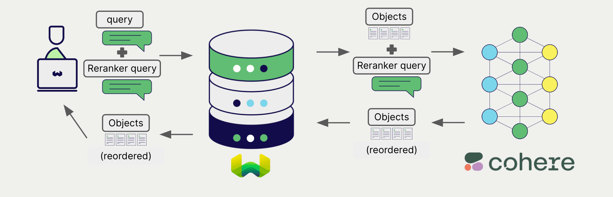

import BetaPageNote from '../_includes/beta_pages.md';

<BetaPageNote />

import Tabs from '@theme/Tabs';
import TabItem from '@theme/TabItem';
import FilteredTextBlock from '@site/src/components/Documentation/FilteredTextBlock';
import PyConnect from '!!raw-loader!../_includes/provider.connect.py';
import TSConnect from '!!raw-loader!../_includes/provider.connect.ts';
import PyCode from '!!raw-loader!../_includes/provider.reranker.py';
import TSCode from '!!raw-loader!../_includes/provider.reranker.ts';

# Cohere reranker models with Weaviate

Weaviate's integration with Cohere's APIs allows you to access their models' capabilities directly from Weaviate.

[Configure a Weaviate collection](#configure-the-reranker) to use a Cohere reranker model, and Weaviate will use the specified model and your Cohere API key to rerank search results.

This two-step process involves Weaviate first performing a search and then reranking the results using the specified model.

## Requirements

### Weaviate configuration

Your Weaviate instance must be configured with the Cohere reranker integration (`reranker-cohere`) module.

  
For Weaviate Cloud (WCD) users

This integration is enabled by default on Weaviate Cloud (WCD) serverless managed instances.

  
For self-hosted users

- Check the [cluster metadata](../../config-refs/meta.md) to verify if the module is enabled.
- Follow the [how-to configure modules](../../configuration/modules.md) guide to enable the module in Weaviate.

### API credentials

You must provide a valid Cohere API key to Weaviate for this integration. Go to [Cohere](https://cohere.com/) to sign up and obtain an API key.

Provide the API key to Weaviate using one of the following methods:

- Set the `COHERE_APIKEY` environment variable that is available to Weaviate.
- Provide the API key at runtime, as shown in the examples below.

<Tabs groupId="languages">

 <TabItem value="py" label="Python (v4)">
    <FilteredTextBlock
      text={PyConnect}
      startMarker="# START CohereInstantiation"
      endMarker="# END CohereInstantiation"
      language="py"
    />
  </TabItem>

 <TabItem value="js" label="JS/TS (Beta)">
    <FilteredTextBlock
      text={TSConnect}
      startMarker="// START CohereInstantiation"
      endMarker="// END CohereInstantiation"
      language="ts"
    />
  </TabItem>

</Tabs>

## Configure the reranker

Configure a Weaviate collection to use a Cohere reranker model as follows:

<Tabs groupId="languages">
  <TabItem value="py" label="Python (v4)">
    <FilteredTextBlock
      text={PyCode}
      startMarker="# START RerankerCohere"
      endMarker="# END RerankerCohere"
      language="py"
    />
  </TabItem>

  <TabItem value="js" label="JS/TS (Beta)">
    <FilteredTextBlock
      text={TSCode}
      startMarker="// START RerankerCohere"
      endMarker="// END RerankerCohere"
      language="ts"
    />
  </TabItem>

</Tabs>

You can specify one of the [available models](#available-models) for the reranker to use. The default model (`rerank-multilingual-v3.0`) is used if no model is specified.

## Reranking query

Once the reranker is configured, Weaviate performs [reranking operations](../../search/rerank.md) using the specified Cohere model.

More specifically, Weaviate performs an initial search, then reranks the results using the specified model.

Any search in Weaviate can be combined with a reranker to perform reranking operations.

<Tabs groupId="languages">

 <TabItem value="py" label="Python (v4)">
    <FilteredTextBlock
      text={PyCode}
      startMarker="# START RerankerQueryExample"
      endMarker="# END RerankerQueryExample"
      language="py"
    />
  </TabItem>

 <TabItem value="js" label="JS/TS (Beta)">
    <FilteredTextBlock
      text={TSCode}
      startMarker="// START RerankerQueryExample"
      endMarker="// END RerankerQueryExample"
      language="ts"
    />
  </TabItem>

</Tabs>

## References

### Available models

- rerank-english-v3.0
- rerank-multilingual-v3.0 (default)
- rerank-english-v2.0
- rerank-multilingual-v2.0

You can also select a fine-tuned reranker model_id, such as:

- `500df123-afr3-...`

Please refer to [this blog post](/blog/fine-tuning-coheres-reranker) for more information.

For further details on model parameters, please consult the [Cohere API documentation](https://docs.cohere.com/reference/rerank).

## Further resources

### Other integrations

- [Cohere embedding models + Weaviate](./embeddings.md).
- [Cohere generative models + Weaviate](./generative.md).

### Code examples

Once the integrations are configured at the collection, the data management and search operations in Weaviate work identically to any other collection. Accordingly, please refer to the following examples, which are model-agnostic:

- The [how-to: manage data](../../manage-data/index.md) guides show how to perform data operations (i.e. create, update, delete).
- The [how-to: search](../../search/index.md) guides show how to perform search operations (i.e. vector, keyword, hybrid) as well as retrieval augmented generation.

### References

- Cohere [Rerank API documentation](https://docs.cohere.com/reference/rerank)

import DocsFeedback from '/_includes/docs-feedback.mdx';

<DocsFeedback/>
