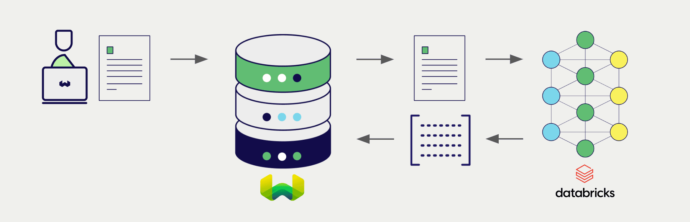
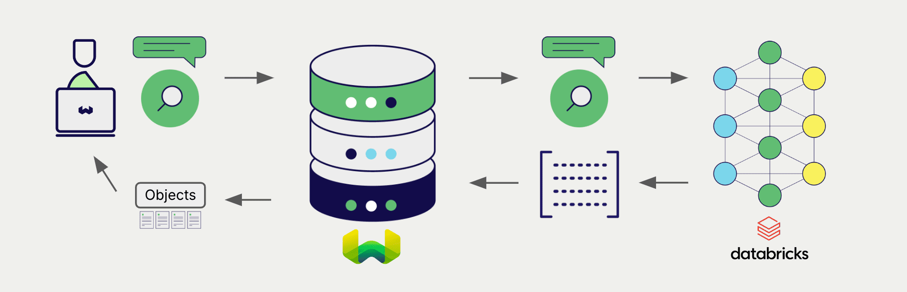

:::info Added in `v1.26.3`
:::

# Databricks Embeddings with Weaviate

import Tabs from '@theme/Tabs';
import TabItem from '@theme/TabItem';
import FilteredTextBlock from '@site/src/components/Documentation/FilteredTextBlock';
import PyConnect from '!!raw-loader!../_includes/provider.connect.py';
import TSConnect from '!!raw-loader!../_includes/provider.connect.ts';
import PyCode from '!!raw-loader!../_includes/provider.vectorizer.py';
import TSCode from '!!raw-loader!../_includes/provider.vectorizer.ts';

Weaviate's integration with Databricks' APIs allows you to access models hosted on their platform directly from Weaviate.

[Configure a Weaviate vector index](#configure-the-vectorizer) to use a Databricks embedding model, and Weaviate will generate embeddings for various operations using the specified endpoint and your Databricks token. This feature is called the *vectorizer*.

At [import time](#data-import), Weaviate generates text object embeddings and saves them into the index. For [vector](#vector-near-text-search) and [hybrid](#hybrid-search) search operations, Weaviate converts text queries into embeddings.

## Requirements

### Weaviate configuration

Your Weaviate instance must be configured with the Databricks vectorizer integration (`text2vec-databricks`) module.

  
For Weaviate Cloud (WCD) users

This integration is enabled by default on Weaviate Cloud (WCD) serverless instances.

  
For self-hosted users

- Check the [cluster metadata](../../config-refs/meta.md) to verify if the module is enabled.
- Follow the [how-to configure modules](../../configuration/modules.md) guide to enable the module in Weaviate.

### Databricks Personal Access Token

You must provide a valid Databricks Personal Access Token (PAT) to Weaviate for this integration. Refer to the [Databricks documentation](https://docs.databricks.com/en/dev-tools/auth/pat.html) for instructions on generating your PAT in your workspace.

Provide the Dataricks token to Weaviate using one of the following methods:

- Set the `DATABRICKS_TOKEN` environment variable that is available to Weaviate.
- Provide the token at runtime, as shown in the examples below.

<Tabs groupId="languages">

 <TabItem value="py" label="Python API v4">
    <FilteredTextBlock
      text={PyConnect}
      startMarker="# START DatabricksInstantiation"
      endMarker="# END DatabricksInstantiation"
      language="py"
    />
  </TabItem>

  <TabItem value="js" label="JS/TS API v3">
    <FilteredTextBlock
      text={TSConnect}
      startMarker="// START DatabricksInstantiation"
      endMarker="// END DatabricksInstantiation"
      language="ts"
    />
  </TabItem>

</Tabs>

## Configure the vectorizer

[Configure a Weaviate index](../../manage-data/collections.mdx#specify-a-vectorizer) to use a Databricks serving model endpoint by setting the vectorizer as follows:

<Tabs groupId="languages">
  <TabItem value="py" label="Python API v4">
    <FilteredTextBlock
      text={PyCode}
      startMarker="# START BasicVectorizerDatabricks"
      endMarker="# END BasicVectorizerDatabricks"
      language="py"
    />
  </TabItem>

  <TabItem value="js" label="JS/TS API v3">
    <FilteredTextBlock
      text={TSCode}
      startMarker="// START BasicVectorizerDatabricks"
      endMarker="// END BasicVectorizerDatabricks"
      language="ts"
    />
  </TabItem>

</Tabs>

This will configure Weaviate to use the vectorizer served through the endpoint you specify.

## Data import

After configuring the vectorizer, [import data](../../manage-data/import.mdx) into Weaviate. Weaviate generates embeddings for text objects using [the specified model](#vectorizer-parameters).

<Tabs groupId="languages">

 <TabItem value="py" label="Python API v4">
    <FilteredTextBlock
      text={PyCode}
      startMarker="# START BatchImportExample"
      endMarker="# END BatchImportExample"
      language="py"
    />
  </TabItem>

  <TabItem value="js" label="JS/TS API v3">
    <FilteredTextBlock
      text={TSCode}
      startMarker="// START BatchImportExample"
      endMarker="// END BatchImportExample"
      language="ts"
    />
  </TabItem>
</Tabs>

:::tip Re-use existing vectors
If you already have a compatible model vector available, you can provide it directly to Weaviate. This can be useful if you have already generated embeddings using the same model and want to use them in Weaviate, such as when migrating data from another system.
:::

## Searches

Once the vectorizer is configured, Weaviate will perform vector and hybrid search operations using the specified model.

### Vector (near text) search

When you perform a [vector search](../../search/similarity.md#search-with-text), Weaviate converts the text query into an embedding using the specified model and returns the most similar objects from the database.

The query below returns the `n` most similar objects from the database, set by `limit`.

<Tabs groupId="languages">

 <TabItem value="py" label="Python API v4">
    <FilteredTextBlock
      text={PyCode}
      startMarker="# START NearTextExample"
      endMarker="# END NearTextExample"
      language="py"
    />
  </TabItem>

  <TabItem value="js" label="JS/TS API v3">
    <FilteredTextBlock
      text={TSCode}
      startMarker="// START NearTextExample"
      endMarker="// END NearTextExample"
      language="ts"
    />
  </TabItem>

</Tabs>

### Hybrid search

:::info What is a hybrid search?
A hybrid search performs a vector search and a keyword (BM25) search, before [combining the results](../../search/hybrid.md#change-the-ranking-method) to return the best matching objects from the database.
:::

When you perform a [hybrid search](../../search/hybrid.md), Weaviate converts the text query into an embedding using the specified model and returns the best scoring objects from the database.

The query below returns the `n` best scoring objects from the database, set by `limit`.

<Tabs groupId="languages">

 <TabItem value="py" label="Python API v4">
    <FilteredTextBlock
      text={PyCode}
      startMarker="# START HybridExample"
      endMarker="# END HybridExample"
      language="py"
    />
  </TabItem>

  <TabItem value="js" label="JS/TS API v3">
    <FilteredTextBlock
      text={TSCode}
      startMarker="// START HybridExample"
      endMarker="// END HybridExample"
      language="ts"
    />
  </TabItem>
</Tabs>

## References

### Vectorizer parameters

- `endpoint`: The URL of the embedding model hosted on Databricks.
- `instruction`:An optional instruction to pass to the embedding model.

For further details on model parameters, see the [Databricks documentation](https://docs.databricks.com/en/machine-learning/foundation-models/api-reference.html#embedding-request).

## Further resources

### Other integrations

- [Databricks generative models + Weaviate](./generative.md).

### Code examples

Once the integrations are configured at the collection, the data management and search operations in Weaviate work identically to any other collection. See the following model-agnostic examples:

- The [how-to: manage data](../../manage-data/index.md) guides show how to perform data operations (i.e. create, update, delete).
- The [how-to: search](../../search/index.md) guides show how to perform search operations (i.e. vector, keyword, hybrid) as well as retrieval augmented generation.

### External resources

- Databricks [Foundation model REST API reference](https://docs.databricks.com/en/machine-learning/foundation-models/api-reference.html)

## Questions and feedback

import DocsFeedback from '/_includes/docs-feedback.mdx';

<DocsFeedback/>
