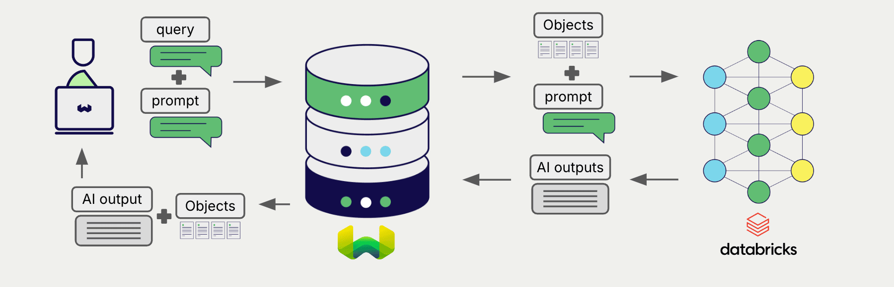

:::info Added in `v1.26.3`
:::

# Databricks Generative AI with Weaviate

import Tabs from '@theme/Tabs';
import TabItem from '@theme/TabItem';
import FilteredTextBlock from '@site/src/components/Documentation/FilteredTextBlock';
import PyConnect from '!!raw-loader!../_includes/provider.connect.py';
import TSConnect from '!!raw-loader!../_includes/provider.connect.ts';
import PyCode from '!!raw-loader!../_includes/provider.generative.py';
import TSCode from '!!raw-loader!../_includes/provider.generative.ts';

Weaviate's integration with Databricks' APIs allows you to access their models' capabilities directly from Weaviate.

[Configure a Weaviate collection](#configure-collection) to use an Databricks' generative AI model, and Weaviate will perform retrieval augmented generation (RAG) using the specified endpoint and your Databricks token.

More specifically, Weaviate will perform a search, retrieve the most relevant objects, and then pass them to the Databricks generative model to generate outputs.

## Requirements

### Weaviate configuration

Your Weaviate instance must be configured with the Databricks generative AI integration (`generative-databricks`) module.

  
For Weaviate Cloud (WCD) users

This integration is enabled by default on Weaviate Cloud (WCD) serverless instances.

  
For self-hosted users

- Check the [cluster metadata](../../config-refs/meta.md) to verify if the module is enabled.
- Follow the [how-to configure modules](../../configuration/modules.md) guide to enable the module in Weaviate.

### API credentials

You must provide a valid Databricks Personal Access Token (PAT) to Weaviate for this integration. Refer to the [Databricks documentation](https://docs.databricks.com/en/dev-tools/auth/pat.html) for instructions on generating your PAT in your workspace.

Provide the Dataricks token to Weaviate using one of the following methods:

- Set the `DATABRICKS_TOKEN` environment variable that is available to Weaviate.
- Provide the API key at runtime, as shown in the examples below.

<Tabs groupId="languages">

  <TabItem value="py" label="Python API v4">
    <FilteredTextBlock
      text={PyConnect}
      startMarker="# START DatabricksInstantiation"
      endMarker="# END DatabricksInstantiation"
      language="py"
    />
  </TabItem>
  <TabItem value="js" label="JS/TS API v3">
    <FilteredTextBlock
      text={TSConnect}
      startMarker="// START DatabricksInstantiation"
      endMarker="// END DatabricksInstantiation"
      language="ts"
    />
  </TabItem>

</Tabs>

## Configure collection

[Configure a Weaviate collection](../../manage-data/collections.mdx#specify-a-generative-module) to use a Databricks generative AI endpoint as follows:

<Tabs groupId="languages">
  <TabItem value="py" label="Python API v4">
    <FilteredTextBlock
      text={PyCode}
      startMarker="# START BasicGenerativeDatabricks"
      endMarker="# END BasicGenerativeDatabricks"
      language="py"
    />
  </TabItem>

  <TabItem value="js" label="JS/TS API v3">
    <FilteredTextBlock
      text={TSCode}
      startMarker="// START BasicGenerativeDatabricks"
      endMarker="// END BasicGenerativeDatabricks"
      language="ts"
    />
  </TabItem>
</Tabs>

This will configure Weaviate to use the generative AI model served through the endpoint you specify.

## Retrieval augmented generation

After configuring the generative AI integration, perform RAG operations, either with the [single prompt](#single-prompt) or [grouped task](#grouped-task) method.

### Single prompt

To generate text for each object in the search results, use the single prompt method.

The example below generates outputs for each of the `n` search results, where `n` is specified by the `limit` parameter.

When creating a single prompt query, use braces `{}` to interpolate the object properties you want Weaviate to pass on to the language model. For example, to pass on the object's `title` property, include `{title}` in the query.

<Tabs groupId="languages">

  <TabItem value="py" label="Python API v4">
    <FilteredTextBlock
      text={PyCode}
      startMarker="# START SinglePromptExample"
      endMarker="# END SinglePromptExample"
      language="py"
    />
  </TabItem>
  <TabItem value="js" label="JS/TS API v3">
    <FilteredTextBlock
      text={TSCode}
      startMarker="// START SinglePromptExample"
      endMarker="// END SinglePromptExample"
      language="ts"
    />
  </TabItem>

</Tabs>

### Grouped task

To generate one text for the entire set of search results, use the grouped task method.

In other words, when you have `n` search results, the generative model generates one output for the entire group.

<Tabs groupId="languages">

  <TabItem value="py" label="Python API v4">
    <FilteredTextBlock
      text={PyCode}
      startMarker="# START GroupedTaskExample"
      endMarker="# END GroupedTaskExample"
      language="py"
    />
  </TabItem>

  <TabItem value="js" label="JS/TS API v3">
    <FilteredTextBlock
      text={TSCode}
      startMarker="// START GroupedTaskExample"
      endMarker="// END GroupedTaskExample"
      language="ts"
    />
  </TabItem>

</Tabs>

## References

### Generative parameters

Configure the following generative parameters to customize the model behavior.

<Tabs groupId="languages">
  <TabItem value="py" label="Python API v4">
    <FilteredTextBlock
      text={PyCode}
      startMarker="# START FullGenerativeDatabricks"
      endMarker="# END FullGenerativeDatabricks"
      language="py"
    />
  </TabItem>

  <TabItem value="js" label="JS/TS API v3">
    <FilteredTextBlock
      text={TSCode}
      startMarker="// START FullGenerativeDatabricks"
      endMarker="// END FullGenerativeDatabricks"
      language="ts"
    />
  </TabItem>

</Tabs>

For further details on model parameters, see the [Databricks documentation](https://docs.databricks.com/en/machine-learning/foundation-models/api-reference.html#chat-task).

## Further resources

### Other integrations

- [Databricks embedding models + Weaviate](./embeddings.md).

### Code examples

Once the integrations are configured at the collection, the data management and search operations in Weaviate work identically to any other collection. See the following model-agnostic examples:

- The [how-to: manage data](../../manage-data/index.md) guides show how to perform data operations (i.e. create, update, delete).
- The [how-to: search](../../search/index.md) guides show how to perform search operations (i.e. vector, keyword, hybrid) as well as retrieval augmented generation.

### References

- [Databricks foundation model documentation](https://docs.databricks.com/en/machine-learning/foundation-models/api-reference.html)

## Questions and feedback

import DocsFeedback from '/_includes/docs-feedback.mdx';

<DocsFeedback/>
