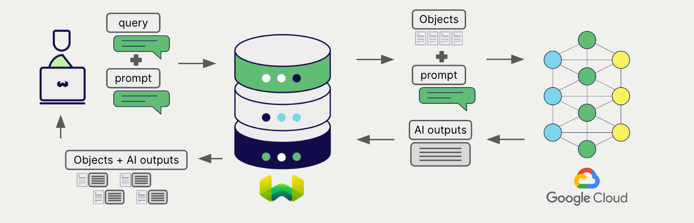
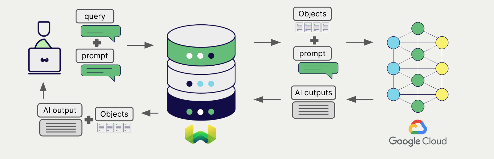

import BetaPageNote from '../_includes/beta_pages.md';

<BetaPageNote />

import Tabs from '@theme/Tabs';
import TabItem from '@theme/TabItem';
import FilteredTextBlock from '@site/src/components/Documentation/FilteredTextBlock';
import PyConnect from '!!raw-loader!../_includes/provider.connect.py';
import TSConnect from '!!raw-loader!../_includes/provider.connect.ts';
import PyCode from '!!raw-loader!../_includes/provider.generative.py';
import TSCode from '!!raw-loader!../_includes/provider.generative.ts';

# Google AI Generative AI with Weaviate

Weaviate's integration with [Google AI Studio](https://ai.google.dev/) and [Google Vertex AI](https://cloud.google.com/vertex-ai) APIs allows you to access their models' capabilities directly from Weaviate.

[Configure a Weaviate collection](#configure-collection) to use an Google AI generative AI model, and Weaviate will perform retrieval augmented generation (RAG) using the specified model and your Google AI API key.

More specifically, Weaviate will perform a search, retrieve the most relevant objects, and then pass them to the Google AI generative model to generate outputs.


:::info AI Studio availability
At the time of writing (November 2023), AI Studio is not available in all regions. See [this page](https://ai.google.dev/gemini-api/docs/available-regions) for the latest information.
:::

## Requirements

### Weaviate configuration

Your Weaviate instance must be configured with the Google AI generative AI integration (`generative-palm`) module.

<details>
  <summary>For Weaviate Cloud (WCD) users</summary>

This integration is enabled by default on Weaviate Cloud (WCD) serverless managed instances.

</details>

<details>
  <summary>For self-hosted users</summary>

- Check the [cluster metadata](../../config-refs/meta.md) to verify if the module is enabled.
- Follow the [how-to configure modules](../../configuration/modules.md) guide to enable the module in Weaviate.

</details>

### API credentials

You must provide valid API credentials to Weaviate for the appropriate integration.

#### AI Studio

Go to [Google AI Studio](https://ai.google.dev/) to sign up and obtain an API key.

#### Vertex AI

This is called an `access token` in Google Cloud.

If you have the [Google Cloud CLI tool](https://cloud.google.com/cli) installed and set up, you can view your token by running the following command:

```shell
gcloud auth print-access-token
```

#### Token expiry for Vertex AI users

import GCPTokenExpiryNotes from '/_includes/gcp.token.expiry.notes.mdx';

<GCPTokenExpiryNotes/>

#### Provide the API key

Provide the API key to Weaviate using one of the following methods:

- Set the `PALM_APIKEY` environment variable that is available to Weaviate.
- Provide the API key at runtime, as shown in the examples below.

<Tabs groupId="languages">

 <TabItem value="py" label="Python (v4)">
    <FilteredTextBlock
      text={PyConnect}
      startMarker="# START GoogleInstantiation"
      endMarker="# END GoogleInstantiation"
      language="py"
    />
  </TabItem>

 <TabItem value="js" label="JS/TS (Beta)">
    <FilteredTextBlock
      text={TSConnect}
      startMarker="// START GoogleInstantiation"
      endMarker="// END GoogleInstantiation"
      language="ts"
    />
  </TabItem>

</Tabs>

## Configure collection

[Configure a Weaviate collection](../../manage-data/collections.mdx#specify-a-generative-module) to use an Google AI generative AI model as follows:

<Tabs groupId="languages">
  <TabItem value="py" label="Python (v4)">
    <FilteredTextBlock
      text={PyCode}
      startMarker="# START BasicGenerativeGoogle"
      endMarker="# END BasicGenerativeGoogle"
      language="py"
    />
  </TabItem>

  <TabItem value="js" label="JS/TS (Beta)">
    <FilteredTextBlock
      text={TSCode}
      startMarker="// START BasicGenerativeGoogle"
      endMarker="// END BasicGenerativeGoogle"
      language="ts"
    />
  </TabItem>

</Tabs>

You can [specify](#generative-parameters) one of the [available models](#available-models) for Weaviate to use. The default model (`gpt-3.5-turbo`) is used if no model is specified.

## Retrieval augmented generation

After configuring the generative AI integration, perform RAG operations, either with the [single prompt](#single-prompt) or [grouped task](#grouped-task) method.

### Single prompt



To generate text for each object in the search results, use the single prompt method.

The example below generates outputs for each of the `n` search results, where `n` is specified by the `limit` parameter.

When creating a single prompt query, use braces `{}` to interpolate the object properties you want Weaviate to pass on to the language model. For example, to pass on the object's `title` property, include `{title}` in the query.

<Tabs groupId="languages">

 <TabItem value="py" label="Python (v4)">
    <FilteredTextBlock
      text={PyCode}
      startMarker="# START SinglePromptExample"
      endMarker="# END SinglePromptExample"
      language="py"
    />
  </TabItem>

 <TabItem value="js" label="JS/TS (Beta)">
    <FilteredTextBlock
      text={TSCode}
      startMarker="// START SinglePromptExample"
      endMarker="// END SinglePromptExample"
      language="ts"
    />
  </TabItem>

</Tabs>

### Grouped task



To generate one text for the entire set of search results, use the grouped task method.

In other words, when you have `n` search results, the generative model generates one output for the entire group.

<Tabs groupId="languages">

 <TabItem value="py" label="Python (v4)">
    <FilteredTextBlock
      text={PyCode}
      startMarker="# START GroupedTaskExample"
      endMarker="# END GroupedTaskExample"
      language="py"
    />
  </TabItem>

 <TabItem value="js" label="JS/TS (Beta)">
    <FilteredTextBlock
      text={TSCode}
      startMarker="// START GroupedTaskExample"
      endMarker="// END GroupedTaskExample"
      language="ts"
    />
  </TabItem>

</Tabs>

## References

### Generative parameters

Configure the following generative parameters to customize the model behavior.

<Tabs groupId="languages">
  <TabItem value="py" label="Python (v4)">
    <FilteredTextBlock
      text={PyCode}
      startMarker="# START FullGenerativeGoogle"
      endMarker="# END FullGenerativeGoogle"
      language="py"
    />
  </TabItem>

  <TabItem value="js" label="JS/TS (Beta)">
    <FilteredTextBlock
      text={TSCode}
      startMarker="// START FullGenerativeGoogle"
      endMarker="// END FullGenerativeGoogle"
      language="ts"
    />
  </TabItem>

</Tabs>

### Available models

Vertex AI:
- `chat-bison` (default)
- `gemini-pro`
- `gemini-pro-vision` (from Weaviate `v1.24.2`)
- `chat-bison-32k` (from Weaviate `v1.24.9`)
- `chat-bison@002` (from Weaviate `v1.24.9`)
- `chat-bison-32k@002` (from Weaviate `v1.24.9`)
- `chat-bison@001` (from Weaviate `v1.24.9`)

AI Studio:
- `chat-bison-001` (default)
- `gemini-pro`
- `gemini-pro-vision` (from Weaviate `v1.24.2`)

## Further resources

### Other integrations

- [Google AI embedding models + Weaviate](./embeddings.md).

### Code examples

Once the integrations are configured at the collection, the data management and search operations in Weaviate work identically to any other collection. Accordingly, please refer to the following examples, which are model-agnostic:

- The [how-to: manage data](../../manage-data/index.md) guides show how to perform data operations (i.e. create, update, delete).
- The [how-to: search](../../search/index.md) guides show how to perform search operations (i.e. vector, keyword, hybrid) as well as retrieval augmented generation.

### References

- [Google Vertex AI](https://cloud.google.com/vertex-ai)
- [Google AI Studio](https://ai.google.dev/)

import DocsFeedback from '/_includes/docs-feedback.mdx';

<DocsFeedback/>
