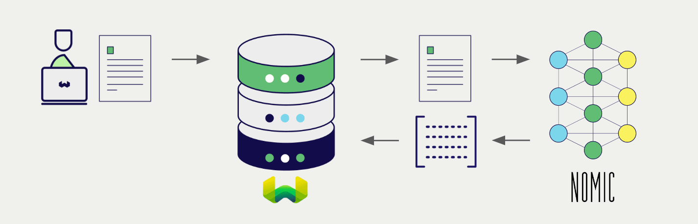
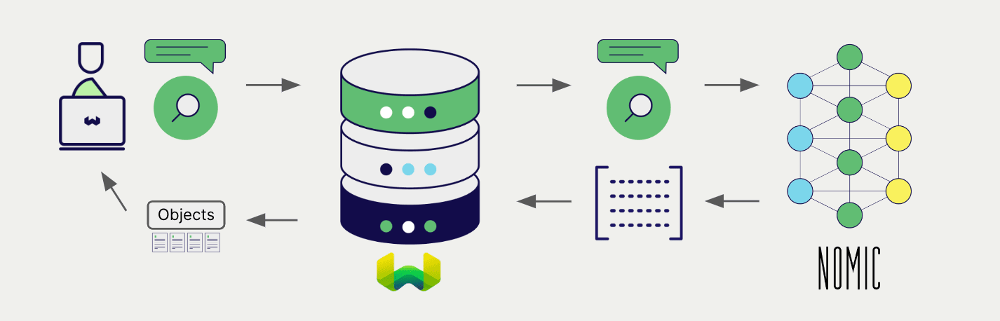

# GPT4All Embeddings with Weaviate

import BetaPageNote from '../_includes/beta_pages.md';

<BetaPageNote />

import Tabs from '@theme/Tabs';
import TabItem from '@theme/TabItem';
import FilteredTextBlock from '@site/src/components/Documentation/FilteredTextBlock';
import PyConnect from '!!raw-loader!../_includes/provider.connect.local.py';
import TSConnect from '!!raw-loader!../_includes/provider.connect.local.ts';
import PyCode from '!!raw-loader!../_includes/provider.vectorizer.py';
import TSCode from '!!raw-loader!../_includes/provider.vectorizer.ts';

Weaviate's integration with GPT4All's models allows you to access their models' capabilities directly from Weaviate.

[Configure a Weaviate vector index](#configure-the-vectorizer) to use an GPT4All embedding model, and Weaviate will generate embeddings for various operations using the specified model via the GPT4All inference container. This feature is called the *vectorizer*.

At [import time](#data-import), Weaviate generates text object embeddings and saves them into the index. For [vector](#vector-near-text-search) and [hybrid](#hybrid-search) search operations, Weaviate converts text queries into embeddings.



This module is optimized for CPU using the [`ggml` library](https://github.com/ggerganov/ggml), allowing for fast inference even without a GPU.

## Requirements

Currently, the GPT4All integration is only available for `amd64/x86_64` architecture devices, as the `gpt4all` library currently does not support ARM devices, such as Apple M-series.

### Weaviate configuration

Your Weaviate instance must be configured with the GPT4All vectorizer integration (`text2vec-gpt4all`) module.

<details>
  <summary>For Weaviate Cloud (WCD) users</summary>

This integration is not available for Weaviate Cloud (WCD) serverless instances, as it requires a locally running GPT4All instance.

</details>

<details>
  <summary>For self-hosted users</summary>

- Check the [cluster metadata](../../config-refs/meta.md) to verify if the module is enabled.
- Follow the [how-to configure modules](../../configuration/modules.md) guide to enable the module in Weaviate.

</details>

#### Configure the integration

To use this integration, you must configure the container image of the GPT4All model, and the inference endpoint of the containerized model.

The following example shows how to configure the GPT4All integration in Weaviate:

<Tabs groupId="languages">
<TabItem value="docker" label="Docker">

#### Docker Option 1: Use a pre-configured `docker-compose.yml` file

Follow the instructions on the [Weaviate Docker installation configurator](../../installation/docker-compose.md#configurator) to download a pre-configured `docker-compose.yml` file with a selected model
<br/>

#### Docker Option 2: Add the configuration manually

Alternatively, add the configuration to the `docker-compose.yml` file manually as in the example below.

```yaml
version: '3.4'
services:
  weaviate:
    # Other Weaviate configuration
    environment:
      GPT4ALL_INFERENCE_API: http://text2vec-gpt4all:8080  # Set the inference API endpoint
  t2v-gpt4all:  # Set the name of the inference container
    image: cr.weaviate.io/semitechnologies/gpt4all-inference:all-MiniLM-L6-v2
```

- `GPT4ALL_INFERENCE_API` environment variable sets the inference API endpoint
- `t2v-gpt4all` is the name of the inference container
- `image` is the container image

</TabItem>
<TabItem value="k8s" label="Kubernetes">

Configure the GPT4All integration in Weaviate by adding or updating the `text2vec-gpt4all` module in the `modules` section of the Weaviate Helm chart values file. For example, modify the `values.yaml` file as follows:

```yaml
modules:

  text2vec-gpt4all:

    enabled: true
    tag: all-MiniLM-L6-v2
    repo: semitechnologies/gpt4all-inference
    registry: cr.weaviate.io
```

See the [Weaviate Helm chart](https://github.com/weaviate/weaviate-helm/blob/master/weaviate/values.yaml) for an example of the `values.yaml` file including more configuration options.

</TabItem>
</Tabs>

### Credentials

As this integration connects to a local GPT4All container, no additional credentials (e.g. API key) are required. Connect to Weaviate as usual, such as in the examples below.

<Tabs groupId="languages">

 <TabItem value="py" label="Python (v4)">
    <FilteredTextBlock
      text={PyConnect}
      startMarker="# START BasicInstantiation"
      endMarker="# END BasicInstantiation"
      language="py"
    />
  </TabItem>

 <TabItem value="js" label="JS/TS (Beta)">
    <FilteredTextBlock
      text={TSConnect}
      startMarker="// START BasicInstantiation"
      endMarker="// END BasicInstantiation"
      language="ts"
    />
  </TabItem>

</Tabs>

## Configure the vectorizer

[Configure a Weaviate index](../../manage-data/collections.mdx#specify-a-vectorizer) to use an GPT4All embedding model by setting the vectorizer as follows:

<Tabs groupId="languages">
  <TabItem value="py" label="Python (v4)">
    <FilteredTextBlock
      text={PyCode}
      startMarker="# START BasicVectorizerGPT4All"
      endMarker="# END BasicVectorizerGPT4All"
      language="py"
    />
  </TabItem>

  <TabItem value="js" label="JS/TS (Beta)">
    <FilteredTextBlock
      text={TSCode}
      startMarker="// START BasicVectorizerGPT4All"
      endMarker="// END BasicVectorizerGPT4All"
      language="ts"
    />
  </TabItem>

</Tabs>

## Data import

After configuring the vectorizer, [import data](../../manage-data/import.mdx) into Weaviate. Weaviate generates embeddings for text objects using the specified model.

<Tabs groupId="languages">

 <TabItem value="py" label="Python (v4)">
    <FilteredTextBlock
      text={PyCode}
      startMarker="# START BatchImportExample"
      endMarker="# END BatchImportExample"
      language="py"
    />
  </TabItem>

 <TabItem value="js" label="JS/TS (Beta)">
    <FilteredTextBlock
      text={TSCode}
      startMarker="// START BatchImportExample"
      endMarker="// END BatchImportExample"
      language="ts"
    />
  </TabItem>

</Tabs>

:::tip Re-use existing vectors
If you already have a compatible model vector available, you can provide it directly to Weaviate. This can be useful if you have already generated embeddings using the same model and want to use them in Weaviate, such as when migrating data from another system.
:::

## Searches

Once the vectorizer is configured, Weaviate will perform vector and hybrid search operations using the specified GPT4All model.



### Vector (near text) search

When you perform a [vector search](../../search/similarity.md#search-with-text), Weaviate converts the text query into an embedding using the specified model and returns the most similar objects from the database.

The query below returns the `n` most similar objects from the database, set by `limit`.

<Tabs groupId="languages">

 <TabItem value="py" label="Python (v4)">
    <FilteredTextBlock
      text={PyCode}
      startMarker="# START NearTextExample"
      endMarker="# END NearTextExample"
      language="py"
    />
  </TabItem>

 <TabItem value="js" label="JS/TS (Beta)">
    <FilteredTextBlock
      text={TSCode}
      startMarker="// START NearTextExample"
      endMarker="// END NearTextExample"
      language="ts"
    />
  </TabItem>

</Tabs>

### Hybrid search

:::info What is a hybrid search?
A hybrid search performs a vector search and a keyword (BM25) search, before [combining the results](../../search/hybrid.md#change-the-ranking-method) to return the best matching objects from the database.
:::

When you perform a [hybrid search](../../search/hybrid.md), Weaviate converts the text query into an embedding using the specified model and returns the best scoring objects from the database.

The query below returns the `n` best scoring objects from the database, set by `limit`.

<Tabs groupId="languages">

 <TabItem value="py" label="Python (v4)">
    <FilteredTextBlock
      text={PyCode}
      startMarker="# START HybridExample"
      endMarker="# END HybridExample"
      language="py"
    />
  </TabItem>

 <TabItem value="js" label="JS/TS (Beta)">
    <FilteredTextBlock
      text={TSCode}
      startMarker="// START HybridExample"
      endMarker="// END HybridExample"
      language="ts"
    />
  </TabItem>

</Tabs>

## References

<!-- #### Example configuration -->

<!-- Hiding "full" examples as no other parameters exist than shown above -->

<!-- <Tabs groupId="languages">
  <TabItem value="py" label="Python (v4)">
    <FilteredTextBlock
      text={PyCode}
      startMarker="# START FullVectorizerGPT4All"
      endMarker="# END FullVectorizerGPT4All"
      language="py"
    />
  </TabItem>

  <TabItem value="js" label="JS/TS (Beta)">
    <FilteredTextBlock
      text={TSCode}
      startMarker="// START FullVectorizerGPT4All"
      endMarker="// END FullVectorizerGPT4All"
      language="ts"
    />
  </TabItem>

</Tabs> -->

### Available models

Currently, the only available model is [`all-MiniLM-L6-v2`](https://huggingface.co/sentence-transformers/all-MiniLM-L6-v2).

## Further resources

### Code examples

Once the integrations are configured at the collection, the data management and search operations in Weaviate work identically to any other collection. See the following model-agnostic examples:

- The [how-to: manage data](../../manage-data/index.md) guides show how to perform data operations (i.e. create, update, delete).
- The [how-to: search](../../search/index.md) guides show how to perform search operations (i.e. vector, keyword, hybrid) as well as retrieval augmented generation.

### External resources

- [GPT4All documentation](https://docs.gpt4all.io/)

import DocsFeedback from '/_includes/docs-feedback.mdx';

<DocsFeedback/>
