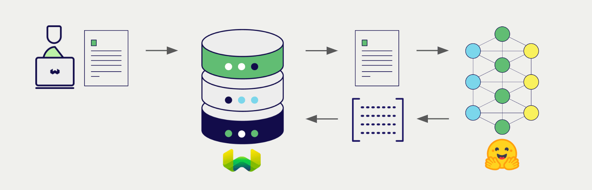

Hugging Face offers a wide range of models for natural language processing and generation. Weaviate seamlessly integrates with Hugging Face's Inference API, allowing users to leverage Hugging Face Hub's models directly within the Weaviate database.

These integrations empower developers to build sophisticated AI-driven applications with ease.

## Integrations with Hugging Face

### Embedding models for semantic search

Hugging Face Hub's embedding models transform text data into high-dimensional vector representations, capturing semantic meaning and context.

[Weaviate integrates with Hugging Face Hub's embedding models](./embeddings.md) to enable seamless vectorization of data. This integration allows users to perform semantic and hybrid search operations without the need for additional preprocessing or data transformation steps.

[Hugging Face embedding integration page](./embeddings.md)

## Summary

These integrations enable developers to leverage Hugging Face's powerful models directly within Weaviate.

In turn, they simplify the process of building AI-driven applications to speed up your development process, so that you can focus on creating innovative solutions.

## Get started

You must provide a valid Hugging Face API key to Weaviate for these integrations. Go to [Hugging Face](https://huggingface.co/docs/api-inference/en/quicktour) to sign up and obtain an API key.

Then, go to the relevant integration page to learn how to configure Weaviate with the Hugging Face Hub models and start using them in your applications.

- [Embeddings](./embeddings.md)

import DocsMoreResources from '/_includes/more-resources-docs.md';

<DocsMoreResources />
