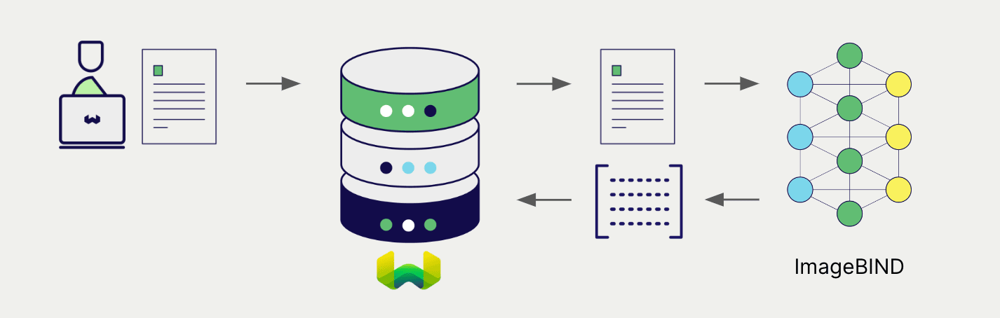

# Locally Hosted ImageBind Embeddings + Weaviate

import BetaPageNote from '../_includes/beta_pages.md';

<BetaPageNote />

import Tabs from '@theme/Tabs';
import TabItem from '@theme/TabItem';
import FilteredTextBlock from '@site/src/components/Documentation/FilteredTextBlock';
import PyConnect from '!!raw-loader!../_includes/provider.connect.py';
import TSConnect from '!!raw-loader!../_includes/provider.connect.ts';
import PyCode from '!!raw-loader!../_includes/provider.vectorizer.py';
import TSCode from '!!raw-loader!../_includes/provider.vectorizer.ts';

Weaviate's integration with the Meta ImageBind library allows you to access its capabilities directly from Weaviate. The ImageBind model supports multiple modalities (text, image, audio, video, thermal, IMU and depth).

[Configure a Weaviate vector index](#configure-the-vectorizer) to use the ImageBind integration, and [configure the Weaviate instance](#weaviate-configuration) with a model image, and Weaviate will generate embeddings for various operations using the specified model in the ImageBind inference container. This feature is called the *vectorizer*.

At [import time](#data-import), Weaviate generates multimodal object embeddings and saves them into the index. For [vector](#vector-near-text-search) and [hybrid](#hybrid-search) search operations, Weaviate converts queries of one or more modalities into embeddings.


## Requirements

### Weaviate configuration

Your Weaviate instance must be configured with the ImageBind vectorizer integration (`multi2vec-bind`) module.

<details>
  <summary>For Weaviate Cloud (WCD) users</summary>

This integration is not available for Weaviate Cloud (WCD) serverless instances, as it requires spinning up a container with the ImageBind model.

</details>

#### Enable the integration module

- Check the [cluster metadata](../../config-refs/meta.md) to verify if the module is enabled.
- Follow the [how-to configure modules](../../configuration/modules.md) guide to enable the module in Weaviate.

#### Configure the integration

To use this integration, you must configure the container image of the ImageBind model, and the inference endpoint of the containerized model.

The following example shows how to configure the ImageBind integration in Weaviate:

<Tabs groupId="languages">
<TabItem value="docker" label="Docker">

#### Docker Option 1: Use a pre-configured `docker-compose.yml` file

Follow the instructions on the [Weaviate Docker installation configurator](../../installation/docker-compose.md#configurator) to download a pre-configured `docker-compose.yml` file with a selected model
<br/>

#### Docker Option 2: Add the configuration manually

Alternatively, add the configuration to the `docker-compose.yml` file manually as in the example below.

```yaml
version: '3.4'
services:
  weaviate:
    # Other Weaviate configuration
    environment:
      BIND_INFERENCE_API: http://multi2vec-bind:8080  # Set the inference API endpoint
  multi2vec-bind:  # Set the name of the inference container
    mem_limit: 12g
    image: cr.weaviate.io/semitechnologies/multi2vec-bind:imagebind
    environment:
      ENABLE_CUDA: 0  # Set to 1 to enable
```

- `BIND_INFERENCE_API` environment variable sets the inference API endpoint
- `multi2vec-bind` is the name of the inference container
- `image` is the container image
- `ENABLE_CUDA` environment variable enables GPU usage

</TabItem>
<TabItem value="k8s" label="Kubernetes">

Configure the ImageBind integration in Weaviate by adding or updating the `multi2vec-bind` module in the `modules` section of the Weaviate Helm chart values file. For example, modify the `values.yaml` file as follows:

```yaml
modules:

  multi2vec-bind:

    enabled: true
    tag: imagebind
    repo: semitechnologies/multi2vec-bind
    registry: cr.weaviate.io
    envconfig:
      enable_cuda: true
```

See the [Weaviate Helm chart](https://github.com/weaviate/weaviate-helm/blob/master/weaviate/values.yaml) for an example of the `values.yaml` file including more configuration options.

</TabItem>
</Tabs>

### Credentials

As this integration runs a local container with the ImageBind model, no additional credentials (e.g. API key) are required.

## Configure the vectorizer

[Configure a Weaviate index](../../manage-data/collections.mdx#specify-a-vectorizer) to use an ImageBind embedding model by setting the vectorizer as follows:

<Tabs groupId="languages">
  <TabItem value="py" label="Python (v4)">
    <FilteredTextBlock
      text={PyCode}
      startMarker="# START BasicMMVectorizerBind"
      endMarker="# END BasicMMVectorizerBind"
      language="py"
    />
  </TabItem>

  <TabItem value="js" label="JS/TS (Beta)">
    <FilteredTextBlock
      text={TSCode}
      startMarker="// START BasicMMVectorizerBind"
      endMarker="// END BasicMMVectorizerBind"
      language="ts"
    />
  </TabItem>

</Tabs>

## Data import

After configuring the vectorizer, [import data](../../manage-data/import.mdx) into Weaviate. Weaviate generates embeddings for the objects using the specified model.

<Tabs groupId="languages">

 <TabItem value="py" label="Python (v4)">
    <FilteredTextBlock
      text={PyCode}
      startMarker="# START MMBatchImportExample"
      endMarker="# END MMBatchImportExample"
      language="py"
    />
  </TabItem>

 <TabItem value="js" label="JS/TS (Beta)">
    <FilteredTextBlock
      text={TSCode}
      startMarker="// START MMBatchImportExample"
      endMarker="// END MMBatchImportExample"
      language="ts"
    />
  </TabItem>

</Tabs>

:::tip Re-use existing vectors
If you already have a compatible model vector available, you can provide it directly to Weaviate. This can be useful if you have already generated embeddings using the same model and want to use them in Weaviate, such as when migrating data from another system.
:::

## Searches

Once the vectorizer is configured, Weaviate will perform vector and hybrid search operations using the specified ImageBind model.



### Vector (near text) search

When you perform a [vector search](../../search/similarity.md#search-with-text), Weaviate converts the text query into an embedding using the specified model and returns the most similar objects from the database.

The query below returns the `n` most similar objects from the database, set by `limit`.

<Tabs groupId="languages">

 <TabItem value="py" label="Python (v4)">
    <FilteredTextBlock
      text={PyCode}
      startMarker="# START NearTextExample"
      endMarker="# END NearTextExample"
      language="py"
    />
  </TabItem>

 <TabItem value="js" label="JS/TS (Beta)">
    <FilteredTextBlock
      text={TSCode}
      startMarker="// START NearTextExample"
      endMarker="// END NearTextExample"
      language="ts"
    />
  </TabItem>

</Tabs>

### Hybrid search

:::info What is a hybrid search?
A hybrid search performs a vector search and a keyword (BM25) search, before [combining the results](../../search/hybrid.md#change-the-ranking-method) to return the best matching objects from the database.
:::

When you perform a [hybrid search](../../search/hybrid.md), Weaviate converts the text query into an embedding using the specified model and returns the best scoring objects from the database.

The query below returns the `n` best scoring objects from the database, set by `limit`.

<Tabs groupId="languages">

 <TabItem value="py" label="Python (v4)">
    <FilteredTextBlock
      text={PyCode}
      startMarker="# START HybridExample"
      endMarker="# END HybridExample"
      language="py"
    />
  </TabItem>

 <TabItem value="js" label="JS/TS (Beta)">
    <FilteredTextBlock
      text={TSCode}
      startMarker="// START HybridExample"
      endMarker="// END HybridExample"
      language="ts"
    />
  </TabItem>

</Tabs>

### Vector (near media) search

When you perform a media search such as a [near image search](../../search/similarity.md#search-with-image), Weaviate converts the query into an embedding using the specified model and returns the most similar objects from the database.

To perform a near media search such as near image search, convert the media query into a base64 string and pass it to the search query.

The query below returns the `n` most similar objects to the input image from the database, set by `limit`.

<Tabs groupId="languages">

 <TabItem value="py" label="Python (v4)">
    <FilteredTextBlock
      text={PyCode}
      startMarker="# START NearImageExample"
      endMarker="# END NearImageExample"
      language="py"
    />
  </TabItem>

 <TabItem value="js" label="JS/TS (Beta)">
    <FilteredTextBlock
      text={TSCode}
      startMarker="// START NearImageExample"
      endMarker="// END NearImageExample"
      language="ts"
    />
  </TabItem>

</Tabs>

You can perform similar searches for other media types such as audio, video, thermal, IMU, and depth, by using an equivalent search query for the respective media type.

## References

### Vectorizer parameters

The ImageBind vectorizer supports multiple modalities (text, image, audio, video, thermal, IMU and depth). One or more of these can be specified in the vectorizer configuration as shown.

<Tabs groupId="languages">
  <TabItem value="py" label="Python (v4)">
    <FilteredTextBlock
      text={PyCode}
      startMarker="# START FullMMVectorizerBind"
      endMarker="# END FullMMVectorizerBind"
      language="py"
    />
  </TabItem>

  <TabItem value="js" label="JS/TS (Beta)">
    <FilteredTextBlock
      text={TSCode}
      startMarker="// START FullMMVectorizerBind"
      endMarker="// END FullMMVectorizerBind"
      language="ts"
    />
  </TabItem>

</Tabs>

### Available models

There is only one ImageBind model available.

## Further resources

### Code examples

Once the integrations are configured at the collection, the data management and search operations in Weaviate work identically to any other collection. See the following model-agnostic examples:

- The [how-to: manage data](../../manage-data/index.md) guides show how to perform data operations (i.e. create, update, delete).
- The [how-to: search](../../search/index.md) guides show how to perform search operations (i.e. vector, keyword, hybrid) as well as retrieval augmented generation.

### Model licenses

Review the license for the model on the [ImageBind page](https://github.com/facebookresearch/ImageBind).

It is your responsibility to evaluate whether the terms of its license(s), if any, are appropriate for your intended use.

### External resources

- [ImageBind GitHub page](https://github.com/facebookresearch/ImageBind)

import DocsFeedback from '/_includes/docs-feedback.mdx';

<DocsFeedback/>
