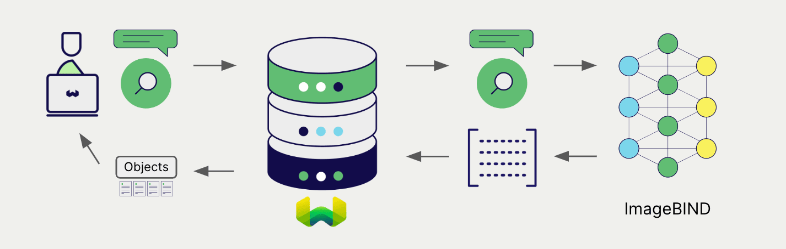

import BetaPageNote from '../_includes/beta_pages.md';

<BetaPageNote />

Meta's ImageBind library can be used with a wide range of models for natural language processing. Weaviate seamlessly integrates with the ImageBind library, allowing users to leverage compatible models directly within the Weaviate database.

These integrations empower developers to build sophisticated AI-driven applications with ease.

## Integrations with ImageBind

Weaviate integrates with the ImageBind model by spinning it up in a container. This allows users to host their own model and use them with Weaviate.

### Embedding models for semantic search

The ImageBind embedding model transforms multi-modal data into high-dimensional vector representations, capturing semantic meaning and context.

[Weaviate integrates with ImageBind's embedding models](./embeddings.md) to enable seamless vectorization of data. This integration allows users to perform semantic and hybrid search operations without the need for additional preprocessing or data transformation steps.

[ImageBind embedding integration page](./embeddings.md)

## Summary

These integrations enable developers to leverage the powerful ImageBind model from directly within Weaviate.

In turn, they simplify the process of building AI-driven applications to speed up your development process, so that you can focus on creating innovative solutions.

## Get started

A locally hosted Weaviate instance is required for these integrations so that you can host your own ImageBind model.

Go to the relevant integration page to learn how to configure Weaviate with the ImageBind model and start using it in your applications.

- [Text Embeddings](./embeddings.md)

import DocsFeedback from '/_includes/docs-feedback.mdx';

<DocsFeedback/>
