Weaviate integrates with a variety of [self-hosted](#self-hosted) and [API-based](#api-based) models from a range of providers.

This enables an enhanced developed experience, such as the ability to:
- Import objects directly into Weaviate without having to manually specify embeddings, and
- Build an integrated retrieval augmented generation (RAG) pipeline with generative AI models.

## Model provider integrations

### API-based

| Model provider | Embeddings | Generative AI | Others |
| --- | --- | --- | --- |
| [Anthropic](./anthropic/index.md) | - | [Text](./anthropic/generative.md) | - |
| [Anyscale](./anyscale/index.md) | - | [Text](./anyscale/generative.md) | - |
| [AWS](./aws/index.md) | [Text](./aws/embeddings.md) | [Text](./aws/generative.md) |
| [Cohere](./cohere/index.md) | [Text](./cohere/embeddings.md) | [Text](./cohere/generative.md) | [Reranker](./cohere/reranker.md) |
| [Databricks](./databricks/index.md) | [Text](./databricks/embeddings.md) | [Text](./databricks/generative.md) | - |
| [FriendliAI](./friendliai/index.md) | - | [Text](./friendliai/generative.md) | - |
| [Google](./google/index.md) | [Text](./google/embeddings.md), [Multimodal](./google/embeddings-multimodal.md) | [Text](./google/generative.md) | - |
| [Hugging Face](./huggingface/index.md) | [Text](./huggingface/embeddings.md) | - | - |
| [Jina AI](./jinaai/index.md) | [Text](./jinaai/embeddings.md) | - | [Reranker](./jinaai/reranker.md) |
| [Mistral](./mistral/index.md) | [Text](./mistral/embeddings.md) | [Text](./mistral/generative.md) | - |
| [OctoAI (Deprecated)](./octoai/index.md) | [Text](./octoai/embeddings.md) | [Text](./octoai/generative.md) | - |
| [OpenAI](./openai/index.md) | [Text](./openai/embeddings.md) | [Text](./openai/generative.md) | - |
| [Azure OpenAI](./openai-azure/index.md) | [Text](./openai-azure/embeddings.md) | [Text](./openai-azure/generative.md) | - |
| [Voyage AI](./voyageai/index.md) | [Text](./voyageai/embeddings.md) | - | [Reranker](./voyageai/reranker.md) |

#### Enable all API-based modules

:::caution Experimental feature
Available starting in `v1.26.0`. This is an experimental feature. Use with caution.
:::

You can enable all API-based integrations at once by [by setting the `ENABLE_API_BASED_MODULES` environment variable to `true`](../configuration/modules.md#enable-all-api-based-modules).

This make all API-based model integrations available for use, such as those for Anthropic, Cohere, OpenAI, and so on. These modules are lightweight, so enabling them all will not significantly increase resource usage.

Read more about [enabling all API-based modules](../configuration/modules.md#enable-all-api-based-modules).

### Locally hosted

| Model provider | Embeddings | Generative AI | Others |
| --- | --- | --- | --- |
| [GPT4All](./gpt4all/index.md) | [Text](./gpt4all/embeddings.md) | - | - |
| [Hugging Face](./transformers/index.md) | [Text](./transformers/embeddings.md), [Multimodal (CLIP)](./transformers/embeddings-multimodal.md) | - | [Reranker](./transformers/reranker.md) |
| [Meta ImageBind](./imagebind/index.md) | [Multimodal](./imagebind/embeddings-multimodal.md) | - | - |
| [Ollama](./ollama/index.md) | [Text](./ollama/embeddings.md) | [Text](./ollama/generative.md) | - |

## How does Weaviate generate embeddings?

When a model provider integration for embeddings is enabled, Weaviate automatically generates embeddings for objects that are added to the database.

This is done by providing the source data to the integration provider, which then returns the embeddings to Weaviate. The embeddings are then stored in the Weaviate database.

```mermaid
%%{init: {
  'theme': 'base',
  'themeVariables': {
    'lineColor': '#B9C8DF',
    'textColor': '#130C49',
    'labelBackground': '#ffffff',
    'labelTextColor': '#130C49',
    'edgeLabelBackground': '#ffffff'
  }
}}%%

flowchart TB

    classDef bigHeader font-weight:bold,padding-bottom:20px
    classDef container padding:48px
    classDef node padding:20px
    linkStyle default stroke:#B9C8DF,stroke-width:2

    %% Define data node
    subgraph user["👤 User System"]
        direction TB
        data["📄 Data objects"]
    end

    %% Define Weaviate section
    subgraph weaviate ["Weaviate"]
        direction LR
        core["⚡️ Weaviate core"]
        vectorizer_module["🔌 Model provider integration&nbsp&nbsp\n(e.g., Cohere, Ollama)"]

        %% Internal connections
        core --> |"2. Request\nvector"| vectorizer_module
        vectorizer_module --> |"5. Vector"| core
    end

    %% Define Vectorizer section
    subgraph vectorizer_section ["Model Provider"]
        direction LR
        inference["🤖 Inference API (e.g., Cohere)&nbsp&nbsp\nor\nLocal model (e.g., Ollama)"]
    end

    %% Define connections between sections with numbered steps
    user --> |"1. Insert object(s)"| core
    vectorizer_module --> |"3. Request\nvector"| inference
    inference --> |"4. Vector"| vectorizer_module

    %% Style nodes
    style data fill:#ffffff,stroke:#B9C8DF,color:#130C49
    style core fill:#ffffff,stroke:#B9C8DF,color:#130C49
    style vectorizer_module fill:#ffffff,stroke:#B9C8DF,color:#130C49
    style inference fill:#ffffff,stroke:#B9C8DF,color:#130C49

    %% Style subgraphs with subtle backgrounds
    style user fill:#F8FBFF,stroke:#7AD6EB,color:#130C49,stroke-width:2px,stroke-dasharray: 5 5
    style weaviate fill:#F8FBFF,stroke:#130C49,stroke-width:2px,color:#130C49
    style vectorizer_section fill:#F8FBFF,stroke:#61BD73,stroke-width:2px,color:#130C49,stroke-dasharray: 5 5

    %% Apply custom classes to nodes
    class user bigHeader
    class weaviate bigHeader
    class vectorizer_section bigHeader
    class user,weaviate,vectorizer_section container
    class data,core,vectorizer_module,inference node
```

Weaviate generates embeddings for objects as follows:

- Selects properties with `text` or `text[]` data types unless they are configured to be skipped
- Sorts properties in alphabetical (a-z) order before concatenating values
- Prepends the collection name if configured

:::note Case sensitivity
For Weaviate versions before `v1.27`, the string created above is lowercased before being sent to the model provider. Starting in `v1.27`, the string is sent as is.

If you prefer the text to be lowercased, you can do so by setting the `LOWERCASE_VECTORIZATION_INPUT` environment variable.
The text is always lowercased for the `text2vec-contextionary` integration.
:::

## Further resources

import IntegrationLinkBack from '/_includes/integrations/link-back.mdx';

<IntegrationLinkBack/>

## Questions and feedback

import DocsFeedback from '/_includes/docs-feedback.mdx';

<DocsFeedback/>
