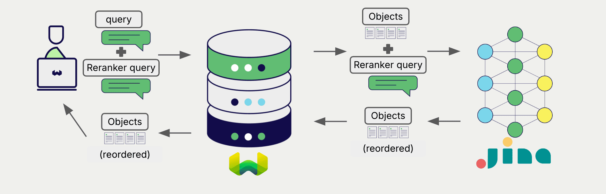

# Jina AI Reranker Models with Weaviate

:::info Added in `v1.26.1`
:::

import Tabs from '@theme/Tabs';
import TabItem from '@theme/TabItem';
import FilteredTextBlock from '@site/src/components/Documentation/FilteredTextBlock';
import PyConnect from '!!raw-loader!../_includes/provider.connect.py';
import TSConnect from '!!raw-loader!../_includes/provider.connect.ts';
import PyCode from '!!raw-loader!../_includes/provider.reranker.py';
import TSCode from '!!raw-loader!../_includes/provider.reranker.ts';

Weaviate's integration with Jina AI's APIs allows you to access their models' capabilities directly from Weaviate.

[Configure a Weaviate collection](#configure-the-reranker) to use a Jina AI reranker model, and Weaviate will use the specified model and your Jina AI API key to rerank search results.

This two-step process involves Weaviate first performing a search and then reranking the results using the specified model.

## Requirements

### Weaviate configuration

Your Weaviate instance must be configured with the JinaAI reranker integration (`reranker-jinaai`) module.

  
For Weaviate Cloud (WCD) users

This integration is enabled by default on Weaviate Cloud (WCD) serverless instances.

  
For self-hosted users

- Check the [cluster metadata](../../config-refs/meta.md) to verify if the module is enabled.
- Follow the [how-to configure modules](../../configuration/modules.md) guide to enable the module in Weaviate.

### API credentials

You must provide a valid JinaAI API key to Weaviate for this integration. Go to [Jina AI](https://jina.ai/embeddings/) to sign up and obtain an API key.

Provide the API key to Weaviate using one of the following methods:

- Set the `JINAAI_APIKEY` environment variable that is available to Weaviate.
- Provide the API key at runtime, as shown in the examples below.

<Tabs groupId="languages">

 <TabItem value="py" label="Python API v4">
    <FilteredTextBlock
      text={PyConnect}
      startMarker="# START JinaAIInstantiation"
      endMarker="# END JinaAIInstantiation"
      language="py"
    />
  </TabItem>

 <TabItem value="js" label="JS/TS API v3">
    <FilteredTextBlock
      text={TSConnect}
      startMarker="// START JinaAIInstantiation"
      endMarker="// END JinaAIInstantiation"
      language="ts"
    />
  </TabItem>

</Tabs>

## Configure the reranker

import MutableRerankerConfig from '/_includes/mutable-reranker-config.md';

<MutableRerankerConfig />

Configure a Weaviate collection to use a Jina AI reranker model as follows:

<Tabs groupId="languages">
  <TabItem value="py" label="Python API v4">
    <FilteredTextBlock
      text={PyCode}
      startMarker="# START RerankerJinaAIBasic"
      endMarker="# END RerankerJinaAIBasic"
      language="py"
    />
  </TabItem>

  <TabItem value="js" label="JS/TS API v3">
    <FilteredTextBlock
      text={TSCode}
      startMarker="// START RerankerJinaAIBasic"
      endMarker="// END RerankerJinaAIBasic"
      language="ts"
    />
  </TabItem>

</Tabs>

### Select a model

You can specify one of the [available models](#available-models) for Weaviate to use, as shown in the following configuration example:

<Tabs groupId="languages">
  <TabItem value="py" label="Python API v4">
    <FilteredTextBlock
      text={PyCode}
      startMarker="# START RerankerJinaAICustomModel"
      endMarker="# END RerankerJinaAICustomModel"
      language="py"
    />
  </TabItem>

  <TabItem value="js" label="JS/TS API v3">
    <FilteredTextBlock
      text={TSCode}
      startMarker="// START RerankerJinaAICustomModel"
      endMarker="// END RerankerJinaAICustomModel"
      language="ts"
    />
  </TabItem>

</Tabs>

The [default model](#available-models) is used if no model is specified.

## Reranking query

Once the reranker is configured, Weaviate performs [reranking operations](../../search/rerank.md) using the specified Jina AI model.

More specifically, Weaviate performs an initial search, then reranks the results using the specified model.

Any search in Weaviate can be combined with a reranker to perform reranking operations.

<Tabs groupId="languages">

 <TabItem value="py" label="Python API v4">
    <FilteredTextBlock
      text={PyCode}
      startMarker="# START RerankerQueryExample"
      endMarker="# END RerankerQueryExample"
      language="py"
    />
  </TabItem>

 <TabItem value="js" label="JS/TS API v3">
    <FilteredTextBlock
      text={TSCode}
      startMarker="// START RerankerQueryExample"
      endMarker="// END RerankerQueryExample"
      language="ts"
    />
  </TabItem>

</Tabs>

## References

### Available models

- `jina-reranker-v2-base-multilingual` (default)
- `jina-reranker-v1-base-en`
- `jina-reranker-v1-turbo-en`
- `jina-reranker-v1-tiny-en`
- `jina-colbert-v1-en`

## Further resources

### Other integrations

- [Jina AI text embedding models + Weaviate](./embeddings.md)
- [Jina AI multimodal embedding models + Weaviate](./embeddings-multimodal.md)

### Code examples

Once the integrations are configured at the collection, the data management and search operations in Weaviate work identically to any other collection. See the following model-agnostic examples:

- The [how-to: manage data](../../manage-data/index.md) guides show how to perform data operations (i.e. create, update, delete).
- The [how-to: search](../../search/index.md) guides show how to perform search operations (i.e. vector, keyword, hybrid) as well as retrieval augmented generation.

### References

- Jina AI [Reranker documentation](https://jina.ai/reranker/)

## Questions and feedback

import DocsFeedback from '/_includes/docs-feedback.mdx';

<DocsFeedback/>
