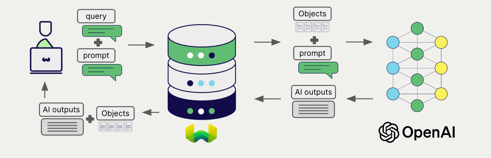

# KubeAI Generative AI with Weaviate

import BetaPageNote from '../_includes/beta_pages.md';

<BetaPageNote />

import Tabs from '@theme/Tabs';
import TabItem from '@theme/TabItem';
import FilteredTextBlock from '@site/src/components/Documentation/FilteredTextBlock';
import PyConnect from '!!raw-loader!../_includes/provider.connect.py';
import TSConnect from '!!raw-loader!../_includes/provider.connect.ts';
import PyCode from '!!raw-loader!../_includes/provider.generative.py';
import TSCode from '!!raw-loader!../_includes/provider.generative.ts';

Weaviate's integration with KubeAI's OpenAI compatible API allows you to access private models' directly from Weaviate.

[Configure a Weaviate collection](#configure-collection) to use KubeAI, and Weaviate will perform retrieval augmented generation (RAG) using the specified model.

More specifically, Weaviate will perform a search, retrieve the most relevant objects, and then pass them to the KubeAI generative model to generate outputs.

<!---
commenting out until we have images

--->

## Requirements

### Weaviate configuration

Your Weaviate instance must be configured with the OpenAI generative AI integration (`generative-openai`) module.

<details>
  <summary>For Weaviate Cloud (WCD) users</summary>

This integration is enabled by default on Weaviate Cloud (WCD) serverless instances.

</details>

<details>
  <summary>For self-hosted users</summary>

- Check the [cluster metadata](../../config-refs/meta.md) to verify if the module is enabled.
- Follow the [how-to configure modules](../../configuration/modules.md) guide to enable the module in Weaviate.

</details>

### API credentials

You must provide a valid OpenAI API key to Weaviate for this integration. However, KubeAI ignores the OpenAI API key. So you can provide any value for the API key.

Provide the API key to Weaviate using one of the following methods:

- Set the following environment variable `export OPENAI_APIKEY=thisIsIgnored`.
- Provide the API key at runtime, as shown in the examples below.

<Tabs groupId="languages">

 <TabItem value="py" label="Python API v4">
    <FilteredTextBlock
      text={PyConnect}
      startMarker="# START OpenAIInstantiation"
      endMarker="# END OpenAIInstantiation"
      language="py"
    />
  </TabItem>

 <TabItem value="js" label="JS/TS API v3">
    <FilteredTextBlock
      text={TSConnect}
      startMarker="// START OpenAIInstantiation"
      endMarker="// END OpenAIInstantiation"
      language="ts"
    />
  </TabItem>

</Tabs>


## Configure collection
We need to configure the collection to use a Text Generation model from KubeAI.

For example, you can enable Gemma 2B model running on CPU. Create a file named
`kubeai-values.yaml` with the following content:

```yaml
models:
  catalog:
    gpt-3.5-turbo:
      enabled: true
      minReplicas: 1
      features: ["TextGeneration"]
      owner: google
      url: "ollama://gemma2:2b"
      engine: OLlama
      resourceProfile: cpu:2
```

Then, upgrade the KubeAI Helm chart with the new configuration:

```bash
helm repo add kubeai https://www.kubeai.org
helm upgrade --install kubeai kubeai/kubeai \
    -f ./kubeai-values.yaml --reuse-values
```


[Configure a Weaviate collection](../../manage-data/collections.mdx#specify-a-generative-module) to use the KubeAI OpenAI compatible API and the model you want to use:

<Tabs groupId="languages">
  <TabItem value="py" label="Python API v4">
    <FilteredTextBlock
      text={PyCode}
      startMarker="# START FullGenerativeKubeAI"
      endMarker="# END FullGenerativeKubeAI"
      language="py"
    />
  </TabItem>

  <TabItem value="js" label="JS/TS API v3">
    <FilteredTextBlock
      text={TSCode}
      startMarker="// START FullGenerativeKubeAI"
      endMarker="// END FullGenerativeKubeAI"
      language="ts"
    />
  </TabItem>

</Tabs>

There are also other models available in the catalog.
You also can configure any model that's supported by vLLM or Ollama. Checkout the docs on
[management of models](https://www.kubeai.org/how-to/manage-models/) for more information.


## Retrieval augmented generation

After configuring the generative AI integration, perform RAG operations, either with the [single prompt](#single-prompt) or [grouped task](#grouped-task) method.

### Single prompt


To generate text for each object in the search results, use the single prompt method.

The example below generates outputs for each of the `n` search results, where `n` is specified by the `limit` parameter.

When creating a single prompt query, use braces `{}` to interpolate the object properties you want Weaviate to pass on to the language model. For example, to pass on the object's `title` property, include `{title}` in the query.

<Tabs groupId="languages">

 <TabItem value="py" label="Python API v4">
    <FilteredTextBlock
      text={PyCode}
      startMarker="# START SinglePromptExample"
      endMarker="# END SinglePromptExample"
      language="py"
    />
  </TabItem>

 <TabItem value="js" label="JS/TS API v3">
    <FilteredTextBlock
      text={TSCode}
      startMarker="// START SinglePromptExample"
      endMarker="// END SinglePromptExample"
      language="ts"
    />
  </TabItem>

</Tabs>

### Grouped task


To generate one text for the entire set of search results, use the grouped task method.

In other words, when you have `n` search results, the generative model generates one output for the entire group.

<Tabs groupId="languages">

 <TabItem value="py" label="Python API v4">
    <FilteredTextBlock
      text={PyCode}
      startMarker="# START GroupedTaskExample"
      endMarker="# END GroupedTaskExample"
      language="py"
    />
  </TabItem>

 <TabItem value="js" label="JS/TS API v3">
    <FilteredTextBlock
      text={TSCode}
      startMarker="// START GroupedTaskExample"
      endMarker="// END GroupedTaskExample"
      language="ts"
    />
  </TabItem>

</Tabs>

## Further resources

### Other integrations

- [KubeAI embedding models + Weaviate](./embeddings.md).

### Code examples

Once the integrations are configured at the collection, the data management and search operations in Weaviate work identically to any other collection. See the following model-agnostic examples:

- The [how-to: manage data](../../manage-data/index.md) guides show how to perform data operations (i.e. create, update, delete).
- The [how-to: search](../../search/index.md) guides show how to perform search operations (i.e. vector, keyword, hybrid) as well as retrieval augmented generation.

## Questions and feedback

import DocsFeedback from '/_includes/docs-feedback.mdx';

<DocsFeedback/>