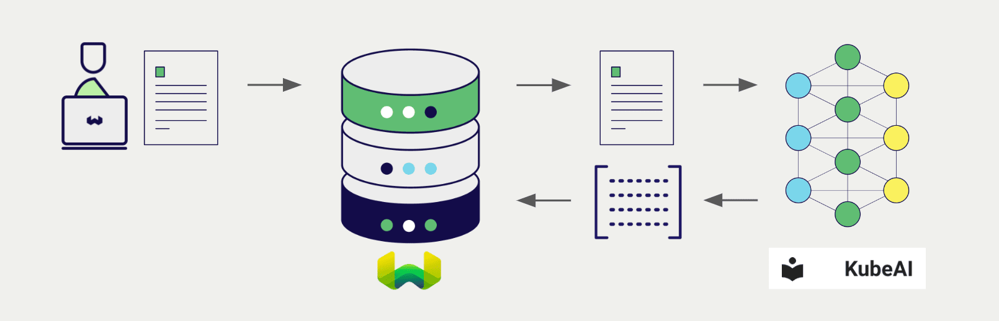
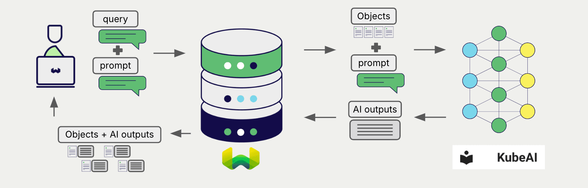

<!-- Note: for images, use https://docs.google.com/presentation/d/15opIcJuaIjEEcs_1Zm8B6pccox2p7_MHSjCnRv4dPfU/edit?usp=sharing -->

[KubeAI](https://github.com/substratusai/kubeai) provides offers a wide range of models for natural language processing and generation through OpenAI-style API endpoints. Weaviate seamlessly integrates with KubeAI's APIs, allowing users to leverage any KubeAI models directly within the Weaviate database.

These integrations empower developers to build sophisticated AI-driven applications with ease.

## Integrations with KubeAI

### Embedding models for semantic search

KubeAI's embedding models transform text data into high-dimensional vector representations, capturing semantic meaning and context.

[Weaviate integrates with KubeAI's embedding endpoint](./embeddings.md) to enable seamless vectorization of data. This integration allows users to perform semantic and hybrid search operations without the need for additional preprocessing or data transformation steps.

[KubeAI embedding integration page](./embeddings.md)

### Generative AI models for RAG

KubeAI's generative AI models can generate human-like text based on given prompts and contexts.

[Weaviate's generative AI integration](./generative.md) enables users to perform retrieval augmented generation (RAG) directly within the Weaviate database. This combines Weaviate's efficient storage and fast retrieval capabilities with KubeAI's generative AI models to generate personalized and context-aware responses.

[KubeAI generative AI integration page](./generative.md)

## Summary

These integrations enable developers to leverage KubeAI's powerful models directly within Weaviate.

In turn, they simplify the process of building AI-driven applications to speed up your development process, so that you can focus on creating innovative solutions.

## Get started

Deploy KubeAI in a Kubernetes cluster with an embedding and generative model. For more specific instructions, see this [KubeAI deployment guide](https://www.kubeai.org/tutorials/weaviate/#kubeai-configuration).

Then, go to the relevant integration page to learn how to configure Weaviate with the KubeAI models and start using them in your applications.

- [Text Embeddings](./embeddings.md)
- [Generative AI](./generative.md)

## Other third party integrations

import IntegrationLinkBack from '/_includes/integrations/link-back.mdx';

<IntegrationLinkBack/>

## Questions and feedback

import DocsFeedback from '/_includes/docs-feedback.mdx';

<DocsFeedback/>
