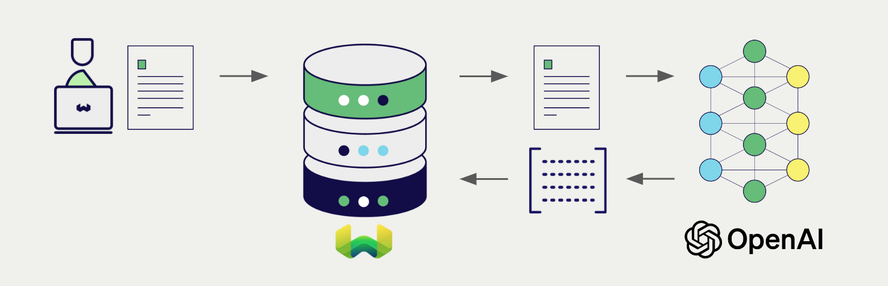
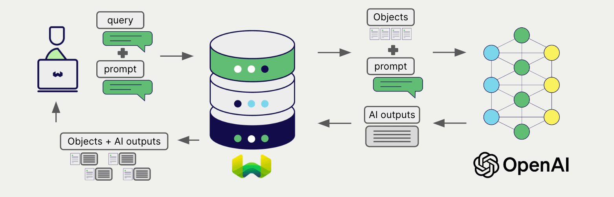

import BetaPageNote from '../_includes/beta_pages.md';

<BetaPageNote />

[KubeAI](https://github.com/substratusai/kubeai) provides private OpenAI compatible API endpoint for OSS or custom LLMs for both embeddings and generation.
Weaviate seamlessly integrates with OpenAI's APIs, allowing users to leverage any KubeAI models directly within the Weaviate database.

These integrations empower developers to build sophisticated AI-driven applications with ease.

## Integrations with KubeAI

### Embedding models for semantic search



OpenAI's embedding models transform text data into high-dimensional vector representations, capturing semantic meaning and context.

[Weaviate integrates with KubeAI's embedding endpoint](./embeddings.md) to enable seamless vectorization of data. This integration allows users to perform semantic and hybrid search operations without the need for additional preprocessing or data transformation steps.

[KubeAI embedding integration page](./embeddings.md)

### Generative AI models for RAG



OpenAI's generative AI models can generate human-like text based on given prompts and contexts.

[Weaviate's generative AI integration](./generative.md) enables users to perform retrieval augmented generation (RAG) directly within the Weaviate database. This combines Weaviate's efficient storage and fast retrieval capabilities with OpenAI's generative AI models to generate personalized and context-aware responses.

[KubeAI generative AI integration page](./generative.md)

## Summary

These integrations enable developers to leverage OpenAI's powerful models directly within Weaviate.

In turn, they simplify the process of building AI-driven applications to speed up your development process, so that you can focus on creating innovative solutions.

## Get started

Deploy KubeAI inside your Kubernetes cluster with an embedding and generative model.

Create a file named `kubeai-values.yaml` with the following content:

```yaml
models:
  catalog:
    text-embedding-ada-002:
      enabled: true
      minReplicas: 1
      features: ["TextEmbedding"]
      owner: nomic
      url: "ollama://nomic-embed-text"
      engine: OLlama
      resourceProfile: cpu:1
    gpt-3.5-turbo:
      enabled: true
      minReplicas: 1
      features: ["TextGeneration"]
      owner: google
      url: "ollama://gemma2:2b"
      engine: OLlama
      resourceProfile: cpu:2
```

Deploy KubeAI by running the following command:

```bash
helm repo add kubeai https://www.kubeai.org
helm upgrade --install kubeai kubeai/kubeai \
    -f ./kubeai-values.yaml
```

You can use the `kubeai` service as the OpenAI endpoint if
Weaviate is deployed within the same Kubernetes cluster. Otherwise,
expose the `kubeai` service as a LoadBalancer.

Within Kubernetes cluster:
```bash
OPENAI_BASEURL=http://kubeai/openai
```

Outside Kubernetes cluster:
```bash
OPENAI_BASEURL=http://<kubeai-loadbalancer-ip>/openai
```

Then, go to the relevant integration page to learn how to configure Weaviate with the KubeAI:

- [Text Embeddings](./embeddings.md)
- [Generative AI](./generative.md)

## Other third party integrations

import IntegrationLinkBack from '/_includes/integrations/link-back.mdx';

<IntegrationLinkBack/>

## Questions and feedback

import DocsFeedback from '/_includes/docs-feedback.mdx';

<DocsFeedback/>
