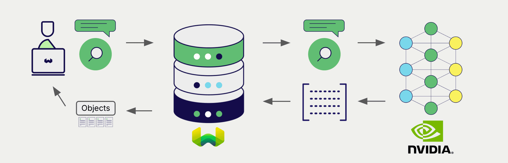

# NVIDIA Multimodal Embeddings with Weaviate

:::info Added in `v1.28.5`, `v1.29.0`
:::

import Tabs from '@theme/Tabs';
import TabItem from '@theme/TabItem';
import FilteredTextBlock from '@site/src/components/Documentation/FilteredTextBlock';
import PyConnect from '!!raw-loader!../_includes/provider.connect.py';
import TSConnect from '!!raw-loader!../_includes/provider.connect.ts';
import PyCode from '!!raw-loader!../_includes/provider.vectorizer.py';
import TSCode from '!!raw-loader!../_includes/provider.vectorizer.ts';

Weaviate's integration with NVIDIA's APIs allows you to access their models' capabilities directly from Weaviate.

[Configure a Weaviate vector index](#configure-the-vectorizer) to use a NVIDIA embedding model, and Weaviate will generate embeddings for various operations using the specified model and your NVIDIA NIM API key. This feature is called the *vectorizer*.

At [import time](#data-import), Weaviate generates multimodal object embeddings and saves them into the index. For [vector](#vector-near-text-search) and [hybrid](#hybrid-search) search operations, Weaviate converts text queries into embeddings. [Multimodal search operations](#vector-near-media-search) are also supported.

## Requirements

### Weaviate configuration

Your Weaviate instance must be configured with the NVIDIA vectorizer integration (`multi2vec-nvidia`) module.

  
For Weaviate Cloud (WCD) users

This integration is enabled by default on Weaviate Cloud (WCD) serverless instances.

  
For self-hosted users

- Check the [cluster metadata](../../config-refs/meta.md) to verify if the module is enabled.
- Follow the [how-to configure modules](../../configuration/modules.md) guide to enable the module in Weaviate.

### API credentials

You must provide a valid NVIDIA NIM API key to Weaviate for this integration. Go to [NVIDIA](https://build.nvidia.com/) to sign up and obtain an API key.

Provide the API key to Weaviate using one of the following methods:

- Set the `NVIDIA_APIKEY` environment variable that is available to Weaviate.
- Provide the API key at runtime, as shown in the examples below.

<Tabs groupId="languages">

 <TabItem value="py" label="Python API v4">
    <FilteredTextBlock
      text={PyConnect}
      startMarker="# START NVIDIAInstantiation"
      endMarker="# END NVIDIAInstantiation"
      language="py"
    />
  </TabItem>

 <TabItem value="js" label="JS/TS API v3">
    <FilteredTextBlock
      text={TSConnect}
      startMarker="// START NVIDIAInstantiation"
      endMarker="// END NVIDIAInstantiation"
      language="ts"
    />
  </TabItem>

</Tabs>

## Configure the vectorizer

[Configure a Weaviate index](../../manage-data/collections.mdx#specify-a-vectorizer) as follows to use a NVIDIA embedding model:

<Tabs groupId="languages">
  <TabItem value="py" label="Python API v4">
    <FilteredTextBlock
      text={PyCode}
      startMarker="# START BasicMMVectorizerNVIDIA"
      endMarker="# END BasicMMVectorizerNVIDIA"
      language="py"
    />
  </TabItem>

  <TabItem value="js" label="JS/TS API v3">
    <FilteredTextBlock
      text={TSCode}
      startMarker="// START BasicMMVectorizerNVIDIA"
      endMarker="// END BasicMMVectorizerNVIDIA"
      language="ts"
    />
  </TabItem>

</Tabs>

### Select a model

You can specify one of the [available models](#available-models) for the vectorizer to use, as shown in the following configuration example.

<Tabs groupId="languages">
  <TabItem value="py" label="Python API v4">
    <FilteredTextBlock
      text={PyCode}
      startMarker="# START MMVectorizerNVIDIACustomModel"
      endMarker="# END MMVectorizerNVIDIACustomModel"
      language="py"
    />
  </TabItem>

  <TabItem value="js" label="JS/TS API v3">
    <FilteredTextBlock
      text={TSCode}
      startMarker="// START MMVectorizerNVIDIACustomModel"
      endMarker="// END MMVectorizerNVIDIACustomModel"
      language="ts"
    />
  </TabItem>

</Tabs>

You can [specify](#vectorizer-parameters) one of the [available models](#available-models) for Weaviate to use. The [default model](#available-models) is used if no model is specified.

import VectorizationBehavior from '/_includes/vectorization.behavior.mdx';

  
Vectorization behavior

<VectorizationBehavior/>

### Vectorizer parameters

The following examples show how to configure NVIDIA-specific options.

<Tabs groupId="languages">
  <TabItem value="py" label="Python API v4">
    <FilteredTextBlock
      text={PyCode}
      startMarker="# START FullMMVectorizerNVIDIA"
      endMarker="# END FullMMVectorizerNVIDIA"
      language="py"
    />
  </TabItem>

  <TabItem value="js" label="JS/TS API v3">
    <FilteredTextBlock
      text={TSCode}
      startMarker="// START FullMMVectorizerNVIDIA"
      endMarker="// END FullMMVectorizerNVIDIA"
      language="ts"
    />
  </TabItem>

</Tabs>

For further details on model parameters, see the [NVIDIA NIM API documentation](https://docs.api.nvidia.com/nim/reference/retrieval-apis).

## Data import

After configuring the vectorizer, [import data](../../manage-data/import.mdx) into Weaviate. Weaviate generates embeddings for text objects using the specified model.

<Tabs groupId="languages">

 <TabItem value="py" label="Python API v4">
    <FilteredTextBlock
      text={PyCode}
      startMarker="# START MMBatchImportExample"
      endMarker="# END MMBatchImportExample"
      language="py"
    />
  </TabItem>

 <TabItem value="js" label="JS/TS API v3">
    <FilteredTextBlock
      text={TSCode}
      startMarker="// START MMBatchImportExample"
      endMarker="// END MMBatchImportExample"
      language="ts"
    />
  </TabItem>

</Tabs>

:::tip Re-use existing vectors
If you already have a compatible model vector available, you can provide it directly to Weaviate. This can be useful if you have already generated embeddings using the same model and want to use them in Weaviate, such as when migrating data from another system.
:::

## Searches

Once the vectorizer is configured, Weaviate will perform vector and hybrid search operations using the specified NVIDIA model.

### Vector (near text) search

When you perform a [vector search](../../search/similarity.md#search-with-text), Weaviate converts the text query into an embedding using the specified model and returns the most similar objects from the database.

The query below returns the `n` most similar objects from the database, set by `limit`.

<Tabs groupId="languages">

 <TabItem value="py" label="Python API v4">
    <FilteredTextBlock
      text={PyCode}
      startMarker="# START NearTextExample"
      endMarker="# END NearTextExample"
      language="py"
    />
  </TabItem>

 <TabItem value="js" label="JS/TS API v3">
    <FilteredTextBlock
      text={TSCode}
      startMarker="// START NearTextExample"
      endMarker="// END NearTextExample"
      language="ts"
    />
  </TabItem>

</Tabs>

### Hybrid search

:::info What is a hybrid search?
A hybrid search performs a vector search and a keyword (BM25) search, before [combining the results](../../search/hybrid.md#change-the-ranking-method) to return the best matching objects from the database.
:::

When you perform a [hybrid search](../../search/hybrid.md), Weaviate converts the text query into an embedding using the specified model and returns the best scoring objects from the database.

The query below returns the `n` best scoring objects from the database, set by `limit`.

<Tabs groupId="languages">

 <TabItem value="py" label="Python API v4">
    <FilteredTextBlock
      text={PyCode}
      startMarker="# START HybridExample"
      endMarker="# END HybridExample"
      language="py"
    />
  </TabItem>

 <TabItem value="js" label="JS/TS API v3">
    <FilteredTextBlock
      text={TSCode}
      startMarker="// START HybridExample"
      endMarker="// END HybridExample"
      language="ts"
    />
  </TabItem>

</Tabs>

### Vector (near media) search

When you perform a media search such as a [near image search](../../search/similarity.md#search-with-image), Weaviate converts the query into an embedding using the specified model and returns the most similar objects from the database.

To perform a near media search such as near image search, convert the media query into a base64 string and pass it to the search query.

The query below returns the `n` most similar objects to the input image from the database, set by `limit`.

<Tabs groupId="languages">

 <TabItem value="py" label="Python API v4">
    <FilteredTextBlock
      text={PyCode}
      startMarker="# START NearImageExample"
      endMarker="# END NearImageExample"
      language="py"
    />
  </TabItem>

 <TabItem value="js" label="JS/TS API v3">
    <FilteredTextBlock
      text={TSCode}
      startMarker="// START NearImageExample"
      endMarker="// END NearImageExample"
      language="ts"
    />
  </TabItem>

</Tabs>

## References

### Available models

You can use any multimodal embedding model [on NVIDIA NIM APIs](https://build.nvidia.com/models) with Weaviate.

The default model is `nvidia/nvclip`.

## Further resources

### Other integrations

- [NVIDIA text embedding models + Weaviate](./embeddings.md).
- [NVIDIA generative models + Weaviate](./generative.md).
- [NVIDIA reranker models + Weaviate](./reranker.md).

### Code examples

Once the integrations are configured at the collection, the data management and search operations in Weaviate work identically to any other collection. See the following model-agnostic examples:

- The [how-to: manage data](../../manage-data/index.md) guides show how to perform data operations (i.e. create, update, delete).
- The [how-to: search](../../search/index.md) guides show how to perform search operations (i.e. vector, keyword, hybrid) as well as retrieval augmented generation.

### External resources

- [NVIDIA NIM API documentation](https://docs.api.nvidia.com/nim/)

## Questions and feedback

import DocsFeedback from '/_includes/docs-feedback.mdx';

<DocsFeedback/>
