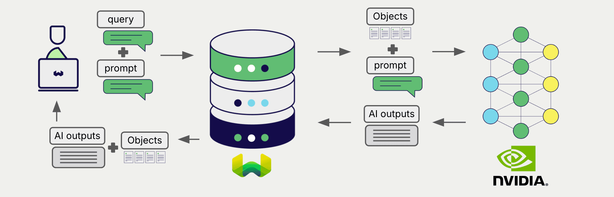

# NVIDIA Generative AI with Weaviate

import Tabs from '@theme/Tabs';
import TabItem from '@theme/TabItem';
import FilteredTextBlock from '@site/src/components/Documentation/FilteredTextBlock';
import PyConnect from '!!raw-loader!../_includes/provider.connect.py';
import TSConnect from '!!raw-loader!../_includes/provider.connect.ts';
import PyCode from '!!raw-loader!../_includes/provider.generative.py';
import TSCode from '!!raw-loader!../_includes/provider.generative.ts';

Weaviate's integrations with NVIDIA NIM API allows you to access a variety of generative models directly from Weaviate.

[Configure a Weaviate collection](#configure-collection) to use generative AI models on NVIDIA. Weaviate will perform Retrieval Augmented Generation (RAG) using the specified model using your NVIDIA NIM API Key.

More specifically, Weaviate will perform a search, retrieve the most relevant objects, and then pass them to the generative model on NVIDIA to generate outputs.

## Requirements

### Weaviate configuration

Your Weaviate instance must be configured with the NVIDIA generative (`generative-nvidia`) module.

  
For Weaviate Cloud (WCD) users

This integration is enabled by default on Weaviate Cloud (WCD) serverless instances.

  
For self-hosted users

- Check the [cluster metadata](../../config-refs/meta.md) to verify if the module is enabled.
- Follow the [how-to configure modules](../../configuration/modules.md) guide to enable the module in Weaviate.

### API credentials

You must provide a valid API key to Weaviate for this integration. [Select a model](https://build.nvidia.com/models) and click on the `Get API Key` button.

Provide the API key to Weaviate using one of the following methods:

- Set the `NVIDIA_TOKEN` environment variable that is available to Weaviate.
- Provide the token at runtime, as shown in the examples below.

<Tabs groupId="languages">

 <TabItem value="py" label="Python API v4">
    <FilteredTextBlock
      text={PyConnect}
      startMarker="# START NVIDIAInstantiation"
      endMarker="# END NVIDIAInstantiation"
      language="py"
    />
  </TabItem>

 <TabItem value="js" label="JS/TS API v3">
    <FilteredTextBlock
      text={TSConnect}
      startMarker="// START NVIDIAInstantiation"
      endMarker="// END NVIDIAInstantiation"
      language="ts"
    />
  </TabItem>

</Tabs>

## Configure collection

import MutableGenerativeConfig from '/_includes/mutable-generative-config.md';

<MutableGenerativeConfig />

[Configure a Weaviate index](../../manage-data/collections.mdx#specify-a-generative-model-integration) as follows to use an NVIDIA generative AI model:

<Tabs groupId="languages">
  <TabItem value="py" label="Python API v4">
    <FilteredTextBlock
      text={PyCode}
      startMarker="# START BasicGenerativeNVIDIA"
      endMarker="# END BasicGenerativeNVIDIA"
      language="py"
    />
  </TabItem>

  <TabItem value="js" label="JS/TS API v3">
    <FilteredTextBlock
      text={TSCode}
      startMarker="// START BasicGenerativeNVIDIA"
      endMarker="// END BasicGenerativeNVIDIA"
      language="ts"
    />
  </TabItem>

</Tabs>

### Generative parameters

Configure the following generative parameters to customize the model behavior.

<Tabs groupId="languages">
  <TabItem value="py" label="Python API v4">
    <FilteredTextBlock
      text={PyCode}
      startMarker="# START FullGenerativeNVIDIA"
      endMarker="# END FullGenerativeNVIDIA"
      language="py"
    />
  </TabItem>

  <TabItem value="js" label="JS/TS API v3">
    <FilteredTextBlock
      text={TSCode}
      startMarker="// START FullGenerativeNVIDIA"
      endMarker="// END FullGenerativeNVIDIA"
      language="ts"
    />
  </TabItem>

</Tabs>

For further details on model parameters, see the [NVIDIA API documentation](https://docs.api.nvidia.com/nim/reference/llm-apis).

## Retrieval augmented generation

After configuring the generative AI integration, perform RAG operations, either with the [single prompt](#single-prompt) or [grouped task](#grouped-task) method.

### Single prompt

To generate text for each object in the search results, use the single prompt method.

The example below generates outputs for each of the `n` search results, where `n` is specified by the `limit` parameter.

When creating a single prompt query, use braces `{}` to interpolate the object properties you want Weaviate to pass on to the language model. For example, to pass on the object's `title` property, include `{title}` in the query.

<Tabs groupId="languages">

 <TabItem value="py" label="Python API v4">
    <FilteredTextBlock
      text={PyCode}
      startMarker="# START SinglePromptExample"
      endMarker="# END SinglePromptExample"
      language="py"
    />
  </TabItem>

 <TabItem value="js" label="JS/TS API v3">
    <FilteredTextBlock
      text={TSCode}
      startMarker="// START SinglePromptExample"
      endMarker="// END SinglePromptExample"
      language="ts"
    />
  </TabItem>

</Tabs>

### Grouped task

To generate one text for the entire set of search results, use the grouped task method.

In other words, when you have `n` search results, the generative model generates one output for the entire group.

<Tabs groupId="languages">

 <TabItem value="py" label="Python API v4">
    <FilteredTextBlock
      text={PyCode}
      startMarker="# START GroupedTaskExample"
      endMarker="# END GroupedTaskExample"
      language="py"
    />
  </TabItem>

 <TabItem value="js" label="JS/TS API v3">
    <FilteredTextBlock
      text={TSCode}
      startMarker="// START GroupedTaskExample"
      endMarker="// END GroupedTaskExample"
      language="ts"
    />
  </TabItem>

</Tabs>

## References

### Available models

* `meta/llama-3.2-3b-instruct` (default)
* `meta/llama-3.3-70b-instruct`

You can use any generative model [on NVIDIA NIM APIs](https://build.nvidia.com/models) with Weaviate.

## Further resources

### Code examples

Once the integrations are configured at the collection, the data management and search operations in Weaviate work identically to any other collection. See the following model-agnostic examples:

- The [how-to: manage data](../../manage-data/index.md) guides show how to perform data operations (i.e. create, update, delete).
- The [how-to: search](../../search/index.md) guides show how to perform search operations (i.e. vector, keyword, hybrid) as well as retrieval augmented generation.

### References

- [NVIDIA NIM API Documentation](https://docs.api.nvidia.com/nim/reference/llm-apis)

import DocsFeedback from '/_includes/docs-feedback.mdx';

<DocsFeedback/>
