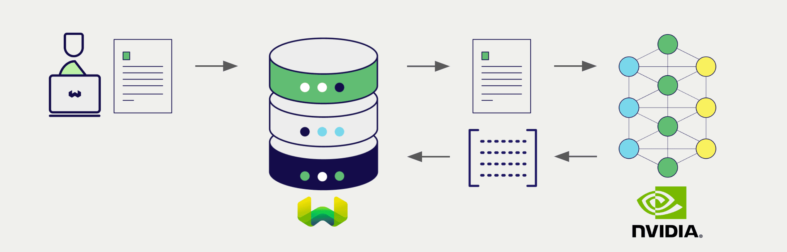
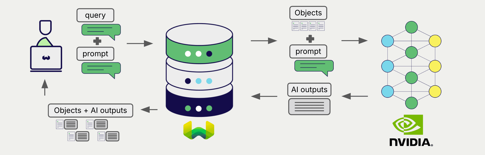
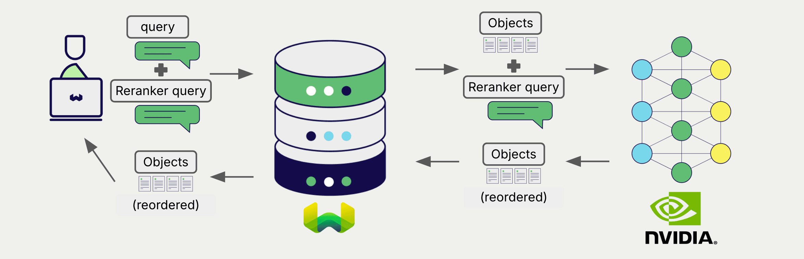

<!-- Note: for images, use https://docs.google.com/presentation/d/15opIcJuaIjEEcs_1Zm8B6pccox2p7_MHSjCnRv4dPfU/edit?usp=sharing -->

NVIDIA NIM microservices offer a wide range of models for natural language processing and generation. Weaviate seamlessly integrates with NVIDIA, allowing users to leverage the inference engine within the Weaviate database.

These integrations empower developers to build sophisticated AI-driven applications with ease.

## Integrations with NVIDIA

### Embedding models for vector search

NVIDIA's embedding models transform text data into high-dimensional vector representations, capturing meaning and context.

[Weaviate integrates with NVIDIA's embedding models](./embeddings.md) to enable seamless vectorization of data. This integration allows users to perform semantic and hybrid search operations without the need for additional preprocessing or data transformation steps.

[NVIDIA embedding integration page](./embeddings.md)
[NVIDIA multimodal embedding integration page](./embeddings-multimodal.md)

### Generative AI models for RAG

Generative AI models on NVIDIA can generate human-like text based on given prompts and contexts.

[Weaviate's generative AI integration](./generative.md) enables users to perform Retrieval Augmented Generation (RAG) directly from the Weaviate database. This combines Weaviate's efficient storage and fast retrieval capabilities with generative AI models on NVIDIA to generate personalized and context-aware responses.

[NVIDIA generative AI integration page](./generative.md)

<!-- ### Reranker models

NVIDIA's reranker models are designed to improve the relevance and ranking of search results.

[The Weaviate reranker integration](./reranker.md) allows users to easily refine their search results by leveraging NVIDIA's reranker models.

[NVIDIA reranker integration page](./reranker.md) -->

## Summary

This integration enables developers to harness the power of NVIDIA's inference engine within Weaviate.

In turn, it simplifies the process of building AI-driven applications to speed up your development process, so that you can focus on creating innovative solutions.

## Get started

You must provide a valid NVIDIA API key to Weaviate for this integration. Go to [NVIDIA](https://build.nvidia.com/) to sign up and obtain an API key.

Then, go to the relevant integration page to learn how to configure Weaviate with the Cohere models and start using them in your applications.

- [Text Embeddings](./embeddings.md)
- [Multimodal Embeddings](./embeddings-multimodal.md)
- [Generative AI](./generative.md)
- [Reranker](./reranker.md)

## Questions and feedback

import DocsFeedback from '/_includes/docs-feedback.mdx';

<DocsFeedback/>
