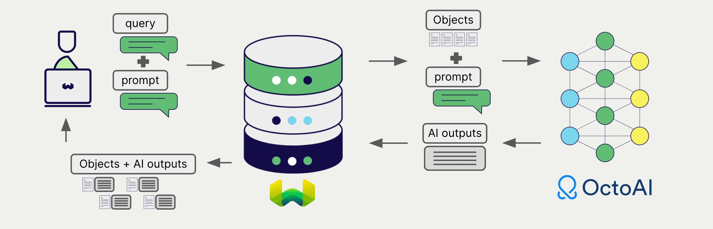

import BetaPageNote from '../_includes/beta_pages.md';

<BetaPageNote />

:::info Added in `v1.25.0`
:::

OctoAI offers a wide range of models for natural language processing and generation. Weaviate seamlessly integrates with OctoAI's APIs, allowing users to leverage OctoAI's models directly within the Weaviate database.

These integrations empower developers to build sophisticated AI-driven applications with ease.

## Integrations with OctoAI

### Embedding models for semantic search

OctoAI's embedding models transform text data into high-dimensional vector representations, capturing semantic meaning and context.

[Weaviate integrates with OctoAI's embedding models](./embeddings.md) to enable seamless vectorization of data. This integration allows users to perform semantic and hybrid search operations without the need for additional preprocessing or data transformation steps.

[OctoAI embedding integration page](./embeddings.md)

### Generative AI models for RAG

OctoAI's generative AI models can generate human-like text based on given prompts and contexts.

[Weaviate's generative AI integration](./generative.md) enables users to perform retrieval augmented generation (RAG) directly within the Weaviate database. This combines Weaviate's efficient storage and fast retrieval capabilities with OctoAI's generative AI models to generate personalized and context-aware responses.

[OctoAI generative AI integration page](./generative.md)

## Summary

These integrations enable developers to leverage OctoAI's powerful models directly within Weaviate.

In turn, they simplify the process of building AI-driven applications to speed up your development process, so that you can focus on creating innovative solutions.

## Get started

You must provide a valid OctoAI API key to Weaviate for these integrations. Go to [OctoAI](https://octo.ai/) to sign up and obtain an API key.

Then, go to the relevant integration page to learn how to configure Weaviate with the OctoAI models and start using them in your applications.

- [Text Embeddings](./embeddings.md)
- [Generative AI](./generative.md)

import DocsFeedback from '/_includes/docs-feedback.mdx';

<DocsFeedback/>
