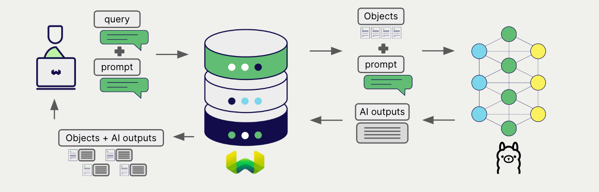
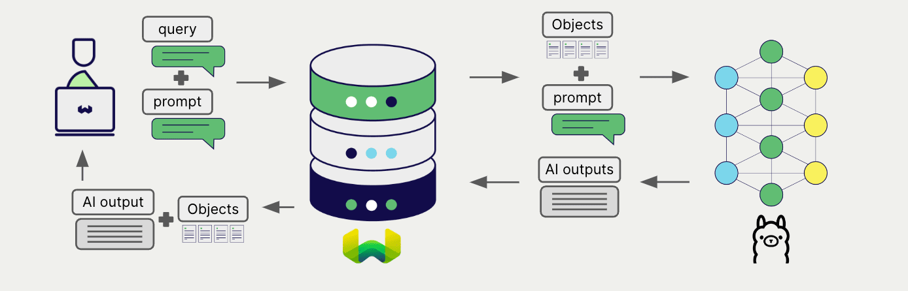

# Ollama Generative AI with Weaviate

import BetaPageNote from '../_includes/beta_pages.md';

<BetaPageNote />

import Tabs from '@theme/Tabs';
import TabItem from '@theme/TabItem';
import FilteredTextBlock from '@site/src/components/Documentation/FilteredTextBlock';
import PyConnect from '!!raw-loader!../_includes/provider.connect.local.py';
import TSConnect from '!!raw-loader!../_includes/provider.connect.local.ts';
import PyCode from '!!raw-loader!../_includes/provider.generative.py';
import TSCode from '!!raw-loader!../_includes/provider.generative.ts';

Weaviate's integration with Ollama's models allows you to access their models' capabilities directly from Weaviate.

[Configure a Weaviate collection](#configure-collection) to use an Ollama generative AI model, and Weaviate will perform retrieval augmented generation (RAG) using the specified model via your local Ollama instance.

More specifically, Weaviate will perform a search, retrieve the most relevant objects, and then pass them to the Ollama generative model to generate outputs.

## Requirements

### Ollama

This integration requires a locally running Ollama instance with your selected model available. Refer to the [Ollama documentation](https://ollama.com/) for installation and model download instructions.

### Weaviate configuration

Your Weaviate instance must be configured with the Ollama generative AI integration (`generative-ollama`) module.

  
For Weaviate Cloud (WCD) users

This integration is not available for Weaviate Cloud (WCD) serverless instances, as it requires a locally running Ollama instance.

  
For self-hosted users

- Check the [cluster metadata](../../config-refs/meta.md) to verify if the module is enabled.
- Follow the [how-to configure modules](../../configuration/modules.md) guide to enable the module in Weaviate.

Your Weaviate instance must be able to access the Ollama endpoint. If you area a Docker user, specify the [Ollama endpoint using `host.docker.internal`](#configure-collection) alias to access the host machine from within the container.

### Credentials

As this integration connects to a local Ollama container, no additional credentials (e.g. API key) are required. Connect to Weaviate as usual, such as in the examples below.

<Tabs groupId="languages">

 <TabItem value="py" label="Python API v4">
    <FilteredTextBlock
      text={PyConnect}
      startMarker="# START BasicInstantiation"
      endMarker="# END BasicInstantiation"
      language="py"
    />
  </TabItem>

 <TabItem value="js" label="JS/TS (API v3)">
    <FilteredTextBlock
      text={TSConnect}
      startMarker="// START BasicInstantiation"
      endMarker="// END BasicInstantiation"
      language="ts"
    />
  </TabItem>

</Tabs>

## Configure collection

[Configure a Weaviate collection](../../manage-data/collections.mdx#specify-a-generative-module) to use an Ollama generative AI model as follows:

<Tabs groupId="languages">
  <TabItem value="py" label="Python API v4">
    <FilteredTextBlock
      text={PyCode}
      startMarker="# START BasicGenerativeOllama"
      endMarker="# END BasicGenerativeOllama"
      language="py"
    />
  </TabItem>

  <TabItem value="js" label="JS/TS (API v3)">
    <FilteredTextBlock
      text={TSCode}
      startMarker="// START BasicGenerativeOllama"
      endMarker="// END BasicGenerativeOllama"
      language="ts"
    />
  </TabItem>

</Tabs>

The default model (`llama3`) is used if no model is specified.

## Retrieval augmented generation

After configuring the generative AI integration, perform RAG operations, either with the [single prompt](#single-prompt) or [grouped task](#grouped-task) method.

### Single prompt

To generate text for each object in the search results, use the single prompt method.

The example below generates outputs for each of the `n` search results, where `n` is specified by the `limit` parameter.

When creating a single prompt query, use braces `{}` to interpolate the object properties you want Weaviate to pass on to the language model. For example, to pass on the object's `title` property, include `{title}` in the query.

<Tabs groupId="languages">

 <TabItem value="py" label="Python API v4">
    <FilteredTextBlock
      text={PyCode}
      startMarker="# START SinglePromptExample"
      endMarker="# END SinglePromptExample"
      language="py"
    />
  </TabItem>

 <TabItem value="js" label="JS/TS (API v3)">
    <FilteredTextBlock
      text={TSCode}
      startMarker="// START SinglePromptExample"
      endMarker="// END SinglePromptExample"
      language="ts"
    />
  </TabItem>

</Tabs>

### Grouped task

To generate one text for the entire set of search results, use the grouped task method.

In other words, when you have `n` search results, the generative model generates one output for the entire group.

<Tabs groupId="languages">

 <TabItem value="py" label="Python API v4">
    <FilteredTextBlock
      text={PyCode}
      startMarker="# START GroupedTaskExample"
      endMarker="# END GroupedTaskExample"
      language="py"
    />
  </TabItem>

 <TabItem value="js" label="JS/TS (API v3)">
    <FilteredTextBlock
      text={TSCode}
      startMarker="// START GroupedTaskExample"
      endMarker="// END GroupedTaskExample"
      language="ts"
    />
  </TabItem>

</Tabs>

## References

<!-- Hiding "full" examples as no other parameters exist than shown above -->
<!-- <Tabs groupId="languages">
  <TabItem value="py" label="Python API v4">
    <FilteredTextBlock
      text={PyCode}
      startMarker="# START FullGenerativeOllama"
      endMarker="# END FullGenerativeOllama"
      language="py"
    />
  </TabItem>

  <TabItem value="js" label="JS/TS (API v3)">
    <FilteredTextBlock
      text={TSCode}
      startMarker="// START FullGenerativeOllama"
      endMarker="// END FullGenerativeOllama"
      language="ts"
    />
  </TabItem>

</Tabs> -->

### Available models

See the [Ollama documentation](https://ollama.com/library) for a list of available models. Note that this list includes both generative models and embedding models; specify a generative model for the `generative-ollama` module.

Download the desired model with `ollama pull <model-name>`.

## Further resources

### Other integrations

- [Ollama embedding models + Weaviate](./embeddings.md).

### Code examples

Once the integrations are configured at the collection, the data management and search operations in Weaviate work identically to any other collection. See the following model-agnostic examples:

- The [how-to: manage data](../../manage-data/index.md) guides show how to perform data operations (i.e. create, update, delete).
- The [how-to: search](../../search/index.md) guides show how to perform search operations (i.e. vector, keyword, hybrid) as well as retrieval augmented generation.

### References

- [Ollama models](https://ollama.com/library)
- [Ollama repository](https://github.com/ollama/ollama)
- [How to change the host and port of the Ollama server](https://github.com/ollama/ollama/blob/main/docs/faq.md#how-can-i-expose-ollama-on-my-network)

import DocsFeedback from '/_includes/docs-feedback.mdx';

<DocsFeedback/>
