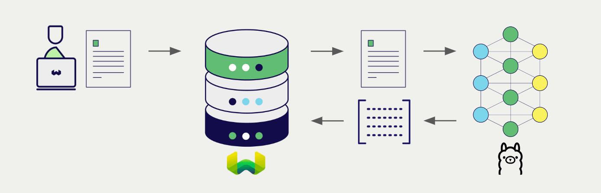

import BetaPageNote from '../_includes/beta_pages.md';

<BetaPageNote />

The Ollama library allows you to easily run a wide range of models on your own device. Weaviate seamlessly integrates with the Ollama library, allowing users to leverage compatible models directly within the Weaviate database.

These integrations empower developers to build sophisticated AI-driven applications with ease.

## Integrations with Ollama

Weaviate integrates with compatible Ollama models by accessing the locally hosted Ollama API.

### Embedding models for semantic search

Ollama's embedding models transform text data into high-dimensional vector representations, capturing semantic meaning and context.

[Weaviate integrates with Ollama's embedding models](./embeddings.md) to enable seamless vectorization of data. This integration allows users to perform semantic and hybrid search operations without the need for additional preprocessing or data transformation steps.

[Ollama embedding integration page](./embeddings.md)

### Generative AI models for RAG

Ollama's generative AI models can generate human-like text based on given prompts and contexts.

[Weaviate's generative AI integration](./generative.md) enables users to perform retrieval augmented generation (RAG) directly within the Weaviate database. This combines Weaviate's efficient storage and fast retrieval capabilities with Ollama's generative AI models to generate personalized and context-aware responses.

[Ollama generative AI integration page](./generative.md)

## Summary

These integrations enable developers to leverage powerful Ollama models from directly within Weaviate.

In turn, they simplify the process of building AI-driven applications to speed up your development process, so that you can focus on creating innovative solutions.

## Get started

A locally hosted Weaviate instance is required for these integrations so that you can host your own Ollama models.

Go to the relevant integration page to learn how to configure Weaviate with the Ollama models and start using them in your applications.

- [Text Embeddings](./embeddings.md)
- [Generative AI](./generative.md)

import DocsFeedback from '/_includes/docs-feedback.mdx';

<DocsFeedback/>
