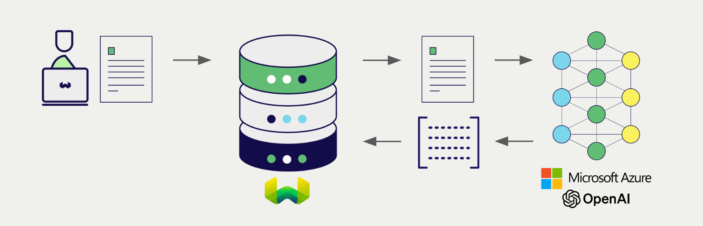
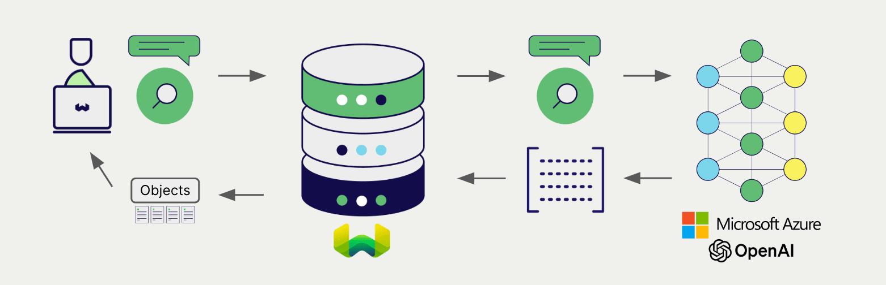

import BetaPageNote from '../_includes/beta_pages.md';

<BetaPageNote />

import Tabs from '@theme/Tabs';
import TabItem from '@theme/TabItem';
import FilteredTextBlock from '@site/src/components/Documentation/FilteredTextBlock';
import PyConnect from '!!raw-loader!../_includes/provider.connect.py';
import TSConnect from '!!raw-loader!../_includes/provider.connect.ts';
import PyCode from '!!raw-loader!../_includes/provider.vectorizer.py';
import TSCode from '!!raw-loader!../_includes/provider.vectorizer.ts';

# Azure OpenAI Embeddings with Weaviate

Weaviate's integration with Azure OpenAI's APIs allows you to access their models' capabilities directly from Weaviate.

[Configure a Weaviate vector index](#configure-the-vectorizer) to use an Azure OpenAI embedding model, and Weaviate will generate embeddings for various operations using the specified model and your Azure OpenAI API key. This feature is called the *vectorizer*.

At [import time](#data-import), Weaviate generates text object embeddings and saves them into the index. For [vector](#vector-near-text-search) and [hybrid](#hybrid-search) search operations, Weaviate converts text queries into embeddings.

## Requirements

### Weaviate configuration

Your Weaviate instance must be configured with the Azure OpenAI vectorizer integration (`text2vec-openai`) module.

  
For WCS (serverless) users

This integration is enabled by default on Weaviate Cloud Services (WCS) serverless managed instances.

  
For self-hosted users

- Check the [cluster metadata](../../config-refs/meta.md) to verify if the module is enabled.
- Follow the [how-to configure modules](../../configuration/modules.md) guide to enable the module in Weaviate.

### API credentials

You must provide a valid Azure OpenAI API key to Weaviate for this integration. Go to [Azure OpenAI](https://azure.microsoft.com/en-us/products/ai-services/openai-service) to sign up and obtain an API key.

Provide the API key to Weaviate using one of the following methods:

- Set the `AZURE_APIKEY` environment variable that is available to Weaviate.
- Provide the API key at runtime, as shown in the examples below.

<Tabs groupId="languages">

 <TabItem value="py" label="Python (v4)">
    <FilteredTextBlock
      text={PyConnect}
      startMarker="# START AzureOpenAIInstantiation"
      endMarker="# END AzureOpenAIInstantiation"
      language="py"
    />
  </TabItem>

 <TabItem value="js" label="JS/TS (Beta)">
    <FilteredTextBlock
      text={TSConnect}
      startMarker="// START AzureOpenAIInstantiation"
      endMarker="// END AzureOpenAIInstantiation"
      language="ts"
    />
  </TabItem>

</Tabs>

## Configure the vectorizer

[Configure a Weaviate index](../../manage-data/collections.mdx#specify-a-vectorizer) to use an Azure OpenAI embedding model by setting the vectorizer as follows:

<Tabs groupId="languages">
  <TabItem value="py" label="Python (v4)">
    <FilteredTextBlock
      text={PyCode}
      startMarker="# START BasicVectorizerAzureOpenAI"
      endMarker="# END BasicVectorizerAzureOpenAI"
      language="py"
    />
  </TabItem>

  <TabItem value="js" label="JS/TS (Beta)">
    <FilteredTextBlock
      text={TSCode}
      startMarker="// START BasicVectorizerAzureOpenAI"
      endMarker="// END BasicVectorizerAzureOpenAI"
      language="ts"
    />
  </TabItem>

</Tabs>

You can [specify](#vectorizer-parameters) one of the [available models](#available-models) for the vectorizer to use. The default model (`text-embedding-ada-002`) is used if no model is specified.

## Data import

After configuring the vectorizer, [import data](../../manage-data/import.mdx) into Weaviate. Weaviate generates embeddings for text objects using the specified model.

<Tabs groupId="languages">

 <TabItem value="py" label="Python (v4)">
    <FilteredTextBlock
      text={PyCode}
      startMarker="# START BatchImportExample"
      endMarker="# END BatchImportExample"
      language="py"
    />
  </TabItem>

 <TabItem value="js" label="JS/TS (Beta)">
    <FilteredTextBlock
      text={TSCode}
      startMarker="// START BatchImportExample"
      endMarker="// END BatchImportExample"
      language="ts"
    />
  </TabItem>

</Tabs>

:::tip Re-use existing vectors
If you already have a compatible model vector available, you can provide it directly to Weaviate. This can be useful if you have already generated embeddings using the same model and want to use them in Weaviate, such as when migrating data from another system.
:::

## Searches

Once the vectorizer is configured, Weaviate will perform vector and hybrid search operations using the specified Azure OpenAI model.

### Vector (near text) search

When you perform a [vector search](../../search/similarity.md#search-with-text), Weaviate converts the text query into an embedding using the specified model and returns the most similar objects from the database.

The query below returns the `n` most similar objects from the database, set by `limit`.

<Tabs groupId="languages">

 <TabItem value="py" label="Python (v4)">
    <FilteredTextBlock
      text={PyCode}
      startMarker="# START NearTextExample"
      endMarker="# END NearTextExample"
      language="py"
    />
  </TabItem>

 <TabItem value="js" label="JS/TS (Beta)">
    <FilteredTextBlock
      text={TSCode}
      startMarker="// START NearTextExample"
      endMarker="// END NearTextExample"
      language="ts"
    />
  </TabItem>

</Tabs>

### Hybrid search

:::info What is a hybrid search?
A hybrid search performs a vector search and a keyword (BM25) search, before [combining the results](../../search/hybrid.md#change-the-ranking-method) to return the best matching objects from the database.
:::

When you perform a [hybrid search](../../search/hybrid.md), Weaviate converts the text query into an embedding using the specified model returns the best scoring objects from the database.

The query below returns the `n` best scoring objects from the database, set by `limit`.

<Tabs groupId="languages">

 <TabItem value="py" label="Python (v4)">
    <FilteredTextBlock
      text={PyCode}
      startMarker="# START HybridExample"
      endMarker="# END HybridExample"
      language="py"
    />
  </TabItem>

 <TabItem value="js" label="JS/TS (Beta)">
    <FilteredTextBlock
      text={TSCode}
      startMarker="// START HybridExample"
      endMarker="// END HybridExample"
      language="ts"
    />
  </TabItem>

</Tabs>

## References

### Vectorizer parameters

The following examples show how to configure Azure OpenAI-specific options.

- `resource_name` (Required): The name of the Azure OpenAI resource to use.
- `deployment_id` (Required): The deployment ID of the Azure OpenAI resource.
- `base_url` (Optional): The base URL of the Azure OpenAI API.

<Tabs groupId="languages">
  <TabItem value="py" label="Python (v4)">
    <FilteredTextBlock
      text={PyCode}
      startMarker="# START FullVectorizerAzureOpenAI"
      endMarker="# END FullVectorizerAzureOpenAI"
      language="py"
    />
  </TabItem>

  <TabItem value="js" label="JS/TS (Beta)">
    <FilteredTextBlock
      text={TSCode}
      startMarker="// START FullVectorizerAzureOpenAI"
      endMarker="// END FullVectorizerAzureOpenAI"
      language="ts"
    />
  </TabItem>

</Tabs>

For further details on these parameters, please consult the [Azure OpenAI API documentation](https://learn.microsoft.com/en-us/azure/ai-services/openai/).

### Available models

Please refer to the [Azure OpenAI documentation](https://learn.microsoft.com/en-us/azure/ai-services/openai/concepts/models#embeddings-models) for a list of available models and their regional availability.

## Further resources

### Other integrations

- [Azure OpenAI generative models + Weaviate](./generative.md).

### Code examples

Once the integrations are configured at the collection, the data management and search operations in Weaviate work identically to any other collection. Accordingly, please refer to the following examples, which are model-agnostic:

- The [how-to: manage data](../../manage-data/index.md) guides show how to perform data operations (i.e. create, update, delete).
- The [how-to: search](../../search/index.md) guides show how to perform search operations (i.e. vector, keyword, hybrid) as well as retrieval augmented generation.

### External resources

- Azure OpenAI [API documentation](https://learn.microsoft.com/en-us/azure/ai-services/openai/)
- Azure OpenAI [models and availability](https://learn.microsoft.com/en-us/azure/ai-services/openai/concepts/models#embeddings-models)

import DocsFeedback from '/_includes/docs-feedback.mdx';

<DocsFeedback/>
