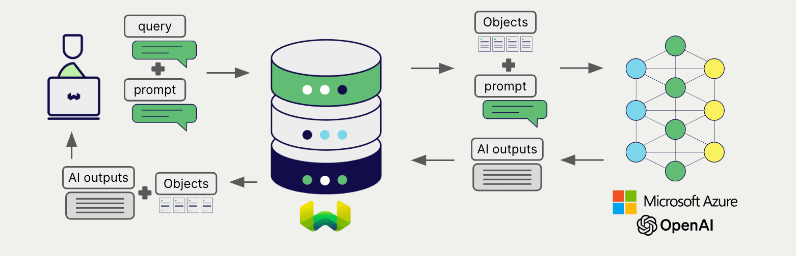

import BetaPageNote from '../_includes/beta_pages.md';

<BetaPageNote />

import Tabs from '@theme/Tabs';
import TabItem from '@theme/TabItem';
import FilteredTextBlock from '@site/src/components/Documentation/FilteredTextBlock';
import PyConnect from '!!raw-loader!../_includes/provider.connect.py';
import TSConnect from '!!raw-loader!../_includes/provider.connect.ts';
import PyCode from '!!raw-loader!../_includes/provider.generative.py';
import TSCode from '!!raw-loader!../_includes/provider.generative.ts';

# Azure OpenAI Generative AI with Weaviate

Weaviate's integration with Azure OpenAI's APIs allows you to access their models' capabilities directly from Weaviate.

[Configure a Weaviate collection](#configure-collection) to use an Azure OpenAI generative AI model, and Weaviate will perform retrieval augmented generation (RAG) using the specified model and your Azure OpenAI API key.

More specifically, Weaviate will perform a search, retrieve the most relevant objects, and then pass them to the Azure OpenAI generative model to generate outputs.

## Requirements

### Weaviate configuration

Your Weaviate instance must be configured with the Azure OpenAI generative AI integration (`generative-openai`) module.

  
For WCS (serverless) users

This integration is enabled by default on Weaviate Cloud Services (WCS) serverless managed instances.

  
For self-hosted users

- Check the [cluster metadata](../../config-refs/meta.md) to verify if the module is enabled.
- Follow the [how-to configure modules](../../configuration/modules.md) guide to enable the module in Weaviate.

### API credentials

You must provide a valid Azure OpenAI API key to Weaviate for this integration. Go to [Azure OpenAI](https://azure.microsoft.com/en-us/products/ai-services/openai-service) to sign up and obtain an API key.

Provide the API key to Weaviate using one of the following methods:

- Set the `AZURE_APIKEY` environment variable that is available to Weaviate.
- Provide the API key at runtime, as shown in the examples below.

<Tabs groupId="languages">

 <TabItem value="py" label="Python (v4)">
    <FilteredTextBlock
      text={PyConnect}
      startMarker="# START AzureOpenAIInstantiation"
      endMarker="# END AzureOpenAIInstantiation"
      language="py"
    />
  </TabItem>

 <TabItem value="js" label="JS/TS (Beta)">
    <FilteredTextBlock
      text={TSConnect}
      startMarker="// START AzureOpenAIInstantiation"
      endMarker="// END AzureOpenAIInstantiation"
      language="ts"
    />
  </TabItem>

</Tabs>

## Configure collection

[Configure a Weaviate collection](../../manage-data/collections.mdx#specify-a-generative-module) to use an OpenAI generative AI model as follows:

<Tabs groupId="languages">
  <TabItem value="py" label="Python (v4)">
    <FilteredTextBlock
      text={PyCode}
      startMarker="# START BasicGenerativeAzureOpenAI"
      endMarker="# END BasicGenerativeAzureOpenAI"
      language="py"
    />
  </TabItem>

  <TabItem value="js" label="JS/TS (Beta)">
    <FilteredTextBlock
      text={TSCode}
      startMarker="// START BasicGenerativeAzureOpenAI"
      endMarker="// END BasicGenerativeAzureOpenAI"
      language="ts"
    />
  </TabItem>

</Tabs>

You can [specify](#generative-parameters) one of the [available models](#available-models) for Weaviate to use. The default model (`gpt-3.5-turbo`) is used if no model is specified.

## Retrieval augmented generation

After configuring the generative AI integration, perform RAG operations, either with the [single prompt](#single-prompt) or [grouped task](#grouped-task) method.

### Single prompt

To generate text for each object in the search results, use the single prompt method.

The example below generates outputs for each of the `n` search results, where `n` is specified by the `limit` parameter.

When creating a single prompt query, use braces `{}` to interpolate the object properties you want Weaviate to pass on to the language model. For example, to pass on the object's `title` property, include `{title}` in the query.

<Tabs groupId="languages">

 <TabItem value="py" label="Python (v4)">
    <FilteredTextBlock
      text={PyCode}
      startMarker="# START SinglePromptExample"
      endMarker="# END SinglePromptExample"
      language="py"
    />
  </TabItem>

 <TabItem value="js" label="JS/TS (Beta)">
    <FilteredTextBlock
      text={TSCode}
      startMarker="// START SinglePromptExample"
      endMarker="// END SinglePromptExample"
      language="ts"
    />
  </TabItem>

</Tabs>

### Grouped task

To generate one text for the entire set of search results, use the grouped task method.

In other words, when you have `n` search results, the generative model generates one output for the entire group.

<Tabs groupId="languages">

 <TabItem value="py" label="Python (v4)">
    <FilteredTextBlock
      text={PyCode}
      startMarker="# START GroupedTaskExample"
      endMarker="# END GroupedTaskExample"
      language="py"
    />
  </TabItem>

 <TabItem value="js" label="JS/TS (Beta)">
    <FilteredTextBlock
      text={TSCode}
      startMarker="// START GroupedTaskExample"
      endMarker="// END GroupedTaskExample"
      language="ts"
    />
  </TabItem>

</Tabs>

## References

### Generative parameters

Configure the following generative parameters to customize the model behavior.

<Tabs groupId="languages">
  <TabItem value="py" label="Python (v4)">
    <FilteredTextBlock
      text={PyCode}
      startMarker="# START FullGenerativeAzureOpenAI"
      endMarker="# END FullGenerativeAzureOpenAI"
      language="py"
    />
  </TabItem>

  <TabItem value="js" label="JS/TS (Beta)">
    <FilteredTextBlock
      text={TSCode}
      startMarker="// START FullGenerativeAzureOpenAI"
      endMarker="// END FullGenerativeAzureOpenAI"
      language="ts"
    />
  </TabItem>

</Tabs>

For further details on these parameters, please consult the [Azure OpenAI API documentation](https://learn.microsoft.com/en-us/azure/ai-services/openai/).

### Available models

Please refer to the [Azure OpenAI documentation](https://learn.microsoft.com/en-us/azure/ai-services/openai/concepts/models) for a list of available models and their regional availability.

## Further resources

### Other integrations

- [Azure OpenAI embedding models + Weaviate](./embeddings.md).

### Code examples

Once the integrations are configured at the collection, the data management and search operations in Weaviate work identically to any other collection. Accordingly, please refer to the following examples, which are model-agnostic:

- The [how-to: manage data](../../manage-data/index.md) guides show how to perform data operations (i.e. create, update, delete).
- The [how-to: search](../../search/index.md) guides show how to perform search operations (i.e. vector, keyword, hybrid) as well as retrieval augmented generation.

### References

- Azure OpenAI [API documentation](https://learn.microsoft.com/en-us/azure/ai-services/openai/)
- Azure OpenAI [models and availability](https://learn.microsoft.com/en-us/azure/ai-services/openai/concepts/models)

import DocsMoreResources from '/_includes/more-resources-docs.md';

<DocsMoreResources />
