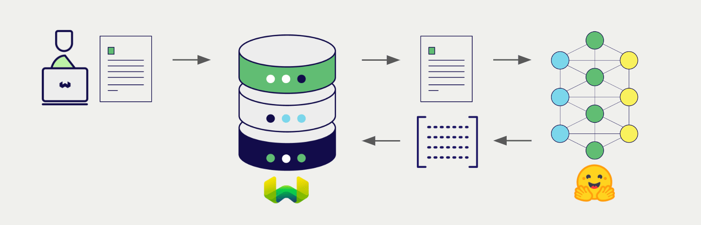
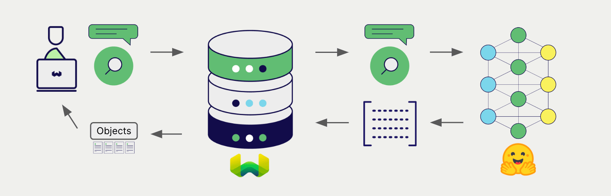

import BetaPageNote from '../_includes/beta_pages.md';

<BetaPageNote />

import Tabs from '@theme/Tabs';
import TabItem from '@theme/TabItem';
import FilteredTextBlock from '@site/src/components/Documentation/FilteredTextBlock';
import PyConnect from '!!raw-loader!../_includes/provider.connect.py';
import TSConnect from '!!raw-loader!../_includes/provider.connect.ts';
import PyCode from '!!raw-loader!../_includes/provider.vectorizer.py';
import TSCode from '!!raw-loader!../_includes/provider.vectorizer.ts';

# Hugging Face Embeddings with Weaviate

Weaviate's integration with the Hugging Face Transformers library allows you to access their models' capabilities directly from Weaviate.

[Configure a Weaviate vector index](#configure-the-vectorizer) to use the Hugging Face Transformers integration, and [configure the Weaviate instance](#weaviate-configuration) with the specified model. Weaviate will generate embeddings for various operations using the specified model in the Transformers inference container. This feature is called the *vectorizer*.

At [import time](#data-import), Weaviate generates text object embeddings and saves them into the index. For [vector](#vector-near-text-search) and [hybrid](#hybrid-search) search operations, Weaviate converts text queries into embeddings.



## Requirements

### Weaviate configuration

Your Weaviate instance must be configured with the Hugging Face Transformers vectorizer integration (`text2vec-transformers`) module.

<details>
  <summary>For Weaviate Cloud (WCD) users</summary>

This integration is not available for Weaviate Cloud (WCD) serverless managed instances, as it requires spinning up a container with the Hugging Face model.

</details>

#### Enable the integration module

- Check the [cluster metadata](../../config-refs/meta.md) to verify if the module is enabled.
- Follow the [how-to configure modules](../../configuration/modules.md) guide to enable the module in Weaviate.

#### Configure the integration

To use this integration, you must configure the container image of the Hugging Face Transformers model, and the inference endpoint of the containerized model.

The following example shows how to configure the Hugging Face Transformers integration in Weaviate:

<Tabs groupId="languages">
<TabItem value="docker" label="Docker">

#### Docker Option 1: Use a pre-configured `docker-compose.yml` file

Follow the instructions on the [Weaviate Docker installation configurator](../../installation/docker-compose.md#configurator) to download a pre-configured `docker-compose.yml` file with a selected model
<br/>

#### Docker Option 2: Add the configuration manually

Alternatively, add the configuration to the `docker-compose.yml` file manually as in the example below.

```yaml
version: '3.4'
services:
  weaviate:
    # Other Weaviate configuration
    environment:
      TRANSFORMERS_INFERENCE_API: http://t2v-transformers:8080  # Set the inference API endpoint
  t2v-transformers:  # Set the name of the inference container
    image: cr.weaviate.io/semitechnologies/transformers-inference:sentence-transformers-multi-qa-MiniLM-L6-cos-v1
    environment:
      ENABLE_CUDA: 0  # Set to 1 to enable
```

- `TRANSFORMERS_INFERENCE_API` environment variable sets the inference API endpoint
- `t2v-transformers` is the name of the inference container
- `image` is the container image
- `ENABLE_CUDA` environment variable enables GPU usage

</TabItem>
<TabItem value="k8s" label="Kubernetes">

Configure the Hugging Face Transformers integration in Weaviate by adding or updating the `text2vec-transformers` module in the `modules` section of the Weaviate Helm chart values file. For example, modify the `values.yaml` file as follows:

```yaml
modules:

  text2vec-transformers:

    enabled: true
    tag: sentence-transformers-paraphrase-multilingual-MiniLM-L12-v2
    repo: semitechnologies/transformers-inference
    registry: cr.weaviate.io
    envconfig:
      enable_cuda: true
```

If you are using a [DPR](https://huggingface.co/docs/transformers/en/model_doc/dpr) model, also configure the parameters listed under `passageQueryServices`.

See the [Weaviate Helm chart](https://github.com/weaviate/weaviate-helm/blob/master/weaviate/values.yaml) for an example of the `values.yaml` file including more configuration options.

</TabItem>
</Tabs>

### Credentials

As this integration runs a local container with the Transformers model, no additional credentials (e.g. API key) are required.

## Configure the vectorizer

[Configure a Weaviate index](../../manage-data/collections.mdx#specify-a-vectorizer) to use the Transformer inference container by setting the vectorizer as follows:

<Tabs groupId="languages">
  <TabItem value="py" label="Python (v4)">
    <FilteredTextBlock
      text={PyCode}
      startMarker="# START BasicVectorizerTransformers"
      endMarker="# END BasicVectorizerTransformers"
      language="py"
    />
  </TabItem>

  <TabItem value="js" label="JS/TS (Beta)">
    <FilteredTextBlock
      text={TSCode}
      startMarker="// START BasicVectorizerTransformers"
      endMarker="// END BasicVectorizerTransformers"
      language="ts"
    />
  </TabItem>

</Tabs>

## Data import

After configuring the vectorizer, [import data](../../manage-data/import.mdx) into Weaviate. Weaviate generates embeddings for text objects using the specified model.

<Tabs groupId="languages">

 <TabItem value="py" label="Python (v4)">
    <FilteredTextBlock
      text={PyCode}
      startMarker="# START BatchImportExample"
      endMarker="# END BatchImportExample"
      language="py"
    />
  </TabItem>

 <TabItem value="js" label="JS/TS (Beta)">
    <FilteredTextBlock
      text={TSCode}
      startMarker="// START BatchImportExample"
      endMarker="// END BatchImportExample"
      language="ts"
    />
  </TabItem>

</Tabs>

:::tip Re-use existing vectors
If you already have a compatible model vector available, you can provide it directly to Weaviate. This can be useful if you have already generated embeddings using the same model and want to use them in Weaviate, such as when migrating data from another system.
:::

## Searches

Once the vectorizer is configured, Weaviate will perform vector and hybrid search operations using the Transformers inference container.



### Vector (near text) search

When you perform a [vector search](../../search/similarity.md#search-with-text), Weaviate converts the text query into an embedding using the specified model and returns the most similar objects from the database.

The query below returns the `n` most similar objects from the database, set by `limit`.

<Tabs groupId="languages">

 <TabItem value="py" label="Python (v4)">
    <FilteredTextBlock
      text={PyCode}
      startMarker="# START NearTextExample"
      endMarker="# END NearTextExample"
      language="py"
    />
  </TabItem>

 <TabItem value="js" label="JS/TS (Beta)">
    <FilteredTextBlock
      text={TSCode}
      startMarker="// START NearTextExample"
      endMarker="// END NearTextExample"
      language="ts"
    />
  </TabItem>

</Tabs>

### Hybrid search

:::info What is a hybrid search?
A hybrid search performs a vector search and a keyword (BM25) search, before [combining the results](../../search/hybrid.md#change-the-ranking-method) to return the best matching objects from the database.
:::

When you perform a [hybrid search](../../search/hybrid.md), Weaviate converts the text query into an embedding using the specified model and returns the best scoring objects from the database.

The query below returns the `n` best scoring objects from the database, set by `limit`.

<Tabs groupId="languages">

 <TabItem value="py" label="Python (v4)">
    <FilteredTextBlock
      text={PyCode}
      startMarker="# START HybridExample"
      endMarker="# END HybridExample"
      language="py"
    />
  </TabItem>

 <TabItem value="js" label="JS/TS (Beta)">
    <FilteredTextBlock
      text={TSCode}
      startMarker="// START HybridExample"
      endMarker="// END HybridExample"
      language="ts"
    />
  </TabItem>

</Tabs>

## References

### Vectorizer parameters

The following examples show how to configure Transformers-specific options.

#### Inference URL parameters

Optionally, if your stack includes multiple inference containers, specify the inference container(s) to use with a collection.

If no parameters are specified, the default inference URL from the Weaviate configuration is used.

Specify `inferenceUrl` for a single inference container.

Specify `passageInferenceUrl` and `queryInferenceUrl` if using a [DPR](https://huggingface.co/docs/transformers/en/model_doc/dpr) model.

#### Additional parameters

- `poolingStrategy` – the pooling strategy to use when the input exceeds the model's context window.
  - Default: `masked_mean`. Allowed values: `masked_mean` or `cls`. ([Read more on this topic.](https://arxiv.org/abs/1908.10084))

<Tabs groupId="languages">
  <TabItem value="py" label="Python (v4)">
    <FilteredTextBlock
      text={PyCode}
      startMarker="# START FullVectorizerTransformers"
      endMarker="# END FullVectorizerTransformers"
      language="py"
    />
  </TabItem>

  <TabItem value="js" label="JS/TS (Beta)">
    <FilteredTextBlock
      text={TSCode}
      startMarker="// START FullVectorizerTransformers"
      endMarker="// END FullVectorizerTransformers"
      language="ts"
    />
  </TabItem>

</Tabs>

### Available models

Lists of pre-built Docker images for this integration are available in the tabs below. If you do not have a GPU available, we recommend using an ONNX-enabled image for CPU inference.

[You can also build your own Docker image](./custom-image.md).

<Tabs groupId="languages">
<TabItem value="main" label="Single container models">

:::info
These models benefit from GPU acceleration. Enable CUDA acceleration where available through your [Docker or Kubernetes configuration](#weaviate-configuration).
:::

<details>
  <summary>See the full list</summary>

|Model Name|Image Name|
|---|---|
|`distilbert-base-uncased` ([Info](https://huggingface.co/distilbert-base-uncased))|`semitechnologies/transformers-inference:distilbert-base-uncased`|
|`sentence-transformers/paraphrase-multilingual-MiniLM-L12-v2` ([Info](https://huggingface.co/sentence-transformers/paraphrase-multilingual-MiniLM-L12-v2))|`semitechnologies/transformers-inference:sentence-transformers-paraphrase-multilingual-MiniLM-L12-v2`|
|`sentence-transformers/multi-qa-MiniLM-L6-cos-v1` ([Info](https://huggingface.co/sentence-transformers/multi-qa-MiniLM-L6-cos-v1))|`semitechnologies/transformers-inference:sentence-transformers-multi-qa-MiniLM-L6-cos-v1`|
|`sentence-transformers/multi-qa-mpnet-base-cos-v1` ([Info](https://huggingface.co/sentence-transformers/multi-qa-mpnet-base-cos-v1))|`semitechnologies/transformers-inference:sentence-transformers-multi-qa-mpnet-base-cos-v1`|
|`sentence-transformers/all-mpnet-base-v2` ([Info](https://huggingface.co/sentence-transformers/all-mpnet-base-v2))|`semitechnologies/transformers-inference:sentence-transformers-all-mpnet-base-v2`|
|`sentence-transformers/all-MiniLM-L12-v2` ([Info](https://huggingface.co/sentence-transformers/all-MiniLM-L12-v2))|`semitechnologies/transformers-inference:sentence-transformers-all-MiniLM-L12-v2`|
|`sentence-transformers/paraphrase-multilingual-mpnet-base-v2` ([Info](https://huggingface.co/sentence-transformers/paraphrase-multilingual-mpnet-base-v2))|`semitechnologies/transformers-inference:sentence-transformers-paraphrase-multilingual-mpnet-base-v2`|
|`sentence-transformers/all-MiniLM-L6-v2` ([Info](https://huggingface.co/sentence-transformers/all-MiniLM-L6-v2))|`semitechnologies/transformers-inference:sentence-transformers-all-MiniLM-L6-v2`|
|`sentence-transformers/multi-qa-distilbert-cos-v1` ([Info](https://huggingface.co/sentence-transformers/multi-qa-distilbert-cos-v1))|`semitechnologies/transformers-inference:sentence-transformers-multi-qa-distilbert-cos-v1`|
|`sentence-transformers/gtr-t5-base` ([Info](https://huggingface.co/sentence-transformers/gtr-t5-base))|`semitechnologies/transformers-inference:sentence-transformers-gtr-t5-base`|
|`sentence-transformers/gtr-t5-large` ([Info](https://huggingface.co/sentence-transformers/gtr-t5-large))|`semitechnologies/transformers-inference:sentence-transformers-gtr-t5-large`|
|`google/flan-t5-base` ([Info](https://huggingface.co/google/flan-t5-base))|`semitechnologies/transformers-inference:google-flan-t5-base`|
|`google/flan-t5-large` ([Info](https://huggingface.co/google/flan-t5-large))|`semitechnologies/transformers-inference:google-flan-t5-large`|
|`BAAI/bge-small-en-v1.5` ([Info](https://huggingface.co/BAAI/bge-small-en-v1.5))|`semitechnologies/transformers-inference:baai-bge-small-en-v1.5`|
|`BAAI/bge-base-en-v1.5` ([Info](https://huggingface.co/BAAI/bge-base-en-v1.5))|`semitechnologies/transformers-inference:baai-bge-base-en-v1.5`|

</details>

</TabItem>
<TabItem value="dpr" label="DPR models">

:::info
[DPR](https://huggingface.co/docs/transformers/en/model_doc/dpr) models use two inference containers, one for the passage encoder and one for the query encoder. These models benefit from GPU acceleration. Enable CUDA acceleration where available through your [Docker or Kubernetes configuration](#weaviate-configuration).
:::

<details>
  <summary>See the full list</summary>

|Model Name|Image Name|
|---|---|
|`facebook/dpr-ctx_encoder-single-nq-base` ([Info](https://huggingface.co/facebook/dpr-ctx_encoder-single-nq-base))|`semitechnologies/transformers-inference:facebook-dpr-ctx_encoder-single-nq-base`|
|`facebook/dpr-question_encoder-single-nq-base` ([Info](https://huggingface.co/facebook/dpr-question_encoder-single-nq-base))|`semitechnologies/transformers-inference:facebook-dpr-question_encoder-single-nq-base`|
|`vblagoje/dpr-ctx_encoder-single-lfqa-wiki` ([Info](https://huggingface.co/vblagoje/dpr-ctx_encoder-single-lfqa-wiki))|`semitechnologies/transformers-inference:vblagoje-dpr-ctx_encoder-single-lfqa-wiki`|
|`vblagoje/dpr-question_encoder-single-lfqa-wiki` ([Info](https://huggingface.co/vblagoje/dpr-question_encoder-single-lfqa-wiki))|`semitechnologies/transformers-inference:vblagoje-dpr-question_encoder-single-lfqa-wiki`|
|Bar-Ilan University NLP Lab Models|
|`biu-nlp/abstract-sim-sentence` ([Info](https://huggingface.co/biu-nlp/abstract-sim-sentence))|`semitechnologies/transformers-inference:biu-nlp-abstract-sim-sentence`|
|`biu-nlp/abstract-sim-query` ([Info](https://huggingface.co/biu-nlp/abstract-sim-query))|`semitechnologies/transformers-inference:biu-nlp-abstract-sim-query`|

</details>

</TabItem>
<TabItem value="snowflake" label="Snowflake">

:::info
Snowflake's [Arctic](https://huggingface.co/collections/Snowflake/arctic-embed-661fd57d50fab5fc314e4c18) embedding models are also available. These models benefit from GPU acceleration. Enable CUDA acceleration where available through your [Docker or Kubernetes configuration](#weaviate-configuration).
:::

<details>
  <summary>See the full list</summary>

|Model Name|Image Name|
|---|---|
|`Snowflake/snowflake-arctic-embed-xs` ([Info](https://huggingface.co/Snowflake/snowflake-arctic-embed-xs))|`semitechnologies/transformers-inference:snowflake-snowflake-arctic-embed-xs`|
|`Snowflake/snowflake-arctic-embed-s` ([Info](https://huggingface.co/Snowflake/snowflake-arctic-embed-s))|`semitechnologies/transformers-inference:snowflake-snowflake-arctic-embed-s`|
|`Snowflake/snowflake-arctic-embed-m` ([Info](https://huggingface.co/Snowflake/snowflake-arctic-embed-m))|`semitechnologies/transformers-inference:snowflake-snowflake-arctic-embed-m`|
|`Snowflake/snowflake-arctic-embed-l` ([Info](https://huggingface.co/Snowflake/snowflake-arctic-embed-l))|`semitechnologies/transformers-inference:snowflake-snowflake-arctic-embed-l`|

</details>

</TabItem>
<TabItem value="onnx" label="ONNX (CPU)">

:::info
ONNX-enabled images use [ONNX Runtime](https://onnxruntime.ai/docs/) for faster inference on CPUs. They are quantized for ARM64 and AMD64 (AVX2) hardware.

They are indicated by the `-onnx` suffix in the image name.
:::

<details>
  <summary>See the full list</summary>

|Model Name|Image Name|
|---|---|
|`sentence-transformers/all-MiniLM-L6-v2` ([Info](https://huggingface.co/sentence-transformers/all-MiniLM-L6-v2))|`semitechnologies/transformers-inference:sentence-transformers-all-MiniLM-L6-v2-onnx`|
|`BAAI/bge-small-en-v1.5` ([Info](https://huggingface.co/BAAI/bge-small-en-v1.5))|`semitechnologies/transformers-inference:baai-bge-small-en-v1.5-onnx`|
|`BAAI/bge-base-en-v1.5` ([Info](https://huggingface.co/BAAI/bge-base-en-v1.5))|`semitechnologies/transformers-inference:baai-bge-base-en-v1.5-onnx`|
|`BAAI/bge-m3` ([Info](https://huggingface.co/BAAI/bge-m3))|`semitechnologies/transformers-inference:baai-bge-m3-onnx`|
|`Snowflake/snowflake-arctic-embed-xs` ([Info](https://huggingface.co/Snowflake/snowflake-arctic-embed-xs))|`semitechnologies/transformers-inference:snowflake-snowflake-arctic-embed-xs-onnx`|
|`Snowflake/snowflake-arctic-embed-s` ([Info](https://huggingface.co/Snowflake/snowflake-arctic-embed-s))|`semitechnologies/transformers-inference:snowflake-snowflake-arctic-embed-s-onnx`|
|`Snowflake/snowflake-arctic-embed-m` ([Info](https://huggingface.co/Snowflake/snowflake-arctic-embed-m))|`semitechnologies/transformers-inference:snowflake-snowflake-arctic-embed-m-onnx`|
|`Snowflake/snowflake-arctic-embed-l` ([Info](https://huggingface.co/Snowflake/snowflake-arctic-embed-l))|`semitechnologies/transformers-inference:snowflake-snowflake-arctic-embed-l-onnx`|

</details>

</TabItem>
</Tabs>

## Advanced configuration

### Run a separate inference container

As an alternative, you can run the inference container independently from Weaviate. To do so, follow these steps:

- Enable `text2vec-transformers` and omit `t2v-transformers` container parameters in your [Weaviate configuration](#weaviate-configuration)
- Run the inference container separately, e.g. using Docker, and
- Use `TRANSFORMERS_INFERENCE_API` or [`inferenceUrl`](#configure-the-vectorizer) to set the URL of the inference container.

For example, run the container with Docker:

```shell
docker run -itp "8000:8080" semitechnologies/transformers-inference:sentence-transformers-multi-qa-MiniLM-L6-cos-v1
```

Then, set `TRANSFORMERS_INFERENCE_API="http://localhost:8000"`. If Weaviate is part of the same Docker network, as a part of the same `docker-compose.yml` file, you can use the Docker networking/DNS, such as `TRANSFORMERS_INFERENCE_API=http://t2v-transformers:8080`.

## Further resources

### Chunking

This integration automatically chunks text if it exceeds the model's maximum token length before it is passed to the model. It will then return the pooled vectors.

See [HuggingFaceVectorizer.vectorizer()](https://github.com/weaviate/t2v-transformers-models/blob/main/vectorizer.py) for the exact implementation.

### Code examples

Once the integrations are configured at the collection, the data management and search operations in Weaviate work identically to any other collection. Accordingly, please refer to the following examples, which are model-agnostic:

- The [how-to: manage data](../../manage-data/index.md) guides show how to perform data operations (i.e. create, update, delete).
- The [how-to: search](../../search/index.md) guides show how to perform search operations (i.e. vector, keyword, hybrid) as well as retrieval augmented generation.

### Model licenses

Each of the compatible models has its own license. For detailed information, please review the license for the model you are using in the [Hugging Face Model Hub](https://huggingface.co/models).

It is your responsibility to evaluate whether the terms of its license(s), if any, are appropriate for your intended use.

## Release notes

For details, see [t2v-transformers-model release notes](https://github.com/weaviate/t2v-transformers-models/releases/).

### External resources

- Hugging Face [Inference API documentation](https://huggingface.co/docs/api-inference/en/quicktour)
- Hugging Face [Model Hub](https://huggingface.co/models)

import DocsFeedback from '/_includes/docs-feedback.mdx';

<DocsFeedback/>
