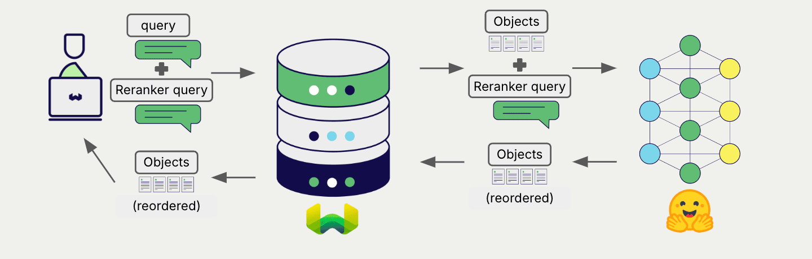

# Locally Hosted Transformers Reranker Models with Weaviate


import Tabs from '@theme/Tabs';
import TabItem from '@theme/TabItem';
import FilteredTextBlock from '@site/src/components/Documentation/FilteredTextBlock';
import PyConnect from '!!raw-loader!../_includes/provider.connect.py';
import TSConnect from '!!raw-loader!../_includes/provider.connect.ts';
import PyCode from '!!raw-loader!../_includes/provider.reranker.py';
import TSCode from '!!raw-loader!../_includes/provider.reranker.ts';

Weaviate's integration with the Hugging Face Transformers library allows you to access their models' capabilities directly from Weaviate.

[Configure a Weaviate collection](#configure-the-reranker) to use Transformers integration, and [configure the Weaviate instance](#weaviate-configuration) with a model image, and Weaviate will use the specified model in the Transformers inference container to rerank search results.

This two-step process involves Weaviate first performing a search and then reranking the results using the specified model.



## Requirements

### Weaviate configuration

Your Weaviate instance must be configured with the Transformers reranker integration (`reranker-transformers`) module.

<details>
  <summary>For Weaviate Cloud (WCD) users</summary>

This integration is not available for Weaviate Cloud (WCD) serverless instances, as it requires spinning up a container with the Hugging Face model.

</details>

#### Enable the integration module

- Check the [cluster metadata](../../config-refs/meta.md) to verify if the module is enabled.
- Follow the [how-to configure modules](../../configuration/modules.md) guide to enable the module in Weaviate.

#### Configure the integration

To use this integration, configure the container image of the Hugging Face Transformers model and the inference endpoint of the containerized model.

The following example shows how to configure the Hugging Face Transformers integration in Weaviate:

<Tabs groupId="languages">
<TabItem value="docker" label="Docker">

#### Docker Option 1: Use a pre-configured `docker-compose.yml` file

Follow the instructions on the [Weaviate Docker installation configurator](../../installation/docker-compose.md#configurator) to download a pre-configured `docker-compose.yml` file with a selected model
<br/>

#### Docker Option 2: Add the configuration manually

Alternatively, add the configuration to the `docker-compose.yml` file manually as in the example below.

```yaml
services:
  weaviate:
    # Other Weaviate configuration
    environment:
      RERANKER_INFERENCE_API: http://reranker-transformers:8080  # Set the inference API endpoint
  reranker-transformers:  # Set the name of the inference container
    image: cr.weaviate.io/semitechnologies/reranker-transformers:cross-encoder-ms-marco-MiniLM-L-6-v2
    environment:
      ENABLE_CUDA: 0  # Set to 1 to enable
```

- `RERANKER_INFERENCE_API` environment variable sets the inference API endpoint
- `reranker-transformers` is the name of the inference container
- `image` is the container image
- `ENABLE_CUDA` environment variable enables GPU usage

Set `image` from a [list of available models](#available-models) to specify a particular model to be used.

</TabItem>
<TabItem value="k8s" label="Kubernetes">

Configure the Hugging Face Transformers integration in Weaviate by adding or updating the `reranker-transformers` module in the `modules` section of the Weaviate Helm chart values file. For example, modify the `values.yaml` file as follows:

```yaml
modules:

  reranker-transformers:

    enabled: true
    tag: cross-encoder-ms-marco-MiniLM-L-6-v2
    repo: semitechnologies/reranker-transformers
    registry: cr.weaviate.io
    envconfig:
      enable_cuda: true
```

See the [Weaviate Helm chart](https://github.com/weaviate/weaviate-helm/blob/master/weaviate/values.yaml) for an example of the `values.yaml` file including more configuration options.

Set `tag` from a [list of available models](#available-models) to specify a particular model to be used.

</TabItem>
</Tabs>

### Credentials

As this integration runs a local container with the transformers model, no additional credentials (e.g. API key) are required. Connect to Weaviate as usual, such as in the examples below.

<Tabs groupId="languages">

 <TabItem value="py" label="Python API v4">
    <FilteredTextBlock
      text={PyConnect}
      startMarker="# START BasicInstantiation"
      endMarker="# END BasicInstantiation"
      language="py"
    />
  </TabItem>

 <TabItem value="js" label="JS/TS API v3">
    <FilteredTextBlock
      text={TSConnect}
      startMarker="// START BasicInstantiation"
      endMarker="// END BasicInstantiation"
      language="ts"
    />
  </TabItem>

</Tabs>

## Configure the reranker

Configure a Weaviate collection to use a Transformer reranker model as follows:

<Tabs groupId="languages">
  <TabItem value="py" label="Python API v4">
    <FilteredTextBlock
      text={PyCode}
      startMarker="# START RerankerTransformersBasic"
      endMarker="# END RerankerTransformersBasic"
      language="py"
    />
  </TabItem>

  <TabItem value="js" label="JS/TS API v3">
    <FilteredTextBlock
      text={TSCode}
      startMarker="// START RerankerTransformersBasic"
      endMarker="// END RerankerTransformersBasic"
      language="ts"
    />
  </TabItem>

</Tabs>

:::note Chose a container image to select a model
To chose a model, select the [container image](#configure-the-integration) that hosts it.
:::

## Reranking query

Once the reranker is configured, Weaviate performs [reranking operations](../../search/rerank.md) using the specified reranker model.

More specifically, Weaviate performs an initial search, then reranks the results using the specified model.

Any search in Weaviate can be combined with a reranker to perform reranking operations.


<Tabs groupId="languages">

 <TabItem value="py" label="Python API v4">
    <FilteredTextBlock
      text={PyCode}
      startMarker="# START RerankerQueryExample"
      endMarker="# END RerankerQueryExample"
      language="py"
    />
  </TabItem>

 <TabItem value="js" label="JS/TS API v3">
    <FilteredTextBlock
      text={TSCode}
      startMarker="// START RerankerQueryExample"
      endMarker="// END RerankerQueryExample"
      language="ts"
    />
  </TabItem>

</Tabs>

## References

### Available models

- `cross-encoder/ms-marco-MiniLM-L-6-v2`
- `cross-encoder/ms-marco-MiniLM-L-2-v2`
- `cross-encoder/ms-marco-TinyBERT-L-2-v2`

These pre-trained models are open-sourced on Hugging Face. The `cross-encoder/ms-marco-MiniLM-L-6-v2` model, for example, provides approximately the same benchmark performance as the largest model (L-12) when evaluated on [MS-MARCO](https://microsoft.github.io/msmarco/) (39.01 vs. 39.02).

We add new model support over time. For a complete list of available models, see the Docker Hub tags for the [reranker-transformers](https://hub.docker.com/r/semitechnologies/reranker-transformers/tags) container.

## Further resources

### Other integrations

- [Transformers embedding models + Weaviate](./embeddings.md).
- [Transformers multi-modal embedding models + Weaviate](./embeddings-multimodal.md).

### Code examples

Once the integrations are configured at the collection, the data management and search operations in Weaviate work identically to any other collection. See the following model-agnostic examples:

- The [how-to: manage data](../../manage-data/index.md) guides show how to perform data operations (i.e. create, update, delete).
- The [how-to: search](../../search/index.md) guides show how to perform search operations (i.e. vector, keyword, hybrid) as well as retrieval augmented generation.

## Questions and feedback

import DocsFeedback from '/_includes/docs-feedback.mdx';

<DocsFeedback/>
