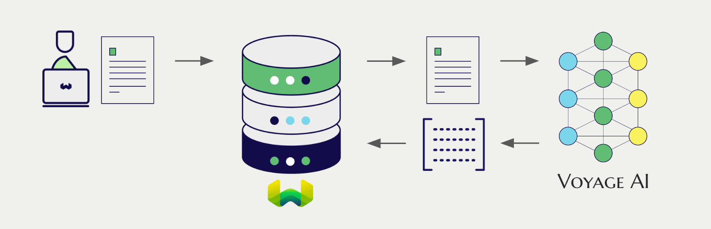

import BetaPageNote from '../_includes/beta_pages.md';

<BetaPageNote />

Voyage AI offers a wide range of models for natural language processing. Weaviate seamlessly integrates with Voyage AI's APIs, allowing users to leverage Voyage AI's models directly within the Weaviate database.

These integrations empower developers to build sophisticated AI-driven applications with ease.

## Integrations with Voyage AI

### Embedding models for semantic search

Voyage AI's embedding models transform text data into high-dimensional vector representations, capturing semantic meaning and context.

[Weaviate integrates with Voyage AI's embedding models](./embeddings.md) to enable seamless vectorization of data. This integration allows users to perform semantic and hybrid search operations without the need for additional preprocessing or data transformation steps.

[Voyage AI embedding integration page](./embeddings.md)

### Reranker models

Voyage AI's reranker models are designed to improve the relevance and ranking of search results.

[The Weaviate reranker integration](./reranker.md) allows users to easily refine their search results by leveraging Voyage AI's reranker models.

[Voyage AI reranker integration page](./reranker.md)

## Summary

These integrations enable developers to leverage Voyage AI's powerful models directly within Weaviate.

In turn, they simplify the process of building AI-driven applications to speed up your development process, so that you can focus on creating innovative solutions.

## Get started

You must provide a valid Voyage AI API key to Weaviate for these integrations. Go to [Voyage AI](https://www.voyageai.com/) to sign up and obtain an API key.

Then, go to the relevant integration page to learn how to configure Weaviate with the Voyage AI models and start using them in your applications.

- [Text Embeddings](./embeddings.md)

import DocsFeedback from '/_includes/docs-feedback.mdx';

<DocsFeedback/>
