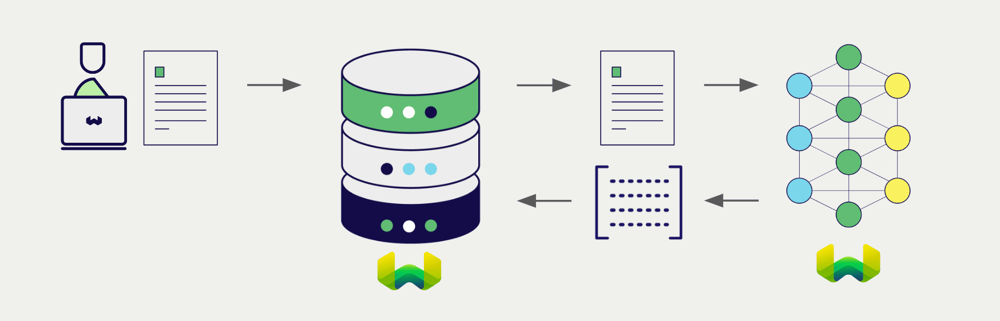

:::info Access to Weaviate Embeddings during technical preview
Weaviate Embeddings is currently in free technical preview.

To try out Weaviate Embeddings at this time, please [contact us](/embeddings) to request access.
:::

<!-- Note: for images, use https://docs.google.com/presentation/d/15opIcJuaIjEEcs_1Zm8B6pccox2p7_MHSjCnRv4dPfU/edit?usp=sharing -->

[Weaviate Embeddings](/developers/wcs/embeddings) offers vectorizer models to Weaviate Cloud users, allowing users to leverage Weaviate Embeddings' models directly from a Weaviate Cloud database instance.

These integrations empower developers to build sophisticated AI-driven applications with ease.

## Integrations with Weaviate Embeddings

### Embedding models for semantic search

Weaviate Embeddings' embedding models transform text data into high-dimensional vector representations, capturing semantic meaning and context.

[Weaviate Cloud integrates with Weaviate Embeddings' embedding models](./embeddings.md) to enable seamless vectorization of data. This integration allows users to perform semantic and hybrid search operations without the need for additional preprocessing or data transformation steps.

[Weaviate Embeddings integration page](./embeddings.md)

## Summary

These integrations enable developers to leverage Weaviate Embeddings' powerful models directly within Weaviate.

In turn, they simplify the process of building AI-driven applications to speed up your development process, so that you can focus on creating innovative solutions.

## Get started

You must provide a valid Weaviate Cloud API key to Weaviate for these integrations. Go to [Weaviate Cloud](https://console.weaviate.cloud/) to sign up and obtain an API key.

Then, go to the relevant integration page to learn how to configure Weaviate with the Weaviate Embeddings models and start using them in your applications.

- [Text Embeddings](./embeddings.md)

## Questions and feedback

import DocsFeedback from '/_includes/docs-feedback.mdx';

<DocsFeedback/>
