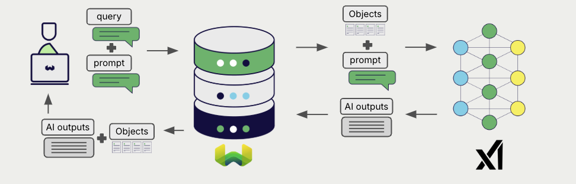

<!-- Note: for images, use https://docs.google.com/presentation/d/15opIcJuaIjEEcs_1Zm8B6pccox2p7_MHSjCnRv4dPfU/edit?usp=sharing -->

xAI offers a wide range of models for natural language processing and generation. Weaviate seamlessly integrates with xAI's APIs, allowing users to leverage xAI's models directly from the Weaviate database.

These integrations empower developers to build sophisticated AI-driven applications with ease.

## Integrations with xAI

### Generative AI models for RAG

xAI's generative AI models can generate human-like text based on given prompts and contexts.

[Weaviate's generative AI integration](./generative.md) enables users to perform retrieval augmented generation (RAG) directly from the Weaviate database. This combines Weaviate's efficient storage and fast retrieval capabilities with xAI's generative AI models to generate personalized and context-aware responses.

[xAI generative AI integration page](./generative.md)

## Summary

These integrations enable developers to leverage xAI's powerful models directly within Weaviate.

In turn, they simplify the process of building AI-driven applications to speed up your development process, so that you can focus on creating innovative solutions.

## Get started

You must provide a valid xAI API key to Weaviate for this integration. Go to [xAI](https://console.x.ai/) to sign up and obtain an API key.

Then, go to the relevant integration page to learn how to configure Weaviate with the xAI models and start using them in your applications.

- [Generative AI](./generative.md)

## Questions and feedback

import DocsFeedback from '/_includes/docs-feedback.mdx';

<DocsFeedback/>
