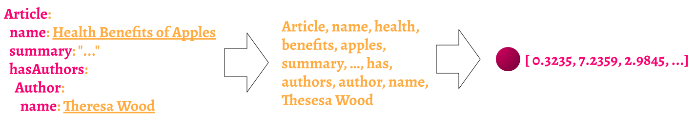

## Overview

The `text2vec-contextionary` module enables Weaviate to obtain vectors locally using a lightweight model.

Key notes:

- This module is not available on Weaviate Cloud Services (WCS).
- Enabling this module will enable the [`nearText` search operator](/developers/weaviate/api/graphql/search-operators.md#neartext).
- This module is based on FastText and uses a weighted mean of word embeddings (WMOWE) to produce the vector.
- Available for multiple languages

:::tip When to use `text2vec-contextionary`
As a lightweight model, it is well suited for testing purposes.

For production use cases, we recommend using other modules that use a more modern, transformer-based architecture.
:::

## Weaviate instance configuration

:::info Not applicable to WCS
This module is not available on Weaviate Cloud Services.
:::

### Docker Compose file

To use `text2vec-contextionary`, you must enable it in your Docker Compose file (e.g. `docker-compose.yml`).

:::tip Use the configuration tool
While you can do so manually, we recommend using the [Weaviate configuration tool](/developers/weaviate/installation/docker-compose.md#configurator) to generate the `Docker Compose` file.
:::

#### Parameters

Weaviate:

- `ENABLE_MODULES` (Required): The modules to enable. Include `text2vec-contextionary` to enable the module.
- `DEFAULT_VECTORIZER_MODULE` (Optional): The default vectorizer module. You can set this to `text2vec-contextionary` to make it the default for all classes.

Contextionary:

* `EXTENSIONS_STORAGE_MODE`: Location of storage for extensions to the Contextionary
* `EXTENSIONS_STORAGE_ORIGIN`: The host of the custom extension storage
* `NEIGHBOR_OCCURRENCE_IGNORE_PERCENTILE`: this can be used to hide very rare words. If you set it to '5', this means the 5th percentile of words by occurrence are removed in the nearestNeighbor search (for example used in the GraphQL `_additional { nearestNeighbors }` feature).
* `ENABLE_COMPOUND_SPLITTING`: see [here](#compound-splitting).

#### Example

This configuration enables `text2vec-contextionary`, sets it as the default vectorizer, and sets the parameters for the Contextionary Docker container.

```yaml
---
version: '3.4'
services:
  weaviate:
    command:
    - --host
    - 0.0.0.0
    - --port
    - '8080'
    - --scheme
    - http
    image: cr.weaviate.io/semitechnologies/weaviate:||site.weaviate_version||
    ports:
    - 8080:8080
    - 50051:50051
    restart: on-failure:0
    environment:
      CONTEXTIONARY_URL: contextionary:9999
      QUERY_DEFAULTS_LIMIT: 25
      AUTHENTICATION_ANONYMOUS_ACCESS_ENABLED: 'true'
      PERSISTENCE_DATA_PATH: '/var/lib/weaviate'
      # highlight-start
      ENABLE_MODULES: 'text2vec-contextionary'
      DEFAULT_VECTORIZER_MODULE: 'text2vec-contextionary'
      # highlight-end
      CLUSTER_HOSTNAME: 'node1'
  # highlight-start
  contextionary:
    environment:
      OCCURRENCE_WEIGHT_LINEAR_FACTOR: 0.75
      EXTENSIONS_STORAGE_MODE: weaviate
      EXTENSIONS_STORAGE_ORIGIN: http://weaviate:8080
      NEIGHBOR_OCCURRENCE_IGNORE_PERCENTILE: 5
      ENABLE_COMPOUND_SPLITTING: 'false'
    image: cr.weaviate.io/semitechnologies/contextionary:en0.16.0-v1.2.1
    ports:
    - 9999:9999
  # highlight-end
...
```

## Class configuration

You can configure how the module will behave in each class through the [Weaviate schema](/developers/weaviate/manage-data/collections.mdx).

### Vectorization settings

You can set vectorizer behavior using the `moduleConfig` section under each class and property:

#### Class-level

- `vectorizer` - what module to use to vectorize the data.
- `vectorizeClassName` – whether to vectorize the class name. Default: `true`.

#### Property-level

- `skip` – whether to skip vectorizing the property altogether. Default: `false`
- `vectorizePropertyName` – whether to vectorize the property name. Default: `false`

#### Example

```json
{
  "classes": [
    {
      "class": "Document",
      "description": "A class called document",
      "vectorizer": "text2vec-contextionary",
      "moduleConfig": {
        // highlight-start
        "text2vec-contextionary": {
          "vectorizeClassName": false
        }
        // highlight-end
      },
      "properties": [
        {
          "name": "content",
          "dataType": [
            "text"
          ],
          "description": "Content that will be vectorized",
          // highlight-start
          "moduleConfig": {
            "text2vec-contextionary": {
              "skip": false,
              "vectorizePropertyName": false
            }
          }
          // highlight-end
        }
      ],
    }
  ]
}
```

### Class/property names

If you are using this module and are vectorizing the class or property name, the name(s) must be a part of the `text2vec-contextionary`.

To use multiple words as a class or property definition, concatenate them as:
- camel case (e.g. `bornIn`) for class or property names, or
- snake case (e.g. `born_in`) for property names.

For example, the following are acceptable:

```yaml
Publication
  name
  hasArticles
Article
  title
  summary
  wordCount
  url
  hasAuthors
  inPublication        # CamelCase (all versions)
  publication_date     # snake_case (from v1.7.2 on)
Author
  name
  wroteArticles
  writesFor
```

## Usage example

This is an example of a `nearText` query with `text2vec-contextionary`.

import CodeNearText from '/_includes/code/graphql.filters.nearText.mdx';

<CodeNearText />

## Additional information

### Find concepts

To find concepts or words or to check if a concept is part of the Contextionary, use the `v1/modules/text2vec-contextionary/concepts/<concept>` endpoint.

```js
GET /v1/modules/text2vec-contextionary/concepts/<concept>
```

#### Parameters

The only parameter `concept` is a string that should be camelCased in case of compound words or a list of words.

#### Response
<!-- TODO: (phase 2) can we make a list of parameters like this look better? -->
The result contains the following fields:
- `"individualWords"`: a list of the results of individual words or concepts in the query, which contains:
  - `"word"`: a string of requested concept or single word from the concept.
  - `"present"`: a boolean value which is `true` if the word exists in the Contextionary.
  - `"info"`: an object with the following fields:
    - `""nearestNeighbors"`: a list with the nearest neighbors, containing `"word"` and `"distance"` (between the two words in the high dimensional space). Note that `"word"` can also be a data object.
    - `"vector"`: the raw 300-long vector value.
  - `"concatenatedWord"`: an object of the concatenated concept.
    - `"concatenatedWord"`: the concatenated word if the concept given is a camelCased word.
      - `"singleWords"`: a list of the single words in the concatenated concept.
      - `"concatenatedVector"`: a list of vector values of the concatenated concept.
      - `"concatenatedNearestNeighbors"`: a list with the nearest neighbors, containing `"word"` and `"distance"` (between the two words in the high dimensional space). Note that `"word"` can also be a data object.

#### Example

```bash
curl http://localhost:8080/v1/modules/text2vec-contextionary/concepts/magazine
```

or (note the camelCased compound concept)

import CodeContextionary from '/_includes/code/contextionary.get.mdx';

<CodeContextionary />

with a result similar to:

```json
{
  "individualWords": [
    {
      "inC11y": true,
      "info": {
        "nearestNeighbors": [
          {
            "word": "magazine"
          },
          {
            "distance": 6.186641,
            "word": "editorial"
          },
          {
            "distance": 6.372504,
            "word": "featured"
          },
          {
            "distance": 6.5695524,
            "word": "editor"
          },
          {
            "distance": 7.0328364,
            "word": "titled"
          },
          ...
        ],
        "vector": [
          0.136228,
          0.706469,
          -0.073645,
          -0.099225,
          0.830348,
          ...
        ]
      },
      "word": "magazine"
    }
  ]
}
```

### Model details

`text2vec-contextionary` (Contextionary) is Weaviate's own language vectorizer that is trained using [fastText](https://fasttext.cc/) on Wiki and CommonCrawl data.

The `text2vec-contextionary` model outputs a 300-dimensional vector. This vector is computed by using a Weighted Mean of Word Embeddings (WMOWE) technique.

The vector is calculated based on the centroid of the words weighted by the occurrences of the individual words in the original training text-corpus (e.g., the word `"has"` is seen as less important than the word `"apples"`).



### Available languages

Contextionary models are available for the following languages:

* Trained with on CommonCrawl and Wiki, using GloVe
  * English
  * Dutch
  * German
  * Czech
  * Italian
* Trained on Wiki
  * English
  * Dutch

### Extending the Contextionary

Custom words or abbreviations (i.e., "concepts") can be added to `text2vec-contextionary` through the `v1/modules/text2vec-contextionary/extensions/` endpoint.

Using this endpoint will enrich the Contextionary with your own words, abbreviations or concepts in context by [transfer learning](https://en.wikipedia.org/wiki/Transfer_learning). Using the `v1/modules/text2vec-contextionary/extensions/` endpoint adds or updates the concepts in real-time.

Note that you need to introduce the new concepts in to Weaviate before adding the data, as this will note cause Weaviate to automatically update the vectors.

#### Parameters

A body (in JSON or YAML) with the extension word or abbreviation you want to add to the Contextionary with the following fields includes a:
- `"concept"`: a string with the word, compound word or abbreviation
- `"definition"`: a clear description of the concept, which will be used to create the context of the concept and place it in the high dimensional Contextionary space.
- `"weight"`: a float with the relative weight of the concept (default concepts in the Contextionary have a weight of 1.0)

#### Response

The same fields as the input parameters will be in the response body if the extension was successful.

#### Example

Let's add the concept `"weaviate"` to the Contextionary.

import CodeContextionaryExtensions from '/_includes/code/contextionary.extensions.mdx';

<CodeContextionaryExtensions />

You can always check if the new concept exists in the Contextionary:

```bash
curl http://localhost:8080/v1/modules/text2vec-contextionary/concepts/weaviate
```

Note that it is not (yet) possible to extend the Contextionary with concatenated words or concepts consisting of more than one word.

You can also overwrite current concepts with this endpoint. Let's say you are using the abbreviation `API` for `Academic Performance Index` instead of `Application Programming Interface`, and you want to reposition this concept in the Contextionary:

```bash
curl \
  -X POST \
  -H 'Content-Type: application/json' \
  -d '{
    "concept": "api",
    "definition": "Academic Performance Index a measurement of academic performance and progress of individual schools in California",
    "weight": 1
  }' \
  http://localhost:8080/v1/modules/text2vec-contextionary/extensions
```

The meaning of the concept `API` has now changed in your Weaviate setting.

### Stopwords

Note that stopwords are automatically removed from camelCased and CamelCased names.

<!-- ### What stopwords are and why they matter

Stopwords are words that don't add semantic meaning to your concepts and are extremely common in texts across different contexts. For example, the sentence "a car is parked on the street" contains the following stopwords: "a", "is", "on", "the". If we look at the sentence "a banana is lying on the table", you would find the exact same stop words. So in those two sentences, over 50% of the words overlap. Therefore they would be considered somewhat similar (based on the overall vector position).

However, if we remove stopwords from both sentences, they become "car parked street" and "banana lying table". Suddenly there are 0% identical words in the sentences, so it becomes easier to perform vector comparisons. Note at this point we cannot say whether both sentences are related or not. For this we'd need to know how close the vector position of the sentence "car parked street" is to the vector position of "banana lying table". But we do know that the result can now be calculated with a lot less noise. -->

#### Vectorization behavior

Stopwords can be useful, so we don't want to encourage you to leave them out completely. Instead Weaviate will remove them during vectorization.

In most cases you won't even notice that this happens in the background, however, there are a few edge cases that might cause a validation error:

* If your camelCased class or property name consists **only** of stopwords, validation will fail. Example: `TheInA` is not a valid class name, however, `TheCarInAField` is (and would internally be represented as `CarField`).

* If your keyword list contains stop words, they will be removed. However, if every single keyword is a stop word, validation will fail.

#### How does Weaviate decide whether a word is a stop word or not?

The list of stopwords is derived from the Contextionary version used and is published alongside the Contextionary files.

### Compound splitting

Sometimes Weaviate's Contextionary does not understand words which are compounded out of words it would otherwise understand. This impact is far greater in languages that allow for arbitrary compounding (such as Dutch or German) than in languages where compounding is not very common (such as English).

#### Effect

Imagine you import an object of class `Post` with content `This is a thunderstormcloud`. The arbitrarily compounded word `thunderstormcloud` is not present in the Contextionary. So your object's position will be made up of the only words it recognizes: `"post", "this"` (`"is"` and `"a"` are removed as stopwords).

If you check how this content was vectorized using the `_interpretation` feature, you will see something like the following:

```json
"_interpretation": {
  "source": [
    {
      "concept": "post",
      "occurrence": 62064610,
      "weight": 0.3623903691768646
    },
    {
      "concept": "this",
      "occurrence": 932425699,
      "weight": 0.10000000149011612
    }
  ]
}
```

To overcome this limitation the optional **Compound Splitting Feature** can be enabled in the Contextionary. It will understand the arbitrary compounded word and interpret your object as follows:

  ```json
"_interpretation": {
  "source": [
    {
      "concept": "post",
      "occurrence": 62064610,
      "weight": 0.3623903691768646
    },
    {
      "concept": "this",
      "occurrence": 932425699,
      "weight": 0.10000000149011612
    },
    {
      "concept": "thunderstormcloud (thunderstorm, cloud)",
      "occurrence": 5756775,
      "weight": 0.5926488041877747
    }
  ]
}
  ```

Note that the newly found word (made up of the parts `thunderstorm` and `cloud` has the highest weight in the vectorization. So this meaning, which would have been lost without Compound Splitting, can now be recognized.

#### How to enable
You can enable Compound Splitting in the Docker Compose file of the `text2vec-contextionary`. See how this is done [here](#compound-splitting).

#### Trade-Off Import speed vs Word recognition

Compound Splitting runs an any word that is otherwise not recognized. Depending on your dataset, this can lead to a significantly longer import time (up to 100% longer). Therefore, you should carefully evaluate whether the higher precision in recognition or the faster import times are more important to your use case. As the benefit is larger in some languages (e.g. Dutch, German) than in others (e.g. English) this feature is turned off by default.

### Noise filtering

So called "noise words" are concatenated words of random words with no easily recognizable meaning. These words are present in the Contextionary training space, but are extremely rare and therefore distributed seemingly randomly. As a consequence, an "ordinary" result of querying features relying on nearest neighbors (additional properties `nearestNeighbors` or `semanticPath`) might contain such noise words as immediate neighbors.

To combat this noise, a neighbor filtering feature was introduced in the contextionary, which ignores words of the configured bottom percentile - ranked by occurrence in the respective training set. By default this value is set to the bottom 5th percentile. This setting can be overridden. To set another value, e.g. to ignore the bottom 10th percentile, provide the environment variable `NEIGHBOR_OCCURRENCE_IGNORE_PERCENTILE=10` to the `text2vec-contextionary` container, in the Docker Compose file.

## Model license(s)

The `text2vec-contextionary` module is based on the [`fastText`](https://github.com/facebookresearch/fastText/tree/main) library, which is released under the MIT license. Please refer to the [license file](https://github.com/facebookresearch/fastText/blob/main/LICENSE) for more information.

It is your responsibility to evaluate whether the terms of its license(s), if any, are appropriate for your intended use.


import DocsMoreResources from '/_includes/more-resources-docs.md';

<DocsMoreResources />
