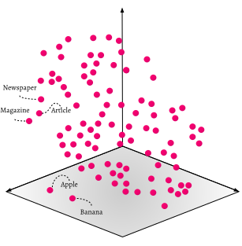
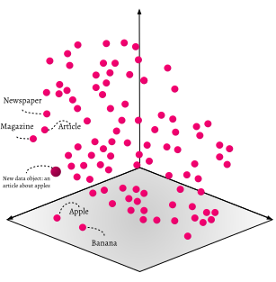

import Badges from '/_includes/badges.mdx';

<Badges/>

## Introduction

The module `text2vec-contextionary`, herein also referred to as the 'Contextionary', is Weaviate's own language vectorizer. It gives context to the language used in your dataset (there are Contextionary versions available for multiple languages). `text2vec-contextionary` is a Weighted Mean of Word Embeddings (WMOWE) vectorizer module which works with popular models such as fastText and GloVe. The most recent `text2vec-contextionary` is trained using [fastText](https://fasttext.cc/) on Wiki and CommonCrawl data. We aim to make the Contextionary available for use cases in any domain, regardless if they are business-related, academic or other. But you can also [create your own vectorizer](/developers/weaviate/modules/other-modules/custom-modules.md) if desired.

The `text2vec-contextionary` places data into a 300-dimensional space. Each datapoint will thus have a vector of 300 numbers. This vector is computed from the pre-trained Contextionary (you never have to do any training yourself), that contains the contextual representation that allows Weaviate to store data based on its contextual meaning. An empty Weaviate with the preloaded `text2vec-contextionary` module, could be envisioned like this (in a simplified 3D visualization):



When you add data, `text2vec-contextionary` calculates the position in the vector space that represents the real-world entity.

The process from a data object to a vector position is calculated based on the centroid of the words weighted by the occurrences of the individual words in the original training text-corpus (e.g., the word `"has"` is seen as less important than the word `"apples"`).


When a new class object is created, it will be added to a Weaviate.



### Available modules and languages

* Trained with on CommonCrawl and Wiki, using GloVe 
  * English
  * Dutch
  * German
  * Czech
  * Italian
* Trained on Wiki
  * English
  * Dutch

## How to enable

### Weaviate Cloud Service

The `text2vec-contextionary` module is not available on the WCS.

### Weaviate open source

Which modules to use in a Weaviate instance can be specified in the docker-compose configuration file. The service can be added like this:

```yaml
---
version: '3.4'
services:
  weaviate:
    command:
    - --host
    - 0.0.0.0
    - --port
    - '8080'
    - --scheme
    - http
    image: semitechnologies/weaviate:||site.weaviate_version||
    ports:
    - 8080:8080
    restart: on-failure:0
    environment:
      CONTEXTIONARY_URL: contextionary:9999
      QUERY_DEFAULTS_LIMIT: 25
      AUTHENTICATION_ANONYMOUS_ACCESS_ENABLED: 'true'
      PERSISTENCE_DATA_PATH: '/var/lib/weaviate'
      DEFAULT_VECTORIZER_MODULE: 'text2vec-contextionary'
      ENABLE_MODULES: 'text2vec-contextionary'
      CLUSTER_HOSTNAME: 'node1'
  contextionary:
    environment:
      OCCURRENCE_WEIGHT_LINEAR_FACTOR: 0.75
      EXTENSIONS_STORAGE_MODE: weaviate
      EXTENSIONS_STORAGE_ORIGIN: http://weaviate:8080
      NEIGHBOR_OCCURRENCE_IGNORE_PERCENTILE: 5
      ENABLE_COMPOUND_SPLITTING: 'false'
    image: semitechnologies/contextionary:en0.16.0-v1.0.2
    ports:
    - 9999:9999
...
```

Variable explanations:
* `EXTENSIONS_STORAGE_MODE`: where custom extensions to the Contextionary are stored
* `EXTENSIONS_STORAGE_ORIGIN`: the host of the custom extension storage
* `NEIGHBOR_OCCURRENCE_IGNORE_PERCENTILE`: this can be used to hide very rare words. If you set it to '5', this means the 5th percentile of words by occurrence are removed in the nearestNeighbor search (for example used in the GraphQL `_additional { nearestNeighbors }` feature).
* `ENABLE_COMPOUND_SPLITTING`: see [here](#compound-splitting).

## How to configure

​In your Weaviate schema, you must define how you want this module to vectorize your data. If you are new to Weaviate schemas, you might want to check out the [tutorial on the Weaviate schema](../../tutorials/schema.md) first.

For example

```json
{
  "classes": [
    {
      "class": "Document",
      "description": "A class called document",
      "moduleConfig": {
        "text2vec-contextionary": {
          "vectorizeClassName": "false"
        }
      },
      "properties": [
        {
          "dataType": [
            "text"
          ],
          "description": "Content that will be vectorized",
          "moduleConfig": {
            "text2vec-contextionary": {
              "skip": false,
              "vectorizePropertyName": false
            }
          },
          "name": "content"
        }
      ],
      "vectorizer": "text2vec-contextionary"
    }
  ]
}
```

### Schema note

- If you are using this module and are vectorizing the class or property name, the name(s) must be a part of the `text2vec-contextionary`.

## How to use

* New GraphQL vector search parameters made available by this module can be found [here](/developers/weaviate/api/graphql/vector-search-parameters.md#neartext).

### Example

import CodeNearText from '/_includes/code/graphql.filters.nearText.mdx';

<CodeNearText />

import MoleculeGQLDemo from '/_includes/molecule-gql-demo.mdx';

<MoleculeGQLDemo query='%7B%0D%0A++Get%7B%0D%0A++++Publication%28%0D%0A++++++nearText%3A+%7B%0D%0A++++++++concepts%3A+%5B%22fashion%22%5D%2C%0D%0A++++++++certainty%3A+0.7%2C%0D%0A++++++++moveAwayFrom%3A+%7B%0D%0A++++++++++concepts%3A+%5B%22finance%22%5D%2C%0D%0A++++++++++force%3A+0.45%0D%0A++++++++%7D%2C%0D%0A++++++++moveTo%3A+%7B%0D%0A++++++++++concepts%3A+%5B%22haute+couture%22%5D%2C%0D%0A++++++++++force%3A+0.85%0D%0A++++++++%7D%0D%0A++++++%7D%0D%0A++++%29%7B%0D%0A++++++name%0D%0A++++++_additional+%7B%0D%0A++++++++certainty%0D%0A++++++%7D%0D%0A++++%7D%0D%0A++%7D%0D%0A%7D'/>

## Additional information

### Find concepts

To find concepts or words or to check if a concept is part of the Contextionary, use the `v1/modules/text2vec-contextionary/concepts/<concept>` endpoint. 

```js
GET /v1/modules/text2vec-contextionary/concepts/<concept>
```

### Parameters 

The only parameter `concept` is a string that should be camelCased in case of compound words or a list of words.

### Response
<!-- TODO: (phase 2) can we make a list of parameters like this look better? -->
The result contains the following fields:
- `"individualWords"`: a list of the results of individual words or concepts in the query, which contains:
  - `"word"`: a string of requested concept or single word from the concept.
  - `"present"`: a boolean value which is `true` if the word exists in the Contextionary.
  - `"info"`: an object with the following fields:
    - `""nearestNeighbors"`: a list with the nearest neighbors, containing `"word"` and `"distance"` (between the two words in the high dimensional space). Note that `"word"` can also be a data object.
    - `"vector"`: the raw 300-long vector value.
  - `"concatenatedWord"`: an object of the concatenated concept.
    - `"concatenatedWord"`: the concatenated word if the concept given is a camelCased word.
      - `"singleWords"`: a list of the single words in the concatenated concept.
      - `"concatenatedVector"`: a list of vector values of the concatenated concept.
      - `"concatenatedNearestNeighbors"`: a list with the nearest neighbors, containing `"word"` and `"distance"` (between the two words in the high dimensional space). Note that `"word"` can also be a data object.

### Example

```bash
$ curl http://localhost:8080/v1/modules/text2vec-contextionary/concepts/magazine
```

or (note the camelCased compound concept)

import CodeContextionary from '/_includes/code/contextionary.get.mdx';

<CodeContextionary />

with a result similar to:

```json
{
  "individualWords": [
    {
      "inC11y": true,
      "info": {
        "nearestNeighbors": [
          {
            "word": "magazine"
          },
          {
            "distance": 6.186641,
            "word": "editorial"
          },
          {
            "distance": 6.372504,
            "word": "featured"
          },
          {
            "distance": 6.5695524,
            "word": "editor"
          },
          {
            "distance": 7.0328364,
            "word": "titled"
          },
          ...
        ],
        "vector": [
          0.136228,
          0.706469,
          -0.073645,
          -0.099225,
          0.830348,
          ...
        ]
      },
      "word": "magazine"
    }
  ]
}
```

## Extending the Contextionary

Custom words or abbreviations (i.e., "concepts") can be added to Weaviate directly by extending the Contextionary. Using this endpoint will enrich the Contextionary with your own words, abbreviations or concepts in context by [transfer learning](https://en.wikipedia.org/wiki/Transfer_learning). Using the `v1/modules/text2vec-contextionary/extensions/` endpoint teaches Weaviate the new concepts in real-time. You can also overwrite concepts with this endpoint. Note that you need to introduce the new concepts in to Weaviate before adding data.

### Parameters

A body (in JSON or YAML) with the extension word or abbreviation you want to add to the Contextionary with the following fields includes a:
- `"concept"`: a string with the word, compound word or abbreviation
- `"definition"`: a clear description of the concept, which will be used to create the context of the concept and place it in the high dimensional Contextionary space.
- `"weight"`: a float with the relative weight of the concept (default concepts in the Contextionary have a weight of 1.0)

### Response

The same fields as the input parameters will be in the response body if the extension was successful.

### Example

Let's add the concept `"weaviate"` to the Contextionary. 

import CodeContextionaryExtensions from '/_includes/code/contextionary.extensions.mdx';

<CodeContextionaryExtensions />

You can always check if the new concept exists in the Contextionary:

```bash
curl http://localhost:8080/v1/modules/text2vec-contextionary/concepts/weaviate
```

Note that it is not (yet) possible to extend the Contextionary with concatenated words or concepts consisting of more than one word.

You can also overwrite current concepts with this endpoint. Let's say you are using the abbreviation `API` for `Academic Performance Index` instead of `Application Programming Interface`, and you want to reposition this concept in the Contextionary:

```bash
$ curl \
  -X POST \
  -H 'Content-Type: application/json' \
  -d '{
    "concept": "api",
    "definition": "Academic Performance Index a measurement of academic performance and progress of individual schools in California",
    "weight": 1
  }' \
  http://localhost:8080/v1/modules/text2vec-contextionary/extensions
```

The meaning of the concept `API` has now changed in your Weaviate setting.

## Stopwords

Note that stopwords are automatically removed from camelCased and CamelCased names.

### What stopwords are and why they matter

Stopwords are words that don't add semantic meaning to your concepts and are
extremely common in texts across different contexts. For example, the sentence
"a car is parked on the street" contains the following stopwords: "a", "is",
"on", "the". If we look at the sentence "a banana is lying on
the table", you would find the exact same stop words. So in those two sentences,
over 50% of the words overlap. Therefore they would be considered somewhat
similar (based on the overall vector position).

However, if we remove stopwords from both sentences, they become "car parked
street" and "banana lying table". Suddenly there are 0% identical words in the
sentences, so it becomes easier to perform vector comparisons. Note at this
point we cannot say whether both sentences are related or not. For this we'd
need to know how close the vector position of the sentence "car parked street"
is to the vector position of "banana lying table". But we do know that the
result can now be calculated with a lot less noise.

### Behavior around stop words

Stopwords are useful for humans, so we don't want to encourage you to leave
them out completely. Instead Weaviate will remove them whenever your schema
information is translated to vector positions.

In most cases you won't even notice that this happens in the background,
however, there are a few edge cases that might cause a validation error:

* If your camelCased class or property name consists **only** of stopwords,
  validation will fail. Example: `TheInA` is not a valid class name, however,
  `TheCarInAField` is (and would internally be represented as `CarField`).

* If your keyword list contains stop words, they will be removed. However, if
  every single keyword is a stop word, validation will fail.

### How does Weaviate decide whether a word is a stop word or not?

The list of stopwords is derived from the Contextionary version used and is
published alongside the Contextionary files.

## Compound splitting

Sometimes Weaviate's Contextionary does not understand words which are compounded out of words it would otherwise understand. This impact is far greater in languages that allow for arbitrary compounding (such as Dutch or German) than in languages where compounding is not very common (such as English).

### Effect

Imagine you import an object of class `Post` with content `This is a thunderstormcloud`. The arbitrarily compounded word `thunderstormcloud` is not present in the Contextionary. So your object's position will be made up of the only words it recognizes: `"post", "this"` (`"is"` and `"a"` are removed as stopwords).

If you check how this content was vectorized using the `_interpretation` feature, you will see something like the following:

```json
"_interpretation": {
  "source": [
    {
      "concept": "post",
      "occurrence": 62064610,
      "weight": 0.3623903691768646
    },
    {
      "concept": "this",
      "occurrence": 932425699,
      "weight": 0.10000000149011612
    }
  ]
}
```

To overcome this limitation the optional **Compound Splitting Feature** can be enabled in the Contextionary. It will understand the arbitrary compounded word and interpret your object as follows:

  ```json
"_interpretation": {
  "source": [
    {
      "concept": "post",
      "occurrence": 62064610,
      "weight": 0.3623903691768646
    },
    {
      "concept": "this",
      "occurrence": 932425699,
      "weight": 0.10000000149011612
    },
    {
      "concept": "thunderstormcloud (thunderstorm, cloud)",
      "occurrence": 5756775,
      "weight": 0.5926488041877747
    }
  ]
}
  ```

Note that the newly found word (made up of the parts `thunderstorm` and `cloud` has the highest weight in the vectorization. So this meaning, which would have been lost without Compound Splitting, can now be recognized.

### How to enable
You can enable Compound Splitting in the configuration file of the `text2vec-contextionary`. See how this is done [here](#compound-splitting).

### Trade-Off Import speed vs Word recognition
Compound Splitting runs an any word that is otherwise not recognized. Depending on your dataset, this can lead to a significantly longer import time (up to 100% longer). Therefore, you should carefully evaluate whether the higher precision in recognition or the faster import times are more important to your use case. As the benefit is larger in some languages (e.g. Dutch, German) than in others (e.g. English) this feature is turned off by default.

## Noise filtering

So called "noise words" are concatenated words of random words with no easily recognizable meaning. These words are present in the Contextionary training space, but are extremely rare and therefore distributed seemingly randomly. As a consequence, an "ordinary" result of querying features relying on nearest neighbors (additional properties `nearestNeighbors` or `semanticPath`) might contain such noise words as immediate neighbors.

To combat this noise, a neighbor filtering feature was introduced in the contextionary, which ignores words of the configured bottom percentile - ranked by occurrence in the respective training set. By default this value is set to the bottom 5th percentile. This setting can be overridden. To set another value, e.g. to ignore the bottom 10th percentile, provide the environment variable `NEIGHBOR_OCCURRENCE_IGNORE_PERCENTILE=10` to the `text2vec-contextionary` container (configuration file).

## More resources

import DocsMoreResources from '/_includes/more-resources-docs.md';

<DocsMoreResources />
