# Quickstart: with cloud resources

import Tabs from '@theme/Tabs';
import TabItem from '@theme/TabItem';
import Link from '@docusaurus/Link';

<span class="badge badge--secondary">Expected time: 30 minutes</span> <span class="badge badge--secondary">Prerequisites: None</span>
<br/><br/>

:::info What you will learn

This quickstart shows you how to combine Weaviate Cloud and Cohere to:

1. Set up a Weaviate instance. (10 minutes)
1. Add and vectorize your data. (10 minutes)
1. Perform a semantic search and retrieval augmented generation (RAG). (10 minutes)


Notes:

- The code examples here are self-contained. You can copy and paste them into your own environment to try them out.
<!-- - Python users can try [our Jupyter notebook](https://github.com/weaviate-tutorials/quickstart/blob/main/quickstart_end_to_end.ipynb) locally or on [Google Colab](https://colab.research.google.com/github/weaviate-tutorials/quickstart/blob/main/quickstart_end_to_end.ipynb). -->
- If you prefer to use locally hosted resources, see [Quickstart: locally hosted](./local.md).

:::

<!-- Vectors are mathematical representations of data objects, which enable similarity-based searches in vector databases like Weaviate. -->

### Requirements

In order to perform Retrieval Augmented Generation (RAG) in the last step, you will need a [Cohere](https://dashboard.cohere.com/) account. You can use a free Cohere trial API key.

If you have another preferred [model provider](/developers/weaviate/model-providers), you can use that instead of Cohere.

<hr/>

## Step 1: Set up Weaviate

### 1.1 Create a Weaviate database

Go to the [Weaviate Cloud console](https://console.weaviate.cloud) and create a free Sandbox instance.

<div style={{position: "relative", paddingBottom: "calc(54.10879629629629% + 50px)", height: 0}}>
  <iframe 
    id="gky9oo0u4p" 
    src="https://app.guideflow.com/embed/gky9oo0u4p" 
    width="100%" 
    height="100%" 
    style={{overflow: "hidden", position: "absolute", border: "none"}} 
    scrolling="no" 
    allow="clipboard-read; clipboard-write" 
    webKitAllowFullScreen 
    mozAllowFullScreen 
    allowFullScreen 
    allowTransparency="true"
  />
  <script src="https://app.guideflow.com/assets/opt.js" data-iframe-id="gky9oo0u4p"></script>
</div>

<br/>

:::note

- Cluster provisioning typically takes 1-3 minutes.
- When the cluster is ready, Weaviate Cloud displays a checkmark (`✔️`) next to the cluster name.
- Note that Weaviate Cloud adds a random suffix to sandbox cluster names to ensure uniqueness.

:::

import LatestWeaviateVersion from '/\_includes/latest-weaviate-version.mdx';

<LatestWeaviateVersion />

### 1.2 Install a client library

We recommend using a [client library](../client-libraries/index.md) to work with Weaviate. Follow the instructions below to install one of the official client libraries, available in [Python](../client-libraries/python/index.md), [JavaScript/TypeScript](../client-libraries/typescript/index.mdx), [Go](../client-libraries/go.md), and [Java](../client-libraries/java.md).

import CodeClientInstall from '/\_includes/code/quickstart/clients.install.mdx';

<CodeClientInstall />

### 1.3 Connect to Weaviate

Now you can connect to your Weaviate instance. You will need the:

- **REST Endpoint URL** and the
- **Administrator API Key**.

You can retrieve them both from the [WCD console](https://console.weaviate.cloud) as shown in the interactive example below.

:::note

New clusters with Weaviate version `v1.30` (or later) have [RBAC (Role-Based Access Control)](/developers/weaviate/configuration/rbac/index.mdx) enabled by default. These clusters don't come with API keys, you will need to create an API key yourself and assign it a role (`admin`, `viewer` or a custom role). 

:::

<div style={{position: "relative", paddingBottom: "calc(54.10879629629629% + 50px)", height: 0}}>
  <iframe 
    id="mk6zxyws6p" 
    src="https://app.guideflow.com/embed/mk6zxyws6p" 
    width="100%" 
    height="100%" 
    style={{overflow: "hidden", position: "absolute", border: "none"}} 
    scrolling="no" 
    allow="clipboard-read; clipboard-write" 
    webKitAllowFullScreen 
    mozAllowFullScreen 
    allowFullScreen 
    allowTransparency="true"
  />
  <script src="https://app.guideflow.com/assets/opt.js" data-iframe-id="mk6zxyws6p"></script>
</div>

<br/>

:::info REST vs gRPC endpoints

Weaviate supports both REST and gRPC protocols. For Weaviate Cloud deployments, you only need to provide the REST endpoint URL - the client will automatically configure gRPC.

:::

Once you have the **REST Endpoint URL** and the **admin API key**, you can connect to the Sandbox instance, and work with Weaviate.

The example below shows how to connect to Weaviate and perform a basic operation, like checking the cluster status.

import ConnectIsReady from '/\_includes/code/quickstart/quickstart.is_ready.mdx'

<ConnectIsReady />

If you did not see any errors, you are ready to proceed. We will replace the simple cluster status check with more meaningful operations in the next steps.

<hr/>

## Step 2: Populate the database

Now, we can populate our database by first defining a collection and then adding data.

### 2.1 Define a collection

:::info What is a collection?

A collection is a set of objects that share the same data structure, like a table in relational databases or a collection in NoSQL databases. A collection also includes additional configurations that define how the data objects are stored and indexed.

:::

The following example creates a _collection_ called `Question` with:

- The [Weaviate Embeddings](/developers/weaviate/model-providers/weaviate/embeddings.md) service for creating vectors during ingestion & queries.
- Cohere [generative AI integrations](/developers/weaviate/model-providers/cohere/generative.md) for retrieval augmented generation (RAG).

import CreateCollection from '/\_includes/code/quickstart/quickstart.create_collection.mdx'

<CreateCollection />

Run this code to create the collection to which you can add data.

:::info What models are being used?

You can optionally specify the model in the collection definition. As we did not specify models in the collection definition above, these integrations will use the Weaviate-defined default models.
<br/>

See the [model providers integration](../model-providers/index.md) section for more information.

:::

<details>
  <summary>Do you prefer a different setup?</summary>

Weaviate is very flexible. If you prefer a different model provider integration, or prefer to import your own vectors, see one of the following guides:

<div class="row">
  <div class="col col--6 margin-top--xs padding-top--xs">
    <div class="card">
      <div class="card__header">
        <h4>Prefer a different model provider?</h4>
      </div>
      <div class="card__body">
        See <Link to="#can-i-use-different-integrations">this section</Link> for information on how to user another provider, such as AWS, Cohere, Google, and many more.
      </div>
    </div>
  </div>
  <div class="col col--6 margin-top--xs padding-top--xs">
    <div class="card">
      <div class="card__header">
        <h4>Want to specify object vectors?</h4>
      </div>
      <div class="card__body">
        If you prefer to add vectors yourself along with the object data, see <Link to="/developers/weaviate/starter-guides/custom-vectors">Starter Guide: Bring Your Own Vectors</Link>.
      </div>
    </div>
  </div>
</div>

</details>

### 2.2 Add objects

We can now add data to our collection.

The following example:

- Loads objects, and
- Adds objects to the target collection (`Question`) using a batch process.

:::tip Batch imports

([Batch imports](../manage-data/import.mdx)) are the most efficient way to add large amounts of data, as it sends multiple objects in a single request. See the [How-to: Batch import](../manage-data/import.mdx) guide for more information.

:::

import ImportObjects from '/\_includes/code/quickstart/quickstart.import_objects.mdx'

<ImportObjects />

Run this code to add the demo data.

<hr/>

## Step 3: Queries

Weaviate provides a wide range of query tools to help you find the right data. We will try a few searches here.

### 3.1 Semantic search

Semantic search finds results based on meaning. This is called `nearText` in Weaviate.

The following example searches for 2 objects whose meaning is most similar to that of `biology`.

import QueryNearText from '/\_includes/code/quickstart/quickstart.query.neartext.mdx'

<QueryNearText />

Run this code to perform the query. Our query found entries for `DNA` and `species`.

<details>
  <summary>Example full response in JSON format</summary>

```json
{
  {
    "answer": "DNA",
    "question": "In 1953 Watson & Crick built a model of the molecular structure of this, the gene-carrying substance",
    "category": "SCIENCE"
  },
  {
    "answer": "species",
    "question": "2000 news: the Gunnison sage grouse isn't just another northern sage grouse, but a new one of this classification",
    "category": "SCIENCE"
  }
}
```

</details>

If you inspect the full response, you will see that the word `biology` does not appear anywhere.

Even so, Weaviate was able to return biology-related entries. This is made possible by _vector embeddings_ that capture meaning. Under the hood, semantic search is powered by vectors, or vector embeddings.

Here is a diagram showing the workflow in Weaviate.

```mermaid
flowchart LR
    Query["🔍 Search:\n'biology'"]

    subgraph sg1 ["Vector Search"]
        direction LR
        VS1["Convert query\nto vector"] --> VS2["Find similar\nvectors"]
        VS2 --> VS3["Return top\nmatches"]
    end

    subgraph sg2 ["Results"]
        R1["Most similar\ndocuments"]
    end

    Query --> VS1
    VS3 --> R1

    %% Style nodes with white background and darker borders
    style Query fill:#ffffff,stroke:#B9C8DF,color:#130C49
    style VS1 fill:#ffffff,stroke:#B9C8DF,color:#130C49
    style VS2 fill:#ffffff,stroke:#B9C8DF,color:#130C49
    style VS3 fill:#ffffff,stroke:#B9C8DF,color:#130C49
    style R1 fill:#ffffff,stroke:#B9C8DF,color:#130C49

    %% Style subgraphs with brand colors
    style sg1 fill:#ffffff,stroke:#61BD73,stroke-width:2px,color:#130C49
    style sg2 fill:#ffffff,stroke:#130C49,stroke-width:2px,color:#130C49
```



:::info Where did the vectors come from?

Weaviate used the **Weaviate Embeddings** service to generate a vector embedding for each object during import. During the query, Weaviate similarly converted the query (`biology`) into a vector.

As we mentioned above, this is optional. See [Starter Guide: Bring Your Own Vectors](/developers/weaviate/starter-guides/custom-vectors.mdx) if you would prefer to provide your own vectors.

:::

:::tip More search types available

Weaviate is capable of many types of searches. See, for example, our how-to guides on [similarity searches](../search/similarity.md), [keyword searches](../search/bm25.md), [hybrid searches](../search/hybrid.md), and [filtered searches](../search/filters.md).

:::

### 3.2 Retrieval augmented generation

Retrieval augmented generation (RAG), also called generative search, combines the power of generative AI models such as large language models (LLMs) with the up-to-date truthfulness of a database.

RAG works by prompting a large language model (LLM) with a combination of a _user query_ and _data retrieved from a database_.

This diagram shows the RAG workflow in Weaviate.

```mermaid
flowchart LR
    subgraph sg0 ["Weaviate Query"]
        direction TB
        Search["🔍 Search: \n'biology'"]
        Prompt["✍️ Prompt: \n'Write a\ntweet...'"]
    end

    subgraph sg1 ["Vector Search"]
        direction LR
        VS1["Convert query\nto vector"] --> VS2["Find similar\nvectors"]
        VS2 --> VS3["Return top\nmatches"]
    end

    subgraph sg2 ["Generation"]
        direction LR
        G1["Send\n(results + prompt)\nto LLM"]
        G1 --> G2["Generate\nresponse"]
    end

    subgraph sg3 ["Results"]
        direction TB
        R1["Most similar\ndocuments"]
        R2["Generated\ncontent"]
    end

    Search --> VS1
    VS3 --> R1
    Prompt --> G1
    VS3 --> G1
    G2 --> R2

    %% Style nodes with white background and darker borders
    style Search fill:#ffffff,stroke:#B9C8DF,color:#130C49
    style Prompt fill:#ffffff,stroke:#B9C8DF,color:#130C49
    style VS1 fill:#ffffff,stroke:#B9C8DF,color:#130C49
    style VS2 fill:#ffffff,stroke:#B9C8DF,color:#130C49
    style VS3 fill:#ffffff,stroke:#B9C8DF,color:#130C49
    style G1 fill:#ffffff,stroke:#B9C8DF,color:#130C49
    style G2 fill:#ffffff,stroke:#B9C8DF,color:#130C49
    style R1 fill:#ffffff,stroke:#B9C8DF,color:#130C49
    style R2 fill:#ffffff,stroke:#B9C8DF,color:#130C49

    %% Style subgraphs with brand colors
    style sg0 fill:#ffffff,stroke:#130C49,stroke-width:2px,color:#130C49
    style sg1 fill:#ffffff,stroke:#61BD73,stroke-width:2px,color:#130C49
    style sg2 fill:#ffffff,stroke:#7AD6EB,stroke-width:2px,color:#130C49
    style sg3 fill:#ffffff,stroke:#130C49,stroke-width:2px,color:#130C49
```



The following example combines the same search (for `biology`) with a prompt to generate a tweet.

import QueryRAG from '/\_includes/code/quickstart/quickstart.query.rag.mdx'

<QueryRAG />

:::info Cohere API key in the header

Note that this code includes an additional header for the Cohere API key. Weaviate uses this key to access the Cohere generative AI model and perform retrieval augmented generation (RAG).

:::

Run this code to perform the query. Here is one possible response (your response will likely be different).

```text
🧬 In 1953 Watson & Crick built a model of the molecular structure of DNA, the gene-carrying substance! 🧬🔬

🦢 2000 news: the Gunnison sage grouse isn't just another northern sage grouse, but a new species! 🦢🌿 #ScienceFacts #DNA #SpeciesClassification
```

The response should be new, yet familiar. This is because you have seen the entries above for `DNA` and `species` in the [semantic search](#semantic-search) section.

The power of RAG comes from the ability to transform your own data. Weaviate helps you in this journey by making it easy to perform a combined search & generation in just a few lines of code.

<hr/>

## Recap

In this quickstart guide, you:

- Created a Serverless Weaviate sandbox instance on Weaviate Cloud.
- Defined a collection and added data.
- Performed queries, including:
  - Semantic search, and
  - Retrieval augmented generation.

Where to go next is up to you. We include some suggested steps and resources below.

<hr/>

## Next

Try these additional resources to learn more about Weaviate:

<div class="container margin-top--xs padding-top--xs">
  <div class="row">
    <div class="col col--6 margin-bottom--md">
      <div class="card">
        <div class="card__header">
          <h4>More on search</h4>
        </div>
        <div class="card__body">
          <p>
            See <Link to="/developers/weaviate/search">how to perform searches</Link>, such as <Link to="/developers/weaviate/search/bm25">keyword</Link>, <Link to="/developers/weaviate/search/similarity">similarity</Link>, <Link to="/developers/weaviate/search/hybrid">hybrid</Link>, <Link to="/developers/weaviate/search/image">image</Link>, <Link to="/developers/weaviate/search/filters">filtered</Link> and <Link to="/developers/weaviate/search/rerank">reranked</Link> searches.
          </p>
        </div>
      </div>
    </div>
    <div class="col col--6 margin-bottom--md">
      <div class="card">
        <div class="card__header">
          <h4>Manage data</h4>
        </div>
        <div class="card__body">
          <p>
            See <Link to="/developers/weaviate/manage-data">how to manage data</Link>, such as <Link to="/developers/weaviate/manage-data/collections">manage collections</Link>, <Link to="/developers/weaviate/manage-data/create">create objects</Link>, <Link to="/developers/weaviate/manage-data/import">batch import data</Link> and <Link to="/developers/weaviate/manage-data/multi-tenancy">use multi-tenancy</Link>.
          </p>
        </div>
      </div>
    </div>
    <div class="col col--6 margin-bottom--md">
      <div class="card">
        <div class="card__header">
          <h4>RAG</h4>
        </div>
        <div class="card__body">
          <p>
            Check out the <Link to="/developers/weaviate/starter-guides/generative">Starter guide: retrieval augmented generation</Link>, and the <Link to="/developers/academy">Weaviate Academy</Link> unit on <Link to="/developers/academy/py/standalone/chunking">chunking</Link>.
          </p>
        </div>
      </div>
    </div>
    <div class="col col--6 margin-bottom--md">
      <div class="card">
        <div class="card__header">
          <h4>Workshops and office hours</h4>
        </div>
        <div class="card__body">
          <p>
          We hold in-person and online <Link to="/community/events">workshops, office hours and events</Link> for different experience levels. Join us!
          </p>
        </div>
      </div>
    </div>
  </div>
</div>

<hr/>

## FAQs & Troubleshooting

We provide answers to some common questions, or potential issues below.

### Questions

#### Can I use different integrations?

<details>
  <summary>See answer</summary>

In this example, we use the `Weaviate Embeddings` and `Cohere` inference API. But you can use others.

If you do want to change the embeddings, or the generative AI integrations, you can. You will need to:

- Ensure that the Weaviate module is available in the Weaviate instance you are using,
- Modify your collection definition to use your preferred integration, and
- Make sure to use the right API key(s) (if necessary) for your integration.

See the [model providers integration](../model-providers/index.md) section for more information.

</details>

### Troubleshooting

#### If you see <code>Error: Name 'Question' already used as a name for an Object class</code>

<details>
  <summary>See answer</summary>

You may see this error if you try to create a collection that already exists in your instance of Weaviate. In this case, you can follow these instructions to delete the collection.

import CautionSchemaDeleteClass from '/\_includes/schema-delete-class.mdx'

<CautionSchemaDeleteClass />

</details>

#### How to confirm collection creation

<details>
  <summary>See answer</summary>

If you are not sure whether the collection has been created, check the [`schema`](/developers/weaviate/api/rest#tag/schema) endpoint.

Replace WEAVIATE_INSTANCE_URL with your instance's REST Endpoint URL.:

```
https://WEAVIATE_INSTANCE_URL/v1/schema
```

You should see:

```json
{
    "classes": [
        {
            "class": "Question",
            ...  // truncated additional information here
            "vectorizer": "text2vec-weaviate"
        }
    ]
}
```

Where the schema should indicate that the `Question` collection has been added.

:::note REST & GraphQL in Weaviate

Weaviate uses a combination of RESTful and GraphQL APIs. In Weaviate, RESTful API endpoints can be used to add data or obtain information about the Weaviate instance, and the GraphQL interface to retrieve data.

:::

</details>

#### How to confirm data import

<details>
  <summary>See answer</summary>

To confirm successful data import, check the [`objects`](/developers/weaviate/api/rest#tag/objects) endpoint to verify that all objects are imported.

Replace WEAVIATE_INSTANCE_URL with your instance REST Endpoint URL:

```
https://WEAVIATE_INSTANCE_URL/v1/objects
```

You should see:

```json
{
    "deprecations": null,
    "objects": [
        ...  // Details of each object
    ],
    "totalResults": 10  // You should see 10 results here
}
```

Where you should be able to confirm that you have imported all `10` objects.

</details>

#### If the `nearText` search is not working

<details>
  <summary>See answer</summary>

To perform text-based (`nearText`) similarity searches, you need to have a vectorizer enabled, and configured in your collection.

Make sure the vectorizer is configured [like this](#define-a-data-collection).

If the search still doesn't work, [contact us](#questions-and-feedback)!

</details>

## Questions and feedback

import DocsFeedback from '/\_includes/docs-feedback.mdx';

<DocsFeedback/>
