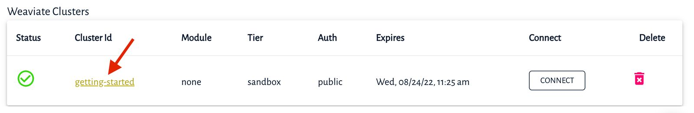

import Badges from '/_includes/badges.mdx';

<Badges/>

Here, you will be creating a new Weaviate instance for use throughout the getting started guide.

## Weaviate Cloud Service

The fastest way 🚀 to create a new Weaviate instance – from scratch – is to use the _Weaviate Cloud Service_ (aka, the WCS). The WCS is a completely managed service, so you don't have to install or maintain anything to run Weaviate. Currently, the service is in private beta, but (🤫) if you log in to the [Weaviate Cloud Console](https://console.weaviate.io), you can create a free sandbox to play around with.

If you are itching to get started with WCS, just skip to the [WCS hands-on section](#wcs-hands-on).

### Sign in to WCS

In order to access WCS, navigate to the [Weaviate Cloud Console](https://console.semi.technology/) and "Sign in with the Weaviate Cloud Service". 

If you don't have an account with WCS yet, click the ["Don't have an account? Sign Up"](https://auth.wcs.api.semi.technology/auth/realms/SeMI/protocol/openid-connect/registrations?client_id=wcs&response_type=code&redirect_uri=https://console.semi.technology/console/wcs) link and create an account.


### Create a Weaviate Cluster

To create a new Weaviate Cluster:
0. Press the "Create a Weaviate Cluster" button
0. Configure the cluster:
    0. Set a unique `name` for your cluster – note: The name will become part of the URL uses to access this instance. 
    0. Leave the `Subscription Tier` as `Sandbox` - note: The sandbox is free, but it will expire after 30 days
    0. Leave the `Weaviate Version` as the latest
    0. **Change** the `OIDC Authentication` to `Disabled`
    
    
0. Finally, press **Create**.

This will start the process to create a new cluster. The status indicator on the page will show the progress (in %); after a short while, you should see a green tick ✔️ - indicating that the cluster is ready.


### Connect to Weaviate

Click on the `Cluster Id` link, which will open a new page in your browser and display all the available endpoints.


> 💡 Note: For every endpoint, there is a `documentationHref` link, which points us to relevant documentation pages.

If you see this JSON response, *congratulations!* you have successfully started up an instance of Weaviate. 🎉

## Client libraries

You can communicate with Weaviate from your code by using one of the available [client libraries](../client-libraries/) (currently available for `Python`, `JavaScript`, `Java` and `Go`) or the [restful API](/developers/weaviate/current/restful-api-references/).

Add the client library to your project as follows:

* For `Python` add the `weaviate-client` to your system libraries with `pip`:
  ```bash
  $ pip install weaviate-client
  ```

* For `JavaScript` add `weaviate-client` to your project with `npm`:
  ```bash
  $ npm install weaviate-client
  ```

* For `Java` add this dependency to your project:
  ```xml
  <dependency>
    <groupId>technology.semi.weaviate</groupId>
    <artifactId>client</artifactId>
    <version>3.2.0</version>
  </dependency>
  ```

* For `Go` add `weaviate-go-client` to your project with `go get`:
  ```bash
  go get github.com/semi-technologies/weaviate-go-client/v4
  ```

Great. You now have an instance of Weaviate, as well as a client library to talk to it *with*. 

Next, let's start to build our database, starting with a *schema*.

## Running Weaviate with Docker

Working with Docker is great if you are building an application around Weaviate and want to run Weaviate on your local machine or in the cloud. If you have Docker already installed, you could have it all up and running in seconds (minutes if you use a  prepackaged transformers module).

To set up Weaviate with Docker, follow these two steps:

0. Get `docker-compose.yml` configuration file by calling:
    ```js
    curl -o docker-compose.yml "https://configuration.semi.technology/v2/docker-compose/docker-compose.yml?enterprise_usage_collector=false&modules=standalone&runtime=docker-compose&weaviate_version={{ site.weaviate_version }}"
    ```
0. Spin up docker
    ```js
    docker-compose up -d
    ```

Then you can continue with the tutorial.

If you are running Weaviate with Docker, keep in mind that the address for Weaviate will change from the WCS address to `http://localhost:8080`.
## More on deployment options

To learn more about the other self-deployment options, check out the documentation for installation with [Docker](https://weaviate.io/developers/weaviate/current/installation/docker-compose.html) or [Kubernetes](https://weaviate.io/developers/weaviate/current/installation/kubernetes.html). 

## Recap

* Weaviate Cloud Service (WCS) is a managed Weaviate SaaS.
* You have a working instance of Weaviate in WCS .
* You have installed a client library in your preferred language.

## Next

[Add a schema](./schema.html).

## More Resources

import DocsMoreResources from '/_includes/more-resources-docs.md';

<DocsMoreResources />
