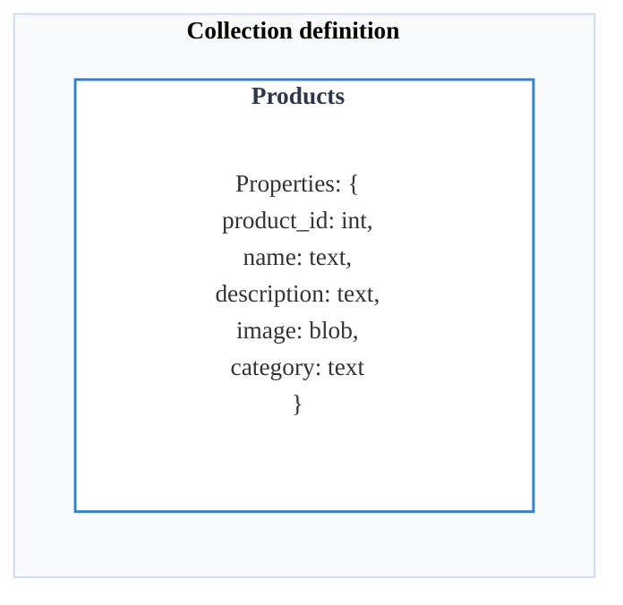
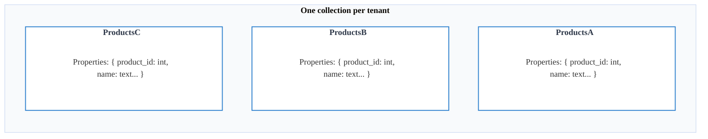
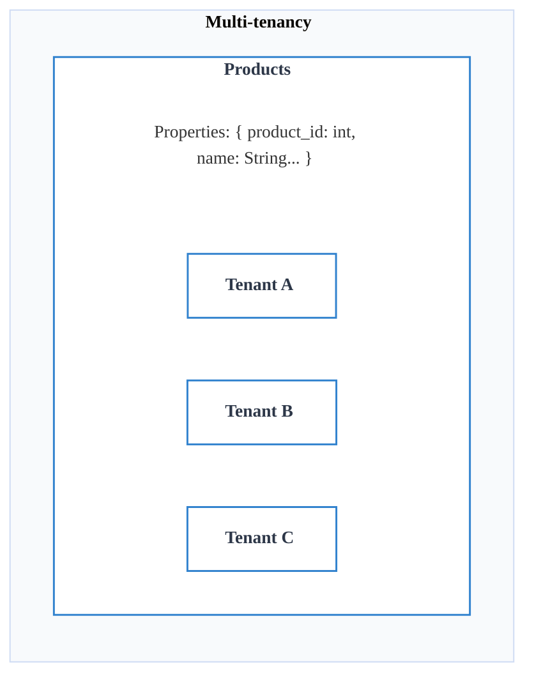

Consider a scenario where you are developing a SaaS platform for product recommendations, allowing merchants to import and vectorize their product data. These merchants require the ability to efficiently perform vector searches to generate personalized recommendations for users on their respective e-commerce platforms.

At first glance, the solution may seem straightforward - creating a dedicated collection for each merchant to store their product data. However, this approach raises critical scalability concerns. As the number of merchants grows, so does the number of collections, potentially leading to performance bottlenecks and increased operational complexity. This leads us to an important question: 
- **How many collections is too many?**

At what scale does this architecture become unsustainable, and is it truly the most efficient design for a vector database? Let's explore these questions by designing the architecture of the aforementioned product recommendation SaaS platform. 

## Structuring the Data in a Vector Database

In Weaviate, data is stored in collections, which contain objects with properties and vectors. For our recommendation engine, we define a collection `Products` where each product is represented by an embedding derived from images, descriptions, or other product information. 

When designing the data schema architecture of a vector database, you are faced with the decision between implementing **multi-tenancy** or creating **multiple collections** (otherwise known as **"One collection per tenant"** strategy). Both approaches have their use cases and trade-offs, particularly in the context of performance, scalability, and manageability.  

This guide aims to clarify these concepts and highlight the implications of each approach, focusing on the benefits and drawbacks:
- **["One collection per tenant" strategy](#one-collection-per-tenant-strategy)** 
- **[Multi-tenancy strategy](#multi-tenancy-strategy)**

### "One collection per tenant" strategy

This is probably the most intuitive approach, creating a separate collection for each merchant in order to ensure data isolation and customizability. When `MerchantA` registers on our platform, the application automatically creates the collection `ProductsA` for that merchant's products. This would also allow them to customize the collection and add properties that are specific to their e-commerce platform. 

At first, creating a new collection per merchant (`ProductsA`, `ProductsB`, etc.) might seem like a simple and effective way to maintain data isolation. However, as the platform scales, this approach quickly encounters significant challenges:

- **Resource Overhead:** Each collection requires its own schema, indexes, and storage, leading to increased memory and disk usage. Managing thousands or even millions of collections becomes nearly impossible.

- **Operational Complexity:** Schema changes must be applied individually to each collection. If a new feature requires modifying the schema (e.g., adding a "release\_date" property), every collection must be updated separately and this takes a lot of time and computational effort.

- **Query Performance:** Retrieving data across multiple collections can be inefficient, especially when performing global analytics (e.g., searching throughout multiple collections).

- **Scaling Limits:** Weaviate performs best when managing a limited number of collections. Exceeding a few hundred collections can introduce significant strain on the system, affecting indexing, backups, and restores.

### Multi-Tenancy Strategy

With multi-tenancy, a single collection stores products from multiple merchants while ensuring logical separation through metadata fields based on the `merchant_id`.

Each merchant is identified by a `merchant_id`, ensuring that their products remain logically separated within the same collection. Queries can also be filtered based on the `merchant_id` to retrieve only the relevant data.

With multi-tenancy, the recommendation engine benefits from:

- **Efficient Resource Utilization:** A single collection reduces indexing overhead and simplifies schema management.

- **Easier Schema Management:** Schema updates apply universally to all merchants.

- **Optimized Query Performance:** Queries leverage `merchant_id` filters for efficient retrieval.

- **Better Scalability:** New merchants can be onboarded without creating additional collections.

By choosing multi-tenancy, the AI-powered recommendation system remains scalable, efficient, and easier to maintain as the platform grows.

## Recommendations

### When to Use Multi-tenancy

Multi-tenancy refers to the practice of using a single collection to store data for multiple tenants. Each tenant’s data is logically isolated through the use of metadata fields like tenant IDs. Multi-tenancy is especially useful when you want to store data for multiple customers, or when you want to store data for multiple projects.

Use multi-tenancy when you need to support a large number of tenants and prioritize resource efficiency and scalability.

#### Advantages

- **Efficient resource utilization**: By consolidating data into a single collection, multi-tenancy reduces overhead associated with maintaining multiple database structures such as collections with their respective data schemas and configurations.
- **Scalability**: Indexes can be optimized with a single collection in mind rather than being fragmented across multiple collections. Each tenant has a dedicated, high-performance vector index which results in faster query speeds. Instead of searching a shared index space, each tenant responds as if it were the only user on the cluster.
- **Data isolation**: Each tenant’s data is completely segregated, simplifying access control and compliance requirements. This also means that data deletion is much easier and faster.
- **Cost reduction**: You can change the status of a tenant into `inactive` (stored locally on disk) or `offloaded` (stored on cloud storage) in order to save resources.

#### Challenges

- **Access control complexity**: Fine-grained access control must be implemented to ensure data isolation between tenants.

### When to Use Multiple Collections

In this approach, each tenant is assigned a dedicated collection to ensure physical separation of data between them. Before the implementation of multi-tenancy in Weaviate this was the best approach for managing data for multiple tenants. It's most suitable for scenarios with a limited number of tenants where schema customizability outweighs operational overhead.

#### Advantages

- **Customizability**: Schema changes or optimizations can be tailored to individual collections without affecting others.
- **Simpler queries**: Queries do not require tenant-specific filters, as each collection inherently belongs to a single tenant.
- **Data isolation**: In theory, each tenant’s data is completely segregated through the use of separate collections. 

#### Challenges

- **Performance drawbacks**: Each collection requires its own index, increasing memory and storage consumption.
- **Lots of duplication**: Schema changes must be applied to each collection individually which results in unnecessary duplicate operations.
- **Scaling limits**: Managing metadata for a large number of collections can strain the database’s internal systems, particularly during operations like backups and restores. In practice, having more than 10 collections could prove to be disadvantages.

## Conclusion

The choice between multi-tenancy and multiple collections depends on your specific use case, including the number of tenants, query patterns, and performance requirements. While multi-tenancy offers scalability and resource efficiency, multiple collections provide stronger data isolation and flexibility. Regularly monitor query performance, index size, and resource utilization to adjust the architecture as needed. Understanding the trade-offs will help you design an architecture that meets both current and future needs.

## Questions and feedback

import DocsFeedback from '/_includes/docs-feedback.mdx';

<DocsFeedback/>
