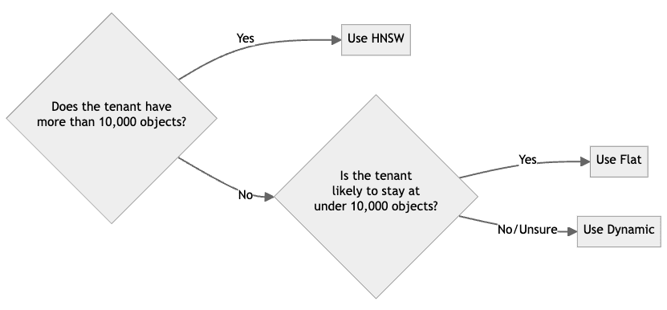
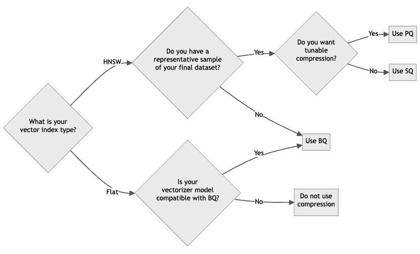
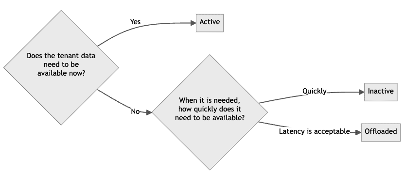

## Overview

Effective resource management is crucial for building scalable, cost-efficient, and high-performing AI applications. As your data grows and query demands increase, understanding how to balance storage tiers, optimize vector indexing, and manage tenants becomes essential.

Weaviate provides flexible resource management options to help build cost-effective and high-performing AI-native applications. This guide will help you make informed decisions about resource allocation, enabling you to minimize costs while maintaining optimal performance for your specific use case.

This guide covers:

- **[Storage tiers (*hot, warm, cold*)](#temperatures)**
- **[Vector index types](#vector-index-types)**
- **[Vector compression](#vector-compression)**
- **[Tenant states](#tenant-states)**
- **[Tips](#tips)**

## Temperatures

:::info Added in `v1.26`
:::

Storage resources are divided into three tiers: [*hot*](#-hot), [*warm*](#-warm), and [*cold*](#-cold). Each tier has different performance characteristics and costs.

| Tier     | Vector   Index Type | Vector   Compression | Tenant State  | Storage    | Performance           | Cost      |
|----------|-------------------|--------------------|---------------|------------|-----------------------|----------|
| 🟥 Hot   | HNSW              | PQ, SQ, BQ         | Active        | Memory | Fastest                | High     |
| 🟨 Warm  | Flat              | BQ                 | Active        | SSD       | Slower                 | Moderate |
| 🟦 Cold  | Any               | Any                | Inactive      | Cloud     | Resource not available | Low      |

### 🟥 Hot

- Describes memory usage
- Fastest and most expensive
- Primarily driven by [`HNSW`](../concepts/vector-index.md#hierarchical-navigable-small-world-hnsw-index) vector indexes
- Always available (active) for use
- Costs increase rapidly with scale

Optimization strategies:
- Select a `flat` or `dynamic` [index type](#vector-index-types)
- Apply [vector compression](#vector-compression) (to reduce memory usage)
- [Offload tenants](#tenant-states)

### 🟨 Warm

- Describes data stored on disk (SSD)
- Slower than [hot](#-hot) tier but less expensive
- Driven by [flat](../concepts/vector-index.md#flat-index) vector index, object data, and [inverted indexes](../concepts/indexing.md#inverted-indexes)
- Always available (active) for use
- Costs increase more slowly than hot tier as data grows

Optimization strategies:
- Apply [vector compression](#vector-compression) (to improve speed)
- Select an `hnsw` or `dynamic` [index type](#vector-index-types)
- [Offload tenants](#tenant-states)

### 🟦 Cold

- Describes data stored in cloud storage (e.g., AWS S3)
- Slowest and least expensive tier
- Primarily driven by [offloaded tenants](#tenant-states)
- Resources are not available (inactive) for use
- Requires [reactivation](#tenant-states) to access

Optimization strategy:
- Develop an offloading and onloading strategy to balance costs and performance

## Vector index types

Weaviate supports HNSW, flat, and dynamic vector index types.

| Index Type | Resource Usage | Performance | Suitable for      | Description |
|------------|----------------|-------------|-------------------|-------------|
| HNSW       | 🟥 Hot         | Fast        | Any object count  | A memory-based, fast index ([read more](../concepts/vector-index.md#hierarchical-navigable-small-world-hnsw-index)) |
| Flat       | 🟨 Warm        | Medium      | <~100k objects    | A disk-based, brute-force index ([read more](../concepts/vector-index.md#flat-index)) |
| Dynamic    | Depends        | Depends     | Any object count  | Transitions from flat to HNSW index at a specified threshold ([read more](../concepts/vector-index.md#dynamic-index)) |

The choice of index type depends on the number of objects and the desired performance. As a rule of thumb, use the following guidelines for a multi-tenant collection:

If you are unsure which index type to use, the dynamic index type is a good starting point, as it automatically transitions from a flat to an HNSW index based on the number of objects.

[Read more about vector indexes here](../concepts/vector-index.md).

## Vector compression

Vector compression reduces the size of each vector. This can have the impact of reducing memory usage, or improving performance by reducing the amount of data that needs to be read from disk.

Weaviate supports the following vector compression methods:

| Compression Method        | Index Type | Requires Training | Description |
|---------------------------|------------|-------------------|-------------|
| Product Quantization (PQ) | HNSW       | Yes               | Each vector becomes an array of integer-based centroids ([read more](../concepts/vector-quantization.md#product-quantization)) |
| Binary Quantization (BQ)  | HNSW, Flat | No                | Each vector dimension becomes a bit ([read more](../concepts/vector-quantization.md#binary-quantization)) |
| Scalar Quantization (SQ)  | HNSW, Flat | Yes               | Each vector dimension becomes an integer ([read more](../concepts/vector-quantization.md#scalar-quantization)) |

As a starting point, use the following guidelines for selecting a compression method:

If you are unsure which index type to use, scalar quantization is a good starting point, provided that you have a representative sample of your likely final dataset.

<!-- Replace with compression guide in the future when ready -->

[Read more about vector compression here](../concepts/vector-quantization.md).

## Tenant states

Multi-tenant collections enable you to efficiently manage isolated subsets of data that share the same schema and configuration. Weaviate supports the following tenant states:

| State     | Description |
|-----------|-------------|
| Active    | Tenant is available for use |
| Inactive  | Tenant is locally stored but not available for use |
| Offloaded | Tenant is stored in cloud storage and not available for use |

Tenant states enable you to balance costs and performance by offloading tenants to cold storage when they are not needed, and reactivating them when they are needed.

A tenant status management strategy can help you to optimize cost and performance. Here's why. A tenant with an HNSW index type uses *hot* resources, which are the most expensive.

But not all tenants need to be active all the time. Some tenants may be used infrequently, and others may be used only for a short period of time. So, strategies can be developed to deactivate or offload tenants to *warm* or *cold* storage when they are not needed, and reactivate them when they are needed.

### Tenant states and index types

Tenant states management strategies are tied to index types. This is because the index type determines the resources used by a tenant. For example, a tenant with an HNSW index type uses *hot* resources, while a tenant with a flat index type uses *warm* resources.

If a multi-tenancy collection is configured with a dynamic index type, some tenants may be stored in *warm* storage (flat index) and others in *hot* storage (HNSW index).

So, strategically managing tenant states can help you to optimize costs and performance.

As a starting point, use the following guidelines for selecting a tenant state:

If you are unsure which tenants can be made inactive or offloaded, consider a strategy of deactivating tenants that have not been accessed for a certain period of time. And offloading tenants that have not been accessed for a longer period of time.

## Tips

### Best Practices:

- Start with a dynamic index type for new collections. This is especially important for multi-tenancy collections, as it allows each tenant to use the most appropriate index type.
- Use vector compression techniques to optimize storage and query performance, especially for large datasets.
- Conduct thorough testing when changing index types or compression methods to ensure performance meets your requirements.

### Common Pitfalls:

- Overprovisioning hot storage: Keeping all data in hot storage can lead to unnecessary costs. Regularly assess what data truly needs the fastest access.
- Neglecting to plan for growth: Not anticipating data growth can lead to performance issues. Always design your resource management strategy with scalability in mind.
- Improper tenant management: In multi-tenant scenarios, forgetting to offload inactive tenants can lead to resource waste. Implement automated processes to manage tenant states based on usage patterns.
- Mismatch between quantization techniques, model and data: When using compression technique, ensure that the quantization technique is compatible with the model (e.g. BQ) and that the data is sufficient and representative for training (e.g. PQ, SQ).

## Related pages

- [Concepts: Vector Index](../concepts/vector-index.md)
- [Concepts: Vector Quantization](../concepts/vector-quantization.md)
- [Concepts: Multi-Tenancy](../concepts/data.md#multi-tenancy)
- [How-to: Set the vector index type](../manage-data/collections.mdx#set-vector-index-type)
- [How-to: Configure vector compression](../configuration/compression/index.md)
- [How-to: Perform multi-tenancy operations](../manage-data/multi-tenancy.md)

## Questions and feedback

import DocsFeedback from '/_includes/docs-feedback.mdx';

<DocsFeedback/>
