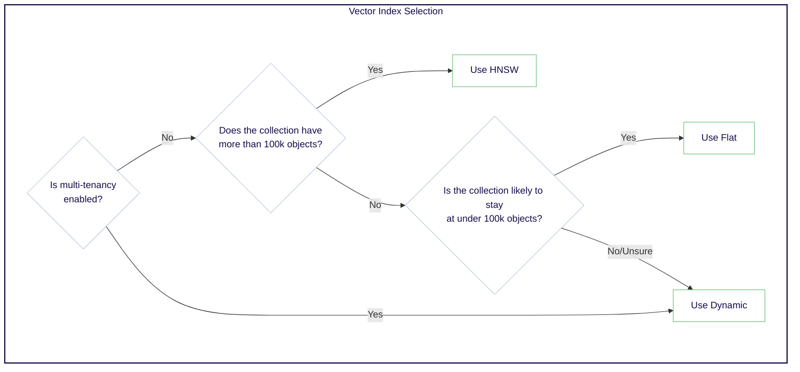
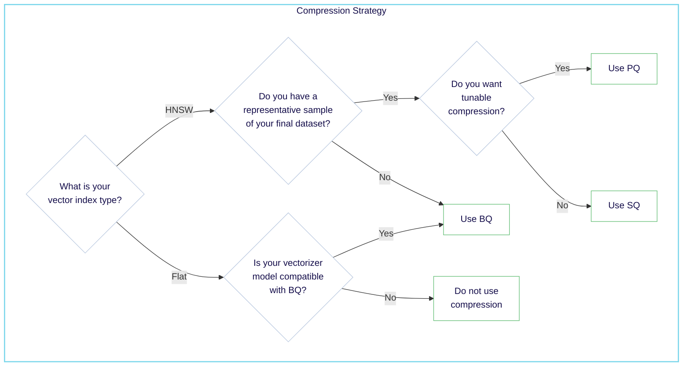
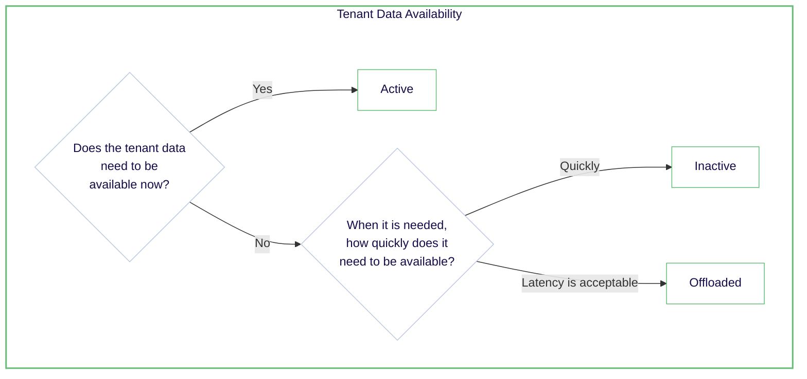

Weaviate provides flexible resource management features that help you to balance search speeds; search accuracy and recall; and system resource costs.

This guide provides an overview of these topics to help you make allocate resources effectively:

- **[Storage tiers (*hot, warm, cold*)](#storage-tiers---temperatures)**
- **[Vector index types](#vector-index-types)**
- **[Vector compression](#vector-compression)**
- **[Tenant states](#tenant-states)**
- **[Tips](#tips)**

:::tip Resource management Tips

- Start with the dynamic [index type](#vector-index-types) unless you have a reason not to.
- Consider [vector compression](#vector-compression) techniques if some loss of accuracy is acceptable.
    - This will improve query speeds.
    - For HNSW indexes, this will reduce memory usage.
- Avoid overprovisioning storage. Especially *hot* storage.
    - Can you use [tenant states](#tenant-states) to reduce costs?
    - Can you use [vector compression](#vector-compression) to reduce memory usage?

:::

## Storage Tiers - Temperatures

We categorize storage resources using three tiers: [*hot*](#-hot), [*warm*](#-warm), and [*cold*](#-cold). Each tier has different performance characteristics and costs.

| Tier     | Vector   Index Type | Vector   Compression | Tenant State  | Storage    | Performance           | Cost      |
|----------|-------------------|--------------------|---------------|------------|-----------------------|----------|
| 🟥 Hot   | HNSW              | PQ, SQ, BQ         | Active        | Memory | Fastest                | High     |
| 🟨 Warm  | Flat              | BQ                 | Active        | SSD       | Slower                 | Moderate |
| 🟦 Cold  | Any               | Any                | Inactive      | Cloud     | Resource not available | Low      |

### 🟥 Hot

- Describes memory usage
- Fastest and most expensive
- Primarily driven by [`HNSW`](./indexing.mdx#hnsw-indexes) vector indexes
- Always available (active) for use
- Costs increase rapidly with scale

### 🟨 Warm

- Describes data stored on disk (SSD)
- Slower than [hot](#-hot) tier but less expensive
- Driven by [flat](./indexing.mdx#flat-indexes) vector index, object data, and [inverted indexes](./indexing.mdx#inverted-indexes)
- Always available (active) for use
- Costs increase more slowly than hot tier as data grows

### 🟦 Cold

import OffloadingLimitation from '/_includes/offloading-limitation.mdx';

<OffloadingLimitation/>

- Describes data stored in cloud storage
- Slowest and least expensive tier
- Primarily driven by [offloaded tenants](#tenant-states)
- Resources are not available (inactive) for use
- Requires [reactivation](#tenant-states) to access

## Resource Management - Key Factors

Effective resource management in Weaviate involves balancing performance, cost, and data accessibility. The key levers to manage resources are:

- **[Vector index types](#vector-index-types)**: Choose the right index type based on the number of objects and desired performance.
- **[Vector compression](#vector-compression)**: Use compression techniques to reduce memory usage and improve query performance at the cost of some accuracy.
- **[Tenant states](#tenant-states)**: Manage tenant states to balance cost and performance.

### Vector index types

The choice of vector index type can have a significant impact on performance and resource usage. Weaviate supports the following index types:

| Index Type | Resource Usage | Performance | Suitable for      | Description |
|------------|----------------|-------------|-------------------|-------------|
| HNSW       | 🟥 Hot         | Fast        | Any object count  | A memory-based, fast index ([read more](./indexing.mdx#hnsw-indexes)) |
| Flat       | 🟨 Warm        | Medium      | <~10k objects    | A disk-based, brute-force index ([read more](./indexing.mdx#flat-indexes)) |
| Dynamic    | Depends        | Depends     | Any object count  | Transitions from flat to HNSW index at a specified threshold ([read more](./indexing.mdx#dynamic-indexes)) |

The choice of index type depends on the number of objects and the desired performance. As a rule of thumb, use the following guidelines for a multi-tenant collection:

If you are unsure which index type to use, the dynamic index type is a good starting point, as it automatically transitions from a flat to an HNSW index based on the number of objects.

- [Starter guide: indexes](./indexing.mdx)
- [How-to: Set the vector index type](../../manage-data/collections.mdx#set-vector-index-type)

### Vector compression

Vector compression techniques reduce the size of vectors by quantizing them into a smaller representation.

This can have the impact of reducing memory usage, or improving performance by reducing the amount of data that needs to be read from disk. The trade-off is that the resulting search quality may be lower.

Weaviate supports the following vector compression methods:

| Compression Method        | Index Type | Requires Training | Description |
|---------------------------|------------|-------------------|-------------|
| Product Quantization (PQ) | HNSW       | Yes               | Each vector becomes an array of integer-based centroids ([read more](../../concepts/vector-quantization.md#product-quantization)) |
| Binary Quantization (BQ)  | HNSW, Flat | No                | Each vector dimension becomes a bit ([read more](../../concepts/vector-quantization.md#binary-quantization)) |
| Scalar Quantization (SQ)  | HNSW       | Yes               | Each vector dimension becomes an integer ([read more](../../concepts/vector-quantization.md#scalar-quantization)) |
| Rotational Quantization (RQ) | HNSW    | No                | Each vector is rotated then quantized to 8-bit integers ([read more](../../concepts/vector-quantization.md#rotational-quantization)) |

As a starting point, use the following guidelines for selecting a compression method:

If you are unsure which index type to use, scalar quantization is a good starting point, provided that you have a representative sample of your likely final dataset.

- [Starter guide: Vector compression](./compression.mdx)
- [How-to: Configure vector compression](../../configuration/compression/index.md)

### Tenant states

Multi-tenant collections enable you to efficiently manage isolated subsets of data. Each tenant share the same schema and configuration.

Weaviate supports the following tenant states:

| Tenant state     | CRUD & Queries | Vector Index | Inverted Index | Object Data | Time to Activate |Description |
|------------------|----------------|--------------|----------------|-------------|------------------|------------|
| Active (default) | **Yes**        | Hot/Warm     | Warm           | Warm        | None             |Tenant is available for use |
| Inactive         | **No**         | Warm         | Warm           | Warm        | Fast             |Tenant is locally stored but not available for use |
| Offloaded        | **No**         | Cold         | Cold           | Cold        | Slow             |Tenant is stored in cloud storage and not available for use |

*Hot* tenants can be deactivated to *warm* storage to reduce memory usage, and any tenant can be offloaded to *cold* storage to reduce memory and disk usage. Conversely, any tenant can be reactivated when needed.

Consider a strategy of deactivating tenants that are not frequently accessed, and offloading tenants that are rarely accessed.

- [Starter guide: tenant states](./tenant-states.mdx)
- [How-to: Configure tenant offloading](../../configuration/tenant-offloading.md)
- [How-to: Manage tenant states](../../manage-data/tenant-states.mdx)

## Tips

### Best Practices

- Start with the dynamic [index type](#vector-index-types) for new collections. This is particularly useful for multi-tenant collections, as it allows each tenant to use the most appropriate index type.
- Use [vector compression](#vector-compression) techniques to optimize storage and query performance, especially for large collections or tenants.
- Conduct thorough testing when changing index types or compression methods to ensure performance meets your requirements.

### Common Pitfalls

- Overprovisioning hot storage: Keeping all data in hot storage can lead to unnecessary costs. Regularly assess what data truly needs the fastest access.
- Neglecting to plan for growth: Not anticipating data growth can lead to performance issues. Always design your resource management strategy with scalability in mind.
- Improper tenant management: In multi-tenant scenarios, forgetting to [offload inactive tenants](#tenant-states) can lead to resource waste. Implement automated processes to manage tenant states based on usage patterns.
- Mismatch between quantization techniques, model and data: When using compression technique, ensure that the quantization technique is compatible with the model (e.g. BQ) and that the data is sufficient and representative for training (e.g. PQ, SQ).

## Related pages

- [Starter guide: Compression](./compression.mdx)
- [Starter guide: Indexing](./indexing.mdx)
- [Starter guide: Tenant states](./tenant-states.mdx)
- [Concepts: Vector Index](../../concepts/vector-index.md)
- [Concepts: Vector Quantization](../../concepts/vector-quantization.md)
- [Concepts: Multi-Tenancy](../../concepts/data.md#multi-tenancy)
- [How-to: Set the vector index type](../../manage-data/collections.mdx#set-vector-index-type)
- [How-to: Configure vector compression](../../configuration/compression/index.md)
- [How-to: Perform multi-tenancy operations](../../manage-data/multi-tenancy.md)
- [How-to: Manage tenant states](../../manage-data/tenant-states.mdx)

## Questions and feedback

import DocsFeedback from '/_includes/docs-feedback.mdx';

<DocsFeedback/>
