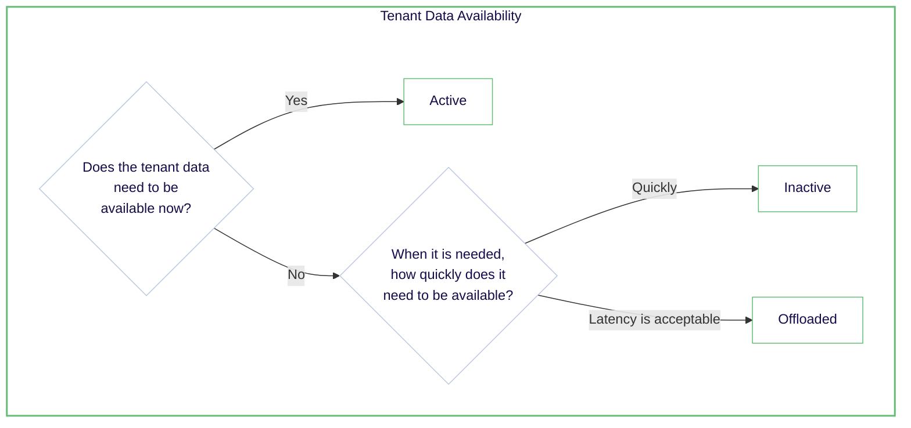

Multi-tenant collections enable you to efficiently manage isolated subsets of data using the same schema and configuration. Weaviate supports the following tenant states:

| Tenant state     | CRUD & Queries | Vector Index | Inverted Index | Object Data | Time to Activate | Tenant description |
|------------------|----------------|--------------|----------------|-------------|------------------|------------|
| Active (default) | **Yes**        | Hot/Warm     | Warm           | Warm        | None             | Available for use |
| Inactive         | **No**         | Warm         | Warm           | Warm        | Fast             | Not available for use, stored locally |
| Offloaded        | **No**         | Cold         | Cold           | Cold        | Slow             | Not available for use, stored on the cloud |

A tenant status management strategy can help you to balance cost and performance. Here's why. An active tenant with an HNSW index uses *hot* resources, which are the most expensive. At the other end of the spectrum, an offloaded tenant uses *cold* resources, which are the least expensive.

:::info Tenant state propagation
A tenant state change may take some time to propagate across a cluster, especially a multi-node cluster.

 

For example, data may not be immediately available after reactivating an offloaded tenant. Similarly, data may not be immediately unavailable after offloading a tenant. This is because the [tenant states are eventually consistent](../../concepts/replication-architecture/consistency.md#tenant-states-and-data-objects), and the change must be propagated to all nodes in the cluster.
:::

### Tenant states and resource usage

*Hot* tenants can be deactivated to *warm* storage to reduce memory usage, and any tenant can be offloaded to *cold* storage to reduce memory and disk usage. Conversely, any tenant can be reactivated when needed.

Therefore, consider a strategy of deactivating tenants that are not frequently accessed, and offloading tenants that are rarely accessed.

For example, imagine an e-commerce platform with separate tenants for each vendor. During a holiday sale, the tenant for a popular electronics vendor might be kept active for quick access, while tenants for seasonal vendors (e.g., Christmas decorations in July) could be offloaded to cold storage to save resources.

Understanding how tenant states interact with different index types is crucial for developing an effective resource management strategy. Let's explore this relationship in more detail.

### Tenant states and index types

Tenant states management strategies are tied to index types. This is because the index type determines the resources used by a tenant. For example, a tenant with an HNSW index type uses *hot* resources, while a tenant with a flat index type uses *warm* resources.

If a multi-tenant collection is configured with a dynamic index type, some tenants may be stored in *warm* storage (flat index) and others in *hot* storage (HNSW index). As a result, effectively managing tenants with HNSW indexes may have the most significant impact on resource usage.

We suggest following the following guidelines for selecting a tenant state:

If you are unsure which tenants can be made inactive or offloaded, consider a strategy of deactivating tenants that have not been accessed for a certain period of time. And offloading tenants that have not been accessed for a longer period of time.

## Hands-on

Here are some resources to implement hands-on tenant offloading in Weaviate.

### Configure tenant offloading

In order to use tenant offloading, you need to configure an offload module.  
(See [How-to: Configure tenant offloading](../../configuration/tenant-offloading.md))

### Update a tenant state

A tenant state can be switched between `active`, `inactive`, and `offloaded` at any time.  
(See [How-to: Manage tenant states](../../manage-data/tenant-states.mdx) for instructions and code examples.)

### Auto-activate tenants

You can configure a collection to automatically activate (inactive and offloaded) tenants when they are accessed.  
This can provide a balance between resource usage and performance.  
(See [How-to: Auto-activate tenants](../../manage-data/tenant-states.mdx#automatically-activate-tenants) for instructions and code examples.)

### Query offloaded tenants

You can query offloaded tenants in 2 fashions.
1. Query offloaded tenants via a weaviate cluster.
2. Query offloaded tenants via the querier service (New in 1.28 only).

#### Using the querier service

:::caution Limited search support
Currently the search feature set is limited. The querier currently supports:
- Reading objects by id
- Vector search
:::

Using the querier service is particulary useful in multi tenants read heavy use cases where the load can be varrying.
It allows cost saving by:
- Right sizing a core weaviate cluster for metadata and data write.
- Reducing storage cost by moving the data source of truth from disk to S3.
- Reducing compute cost allocated to the read path by allowing scaling up/down the querier service.

If your multi-tenant application has very large tenants or is requires very low latency, we would advise against
offloading tenants as in these cases the round trips to S3 storage can induce high latency.

See [How-to: Configure | Tenant Offloading](../../configuration/tenant-offloading.md#querier-module) for details of how to configure the Querier service, and [How-to: Manage Data | Multi-tenancy page](../../manage-data/multi-tenancy.md#query-offloaded-tenants) for query examples.

## Questions and feedback

import DocsFeedback from '/_includes/docs-feedback.mdx';

<DocsFeedback/>
