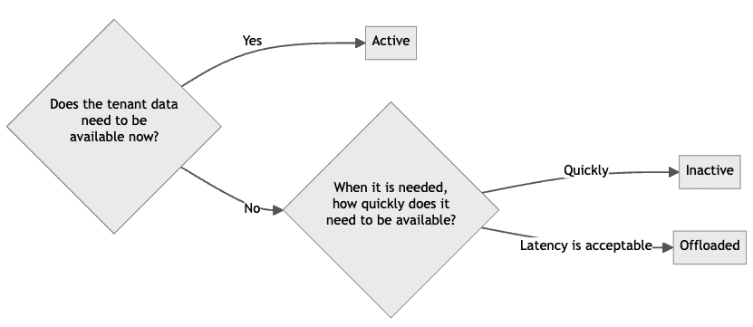

## Tenant states

Multi-tenant collections enable you to efficiently manage isolated subsets of data that share the same schema and configuration. Weaviate supports the following tenant states:

| Tenant state     | CRUD & Queries | Vector Index | Inverted Index | Object Data | Time to Activate |Description |
|------------------|----------------|--------------|----------------|-------------|------------------|------------|
| Active (default) | **Yes**        | Hot/Warm     | Warm           | Warm        | None             |Tenant is available for use |
| Inactive         | **No**         | Warm         | Warm           | Warm        | Fast             |Tenant is locally stored but not available for use |
| Offloaded        | **No**         | Cold         | Cold           | Cold        | Slow             |Tenant is stored in cloud storage and not available for use |

A tenant status management strategy can help you to balance cost and performance. Here's why. An active tenant with an HNSW index uses *hot* resources, which are the most expensive. At the other end of the spectrum, an offloaded tenant uses *cold* resources, which are the least expensive.

*Hot* tenants can be deactivated to *warm* storage to reduce memory usage, and any tenant can be offloaded to *cold* storage to reduce memory and disk usage. Conversely, any tenant can be reactivated when needed.

Therefore, consider a strategy of deactivating tenants that are not frequently accessed, and offloading tenants that are rarely accessed.

For example, imagine an e-commerce platform with separate tenants for each vendor. During a holiday sale, the tenant for a popular electronics vendor might be kept active for quick access, while tenants for seasonal vendors (e.g., Christmas decorations in July) could be offloaded to cold storage to save resources.

Understanding how tenant states interact with different index types is crucial for developing an effective resource management strategy. Let's explore this relationship in more detail.

### Tenant states and index types

Tenant states management strategies are tied to index types. This is because the index type determines the resources used by a tenant. For example, a tenant with an HNSW index type uses *hot* resources, while a tenant with a flat index type uses *warm* resources.

If a multi-tenant collection is configured with a dynamic index type, some tenants may be stored in *warm* storage (flat index) and others in *hot* storage (HNSW index). As a result, effectively managing tenants with HNSW indexes may have the most significant impact on resource usage.

We suggest following the following guidelines for selecting a tenant state:

If you are unsure which tenants can be made inactive or offloaded, consider a strategy of deactivating tenants that have not been accessed for a certain period of time. And offloading tenants that have not been accessed for a longer period of time.

## Questions and feedback

import DocsFeedback from '/_includes/docs-feedback.mdx';

<DocsFeedback/>
