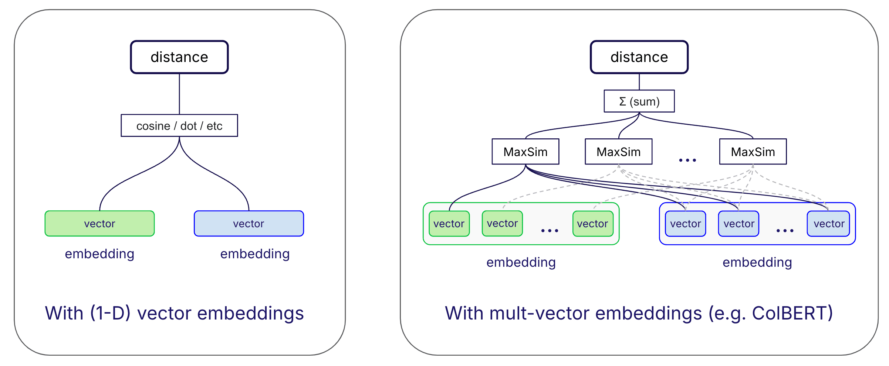

import Tabs from '@theme/Tabs';
import TabItem from '@theme/TabItem';
import FilteredTextBlock from '@site/src/components/Documentation/FilteredTextBlock';
import PyCode from '!!raw-loader!/developers/weaviate/tutorials/_includes/multi-vector-embeddings.py';

In this section, we will explore how to use multi-vector embeddings in Weaviate. Multi-vector embeddings (implemented through models like ColBERT, ColPali, or ColQwen) represent each object or query using multiple vectors instead of a single vector. This approach enables more precise searching through "late interaction" - a technique that matches individual parts of texts rather than comparing them as whole units.

:::caution Multi-vector embeddings technical preview
Multi-vector support is added in `v1.29` as a **technical preview**.
<br/>

This means that the feature is still under development and may change in future releases, including potential breaking changes. Currently, quantization is not supported for multi-vector embeddings.
<br/>

**We do not recommend using this feature in production environments at this time.**
:::

## Prerequisites

Before you start this tutorial, you should:

- Set up an instance of Weaviate (e.g. on [Weaviate Cloud](https://console.weaviate.cloud), or locally).
- Install your preferred Weaviate client library.
- A API key for Jina AI.
    - A free, "toy" key can be obtained from [Jina AI](https://jina.ai/).

:::tip See the Quickstart guide
For information on how to set up Weaviate and install the client library, see the [cloud](../quickstart/index.md) or [local](../quickstart/local.md) Quickstart guide.
:::

## Introduction

If you have used vector databases before, you may be familiar with the concept of a single vector representing an object. For example, the text `"A very nice cat"` could be represented by a vector such as:

```text
[0.0412, 0.1056, 0.5021, ...]
```

A multi-vector embedding, on the other hand, represents the same object using a set of nested, or two-dimensional vectors. For example, the text `"A very nice cat"` could be represented by a ColBERT embedding as:

```text
[
    [0.0543, 0.1941, 0.0451, ...],
    [0.0123, 0.0567, 0.1234, ...],
    ...,
    [0.4299, 0.0491, 0.9811, ...]
]
```

The core idea behind this representation is that the meaning of different parts of the text can be captured by different vectors. For example, the first vector might represent the token `"A"`, the second vector might represent the token `"very"`, and so on.

This allows for more nuanced comparisons between objects, and therefore improved retrieval of similar objects.

Weaviate `1.29` introduces support for multi-vector embeddings, allowing you to store and search for objects using multi-vector embeddings. Let's see how this works in practice.

<!-- This tutorial shows two workflows, one using a [ColBERT model integration](#colbert-model-integration) (with JinaAI's model) and another with [user-generated embeddings](#user-generated-embeddings).

Jump to the section that interests you, or follow along with both.

- [ColBERT model integration](#colbert-model-integration)
- [User-generated embeddings](#user-generated-embeddings) -->

:::info In depth: Understanding "late interaction"

Late interaction is an approach for computing similarity between texts that preserves fine-grained meaning by comparing individual parts of the text (like words or phrases). Models like ColBERT use this technique to achieve more precise text matching than traditional single-vector methods.
<br/>

The following visualization shows how late interaction works in a ColBERT model, in comparison to a single-vector model.



<small>Figure: Late interaction vs single-vector comparison</small>
<br/><br/>

<details>
  <summary>More about late interaction</summary>

In a single-vector approach, two embeddings have the same dimensionality (e.g. 768). So, their similarity is calculated directly, e.g. by calculating their dot product, or cosine distance. In this case, the only interaction occurs when the two vectors are compared.
<br/>

Another approach is a "early interaction" search, as seen in some "cross-encoder" models. In this approach, the query and the object are used throughout the embedding generation and comparison process. While this can lead to more accurate results, the challenge is that embeddings cannot be pre-calculated, before the query is known. So, this approach is often used for "reranker" models where the dataset is small.
<br/>

Late interaction is a middle ground between these two approaches, using multi-vector embeddings.
<br/>

Each multi-vector embedding is composed of multiple vectors, where a vector represents a portion of the object, such as a token. For example, one object's embedding may have a shape of (30, 64), meaning it has 30 vectors, each with 64 dimensions. But another object's embedding may have a shape of (20, 64), meaning it has 20 vectors, each with 64 dimensions.
<br/>

Late interaction takes advantage of this structure by finding the best match for each query token among all tokens in the target text (using MaxSim operation). For example, when searching for 'data science', each token-level vector is compared with the most relevant part of a document, rather than trying to match the vector for the entire phrase at once. The final similarity score combines these individual best matches. This token-level matching helps capture nuanced relationships and word order, making it especially effective for longer texts.
<br/>

A late interaction search:
1. Compares each query vector against each object vector
1. Combines these token-level comparisons to produce a final similarity score
<br/>

This approach often leads to better search results, as it can capture more nuanced relationships between objects.
</details>
:::

### When to use multi-vector embeddings

Multi-vector embeddings are particularly useful for search tasks where word order and exact phrase matching are important. This is due to multi-vector embeddings preserving token-level information and enabling late interaction.

The tradeoff is between search quality and resources. Multi-vector embeddings tend to be larger than single-vector embeddings, requiring more memory for the vector index. Additionally, the search process is more computationally intensive, as each token in the query must be compared to each token in the object.

The inference time and/or cost for embedding generation may also be higher, as multi-vector embeddings require more compute to generate.

## ColBERT model integration

In this section, we will use Weaviate's model integration with JinaAI's ColBERT model to generate multi-vector embeddings for text data.

### Step 0: Connect to Weaviate

First, connect to your Weaviate instance using your preferred client library. In this example, we assume you are connecting to a local Weaviate instance. For other types of instances, replace the connection details as needed ([connection examples](../connections/index.mdx)).

<Tabs groupId="languages">

 <TabItem value="py" label="Python Client v4">
    <FilteredTextBlock
      text={PyCode}
      startMarker="# START ConnectToWeaviate"
      endMarker="# END ConnectToWeaviate"
      language="py"
    />
  </TabItem>

</Tabs>

### Step 1: Collection configuration

Here, we define a collection called `"DemoCollection"`. It has a named vector configured with the `jina-colbert-v2` ColBERT model integration.

<Tabs groupId="languages">

 <TabItem value="py" label="Python Client v4">
    <FilteredTextBlock
      text={PyCode}
      startMarker="# START ColBERTCollectionConfig"
      endMarker="# END ColBERTCollectionConfig"
      language="py"
    />
  </TabItem>

</Tabs>

### Step 2: Import data

Now, we can import the data. For this example, we will import a few arbitrary text objects.

:::note Embeddings not required in this scenario
Recall that we configured the model integration (for `text2colbert-jinaai`) above. This enables Weaviate to obtain embeddings as needed.
:::

<Tabs groupId="languages">

 <TabItem value="py" label="Python Client v4">
    <FilteredTextBlock
      text={PyCode}
      startMarker="# START ColBERTImport"
      endMarker="# END ColBERTImport"
      language="py"
    />
  </TabItem>

</Tabs>

#### Confirm embedding shape

Let's retrieve an object and inspect the shape of its embeddings.

<Tabs groupId="languages">

 <TabItem value="py" label="Python Client v4">
    <FilteredTextBlock
      text={PyCode}
      startMarker="# START ColBERTCheckEmbeddings"
      endMarker="# END ColBERTCheckEmbeddings"
      language="py"
    />
  </TabItem>

</Tabs>

Inspecting the results, each embedding is composed of a list of lists (of floats).

```text
Embedding data type: <class 'list'>
Embedding first element type: <class 'list'>
This embedding's shape is (22, 128)
This embedding's shape is (25, 128)
This embedding's shape is (22, 128)
```

Note this in contrast to a single vector, which would be a list of floats.

### Step 3: Perform queries

Now that we have imported the data, we can perform searches using the multi-vector embeddings. Let's see how to perform semantic, hybrid, and vector searches.

#### 3.1 Near text search

Performing a near text, or semantic, search with a ColBERT embedding model integration is the same as with any other embedding model integration. The difference in embeddings' dimensionality is not visible to the user.

<Tabs groupId="languages">

 <TabItem value="py" label="Python Client v4">
    <FilteredTextBlock
      text={PyCode}
      startMarker="# START ColBERTNearText"
      endMarker="# END ColBERTNearText"
      language="py"
    />
  </TabItem>

</Tabs>

#### 3.2 Hybrid search (simple)

Similarly to the near text search, a hybrid search with a ColBERT embedding model integration is performed in the same way as with other embedding model integrations.

<Tabs groupId="languages">

 <TabItem value="py" label="Python Client v4">
    <FilteredTextBlock
      text={PyCode}
      startMarker="# START ColBERTHybrid"
      endMarker="# END ColBERTHybrid"
      language="py"
    />
  </TabItem>

</Tabs>

#### 3.3 Vector search

When performing a manual vector search, the user must specify the query embedding. In this example, to search the `multi_vector` index, the query vector must be a corresponding multi-vector.

Since we use JinaAI's `jina-colbert-v2` model in the integration, we obtain the embedding manually through JinaAI's API to make sure the query embedding is compatible with the object embeddings.

<details>
  <summary>Obtain the embedding manually</summary>

<Tabs groupId="languages">

 <TabItem value="py" label="Python Client v4">
    <FilteredTextBlock
      text={PyCode}
      startMarker="# START ObtainColBERTEmbedding"
      endMarker="# END ObtainColBERTEmbedding"
      language="py"
    />
  </TabItem>

</Tabs>

</details>

<Tabs groupId="languages">

 <TabItem value="py" label="Python Client v4">
    <FilteredTextBlock
      text={PyCode}
      startMarker="# START ColBERTVector"
      endMarker="# END ColBERTVector"
      language="py"
    />
  </TabItem>

</Tabs>

#### 3.4 Hybrid search (manual vector)

In all other searches where a vector embedding is to be specifically provided, it must be a multi-vector embedding, as with the manual vector search shown above.

<Tabs groupId="languages">

 <TabItem value="py" label="Python Client v4">
    <FilteredTextBlock
      text={PyCode}
      startMarker="# START ColBERTHybrid"
      endMarker="# END ColBERTHybrid"
      language="py"
    />
  </TabItem>

</Tabs>

<!-- ## User-generated embeddings -->

## Summary

In this tutorial, we learned how to use multi-vector embeddings in Weaviate.

We used the ColBERT model integration to generate multi-vector embeddings for text data, and performed semantic, hybrid, and vector searches.

For the most part, using Weaviate with multi-vector embeddings is similar to using Weaviate with single-vector embeddings. The main difference is in the shape of the embeddings, in occasions where the user must provide the embeddings manually.

## Further resources

- [ColBERT paper](https://arxiv.org/abs/2004.12832), [ColBERT v2 paper](https://arxiv.org/abs/2112.01488)
- [ColPali paper](https://arxiv.org/abs/2407.01449)

## Questions and feedback

import DocsFeedback from '/_includes/docs-feedback.mdx';

<DocsFeedback/>
