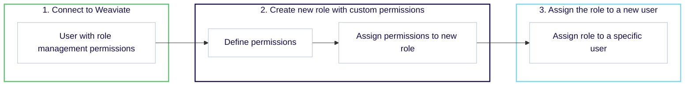

import Link from '@docusaurus/Link';
import Tabs from '@theme/Tabs';
import TabItem from '@theme/TabItem';
import FilteredTextBlock from '@site/src/components/Documentation/FilteredTextBlock';
import PyCode from '!!raw-loader!/_includes/code/python/howto.configure.rbac.permissions.py';
import RolePyCode from '!!raw-loader!/_includes/code/python/howto.configure.rbac.roles.py';
import UserPyCode from '!!raw-loader!/_includes/code/python/howto.configure.rbac.users.py';

**Role-Based Access Control (RBAC)** is a powerful security mechanism that lets you manage who can access and modify your Weaviate instance. In this tutorial, you'll learn how to set up RBAC in Weaviate by defining roles with tailored permissions and assigning them to users. This enables granular control over operations—from reading and writing data to managing collections and tenants—ensuring that only authorized users can perform specific actions.

## Introduction

In the steps that follow, we’ll cover:

- **Step 1: Connecting to Weaviate**  
  Ensure you're authenticated with a user who has the necessary role management permissions.
- **Step 2: Creating custom roles**  
  Define roles with specific permissions, such as read, write, tenant management, etc.
- **Step 3: Assigning roles to new users**  
  Apply these roles to a new user, limiting their access across different resources.



By the end of this guide, you’ll have a clear roadmap for implementing RBAC in your Weaviate deployment, adding an essential layer of security to your AI powered applications.

---

We are going to create the following roles:

- **[Read and write permissions](#read-and-write-permissions):** `rw_role`  
  Learn how to create a custom role that grants read and write access to collections and data, and assign it to a user.
- **[Viewer permissions](#viewer-permissions):** `viewer_role`  
  Set up a role that restricts users to read-only access for specific collections.
- **[Tenant permissions](#tenant-permissions):** `tenant_manager`  
  Configure roles with permissions to manage tenants, including creating, reading, and updating tenant information.

## Prerequisites

Before starting this tutorial, ensure you have the following:

- Docker for running a Weaviate instance locally.
- Your preferred Weaviate [client library](../client-libraries/index.md) installed.

### Local instance - `root` user

In order to follow the rest of the tutorial we will need to connect to Weaviate with a user who has the `root` role assigned. This will allow us to manage roles and permissions.

Create a Docker Compose file (`docker-compose.yml`) and copy the following configuration:

```yaml
---
services:
  weaviate:
    command:
      - --host
      - 0.0.0.0
      - --port
      - '8080'
      - --scheme
      - http
    image: cr.weaviate.io/semitechnologies/weaviate:||site.weaviate_version||
    ports:
      - 8080:8080
      - 50051:50051
    volumes:
      - weaviate_data:/var/lib/weaviate
    restart: on-failure:0
    environment:
      QUERY_DEFAULTS_LIMIT: 25
      PERSISTENCE_DATA_PATH: '/var/lib/weaviate'
      ENABLE_API_BASED_MODULES: 'true'
      CLUSTER_HOSTNAME: 'node1'
      AUTHENTICATION_ANONYMOUS_ACCESS_ENABLED: 'false'
      AUTHENTICATION_DB_USERS_ENABLED: 'true'
      AUTHENTICATION_APIKEY_ENABLED: 'true'
      AUTHENTICATION_APIKEY_ALLOWED_KEYS: 'root-user-key'
      AUTHENTICATION_APIKEY_USERS: 'root-user'
      AUTHORIZATION_ENABLE_RBAC: 'true'
      AUTHORIZATION_RBAC_ROOT_USERS: 'root-user'
volumes:
  weaviate_data:
```

The environment variables in this configuration:

- Enable RBAC.
- Configure `root-user` as a user with built-in root/admin permissions.

We will connect to Weaviate with `root-user`, and once we create a new role, we will also create a new user `custom-user` and assign the role to it.

## Read and write permissions

### Step 1: Connect to Weaviate

Ensure you are connected to Weaviate with a user possessing sufficient permissions to manage roles. You can achieve this by either using the predefined `root` role during [Weaviate configuration](../configuration/rbac/configuration.md) or by granting a user the [`manage_roles` permission](../configuration/rbac/manage-roles.mdx#role-management-permissions).

<Tabs groupId="languages">
  <TabItem value="py" label="Python Client v4">
    <FilteredTextBlock
      text={RolePyCode}
      startMarker="# START AdminClient"
      endMarker="# END AdminClient"
      language="py"
    />
  </TabItem>
  <TabItem value="js" label="JS/TS Client v3">

```ts
// TS support coming soon
```

  </TabItem>
  <TabItem value="go" label="Go">

```go
// Go support coming soon
```

  </TabItem>
  <TabItem value="java" label="Java">

```java
// Java support coming soon
```

  </TabItem>
</Tabs>

### Step 2: Create new role with custom permissions

This grants read and write permissions for collections starting with `TargetCollection`, and read permissions to nodes and cluster metadata.

<Tabs groupId="languages">
  <TabItem value="py" label="Python Client v4">
    <FilteredTextBlock
      text={PyCode}
      startMarker="# START ReadWritePermissionDefinition"
      endMarker="# END ReadWritePermissionDefinition"
      language="py"
    />
  </TabItem>
  <TabItem value="js" label="JS/TS Client v3">

```ts
// TS support coming soon
```

  </TabItem>
  <TabItem value="go" label="Go">

```go
// Go support coming soon
```

  </TabItem>
  <TabItem value="java" label="Java">

```java
// Java support coming soon
```

  </TabItem>
</Tabs>

### Step 3: Assign the role to a new user

First, let's create the new user `custom-user`:

<Tabs groupId="languages">
  <TabItem value="py" label="Python Client v4">
    <FilteredTextBlock
      text={UserPyCode}
      startMarker="# START CreateUser"
      endMarker="# END CreateUser"
      language="py"
    />
  </TabItem>
  <TabItem value="js" label="JS/TS Client v3">

```ts
// TS support coming soon
```

  </TabItem>
  <TabItem value="go" label="Go">

```go
// Go support coming soon
```

  </TabItem>
  <TabItem value="java" label="Java">

```java
// Java support coming soon
```

  </TabItem>
</Tabs>

Now, you can assign the role `rw_role` to `custom-user`:

<Tabs groupId="languages">
  <TabItem value="py" label="Python Client v4">
    <FilteredTextBlock
      text={PyCode}
      startMarker="# START ReadWritePermissionAssignment"
      endMarker="# END ReadWritePermissionAssignment"
      language="py"
    />
  </TabItem>
  <TabItem value="js" label="JS/TS Client v3">

```ts
// TS support coming soon
```

  </TabItem>
  <TabItem value="go" label="Go">

```go
// Go support coming soon
```

  </TabItem>
  <TabItem value="java" label="Java">

```java
// Java support coming soon
```

  </TabItem>
</Tabs>

## Viewer permissions

### Step 1: Connect to Weaviate

Ensure you are connected to Weaviate with a user possessing sufficient permissions to manage roles. You can achieve this by either using the predefined `root` role during [Weaviate configuration](../configuration/rbac/configuration.md) or by granting a user the [`manage_roles` permission](../configuration/rbac/manage-roles.mdx#role-management-permissions).

<Tabs groupId="languages">
  <TabItem value="py" label="Python Client v4">
    <FilteredTextBlock
      text={RolePyCode}
      startMarker="# START AdminClient"
      endMarker="# END AdminClient"
      language="py"
    />
  </TabItem>
  <TabItem value="js" label="JS/TS Client v3">

```ts
// TS support coming soon
```

  </TabItem>
  <TabItem value="go" label="Go">

```go
// Go support coming soon
```

  </TabItem>
  <TabItem value="java" label="Java">

```java
// Java support coming soon
```

  </TabItem>
</Tabs>

### Step 2: Create new role with custom permissions

This grants viewer permissions for collections starting with `TargetCollection`.

<Tabs groupId="languages">
  <TabItem value="py" label="Python Client v4">
    <FilteredTextBlock
      text={PyCode}
      startMarker="# START ViewerPermissionDefinition"
      endMarker="# END ViewerPermissionDefinition"
      language="py"
    />
  </TabItem>
  <TabItem value="js" label="JS/TS Client v3">

```ts
// TS support coming soon
```

  </TabItem>
  <TabItem value="go" label="Go">

```go
// Go support coming soon
```

  </TabItem>
  <TabItem value="java" label="Java">

```java
// Java support coming soon
```

  </TabItem>
</Tabs>

### Step 3: Assign the role to a new user

First, let's create the new user `custom-user`:

<Tabs groupId="languages">
  <TabItem value="py" label="Python Client v4">
    <FilteredTextBlock
      text={UserPyCode}
      startMarker="# START CreateUser"
      endMarker="# END CreateUser"
      language="py"
    />
  </TabItem>
  <TabItem value="js" label="JS/TS Client v3">

```ts
// TS support coming soon
```

  </TabItem>
  <TabItem value="go" label="Go">

```go
// Go support coming soon
```

  </TabItem>
  <TabItem value="java" label="Java">

```java
// Java support coming soon
```

  </TabItem>
</Tabs>

Now, you can assign the role `viewer_role` to `custom-user`:

<Tabs groupId="languages">
  <TabItem value="py" label="Python Client v4">
    <FilteredTextBlock
      text={PyCode}
      startMarker="# START ViewerPermissionAssignment"
      endMarker="# END ViewerPermissionAssignment"
      language="py"
    />
  </TabItem>
  <TabItem value="js" label="JS/TS Client v3">

```ts
// TS support coming soon
```

  </TabItem>
  <TabItem value="go" label="Go">

```go
// Go support coming soon
```

  </TabItem>
  <TabItem value="java" label="Java">

```java
// Java support coming soon
```

  </TabItem>
</Tabs>

## Tenant permissions

### Step 1: Connect to Weaviate

Ensure you are connected to Weaviate with a user possessing sufficient permissions to manage roles. You can achieve this by either using the predefined `root` role during [Weaviate configuration](../configuration/rbac/configuration.md) or by granting a user the [`manage_roles` permission](../configuration/rbac/manage-roles.mdx#role-management-permissions).

<Tabs groupId="languages">
  <TabItem value="py" label="Python Client v4">
    <FilteredTextBlock
      text={RolePyCode}
      startMarker="# START AdminClient"
      endMarker="# END AdminClient"
      language="py"
    />
  </TabItem>
  <TabItem value="js" label="JS/TS Client v3">

```ts
// TS support coming soon
```

  </TabItem>
  <TabItem value="go" label="Go">

```go
// Go support coming soon
```

  </TabItem>
  <TabItem value="java" label="Java">

```java
// Java support coming soon
```

  </TabItem>
</Tabs>

### Step 2: Create new role with custom permissions

This grants permissions to manage collections starting with `TargetCollection`, and to create, read, and update tenants in the same collection.

<Tabs groupId="languages">
  <TabItem value="py" label="Python Client v4">
    <FilteredTextBlock
      text={PyCode}
      startMarker="# START MTPermissionsExample"
      endMarker="# END MTPermissionsExample"
      language="py"
    />
  </TabItem>
  <TabItem value="js" label="JS/TS Client v3">

```ts
// TS support coming soon
```

  </TabItem>
  <TabItem value="go" label="Go">

```go
// Go support coming soon
```

  </TabItem>
  <TabItem value="java" label="Java">

```java
// Java support coming soon
```

  </TabItem>
</Tabs>

### Step 3: Assign the role to a new user

First, let's create the new user `custom-user`:

<Tabs groupId="languages">
  <TabItem value="py" label="Python Client v4">
    <FilteredTextBlock
      text={UserPyCode}
      startMarker="# START CreateUser"
      endMarker="# END CreateUser"
      language="py"
    />
  </TabItem>
  <TabItem value="js" label="JS/TS Client v3">

```ts
// TS support coming soon
```

  </TabItem>
  <TabItem value="go" label="Go">

```go
// Go support coming soon
```

  </TabItem>
  <TabItem value="java" label="Java">

```java
// Java support coming soon
```

  </TabItem>
</Tabs>

Now, you can assign the role `tenant_manager` to `custom-user`:

<Tabs groupId="languages">
  <TabItem value="py" label="Python Client v4">
    <FilteredTextBlock
      text={PyCode}
      startMarker="# START MTPermissionsAssignment"
      endMarker="# END MTPermissionsAssignment"
      language="py"
    />
  </TabItem>
  <TabItem value="js" label="JS/TS Client v3">

```ts
// TS support coming soon
```

  </TabItem>
  <TabItem value="go" label="Go">

```go
// Go support coming soon
```

  </TabItem>
  <TabItem value="java" label="Java">

```java
// Java support coming soon
```

  </TabItem>
</Tabs>

## Summary

This tutorial provides a comprehensive guide to configuring RBAC in Weaviate, helping you secure your vector database by managing user access with tailored roles and permissions.

It walks you through connecting to Weaviate using a user with role management capabilities, then demonstrates how to create custom roles for different access levels. You’ll learn how to set up roles with read and write permissions to manage collections and data, configure viewer permissions for read-only access, and establish tenant permissions for managing tenant operations.

## Additional resources

- [RBAC: Configuration](../configuration/rbac/configuration.md)
- [RBAC: Manage roles](../configuration/rbac/manage-roles.mdx)
- [RBAC: Manage users](../configuration/rbac/manage-users.mdx)

## Questions and feedback

import DocsFeedback from '/_includes/docs-feedback.mdx';

<DocsFeedback />
