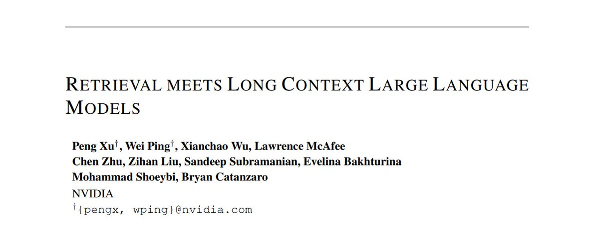

<!-- truncate -->

import { DownloadButton } from '/src/theme/Buttons';

Fine-tuned larger language models and longer context lengths eliminate the need for retrieval from external knowledge/vector databases, right? ... Not quite!!

NVIDIA asked the same question last month! 

They published a [new paper](https://arxiv.org/abs/2310.03025) examining how well very large finetuned LLMs with longer context lengths compare to shorter context length RAG supported LLMs. They explore two main questions:

1. Retrieval-augmentation versus long context window, which one is better for downstream tasks?
2. Can both methods be combined to get the best of both worlds?

In short, they found:

1. RAG outperforms long context alone.
2. Yes they perform better together. RAG works better with longer context than with shorter context.

The main finding presented in the paper was that "retrieval can significantly improve the performance of LLMs regardless of their extended context window sizes". 

Some more details: 
1. RAG is more important than context windows: a LLM with 4K context window using simple retrieval-augmentation at generation can achieve comparable performance to finetuned LLM with 16K context window.

2. RAG is also faster: Augmenting generation with retrieval not only performs better by requiring significantly less computation and is much faster at generation.

3. RAG works even better as parameter count increases because smaller 6-7B LLMs have relatively worse zero-shot capability to incorporate the retrieved chunked context: Perhaps counter intuitively the benefits of RAG on performance are more pronounced the larger the language model gets, experiments were done for LLMs with 43B and 70B params.

4. RAG works even better as context length increases: Retrieval-augmented long context LLM (e.g., 16K and 32K) can obtain better results than retrieval-augmented 4K context LLM, even when fed with the same top 5 chunks of evidence.

5. Retrieval-augmented LLaMA2-70B with 32K context window, outperforms GPT-3.5-turbo-16k and Davinci003 and non-retrieval LLaMA2-70B-32k baseline for question answering and query-based summarization.

  <DownloadButton link='https://arxiv.org/abs/2310.03025'>🔗 Arxiv Link</DownloadButton>

  <DownloadButton link='https://arxiv.org/pdf/2310.03025'>📜 Download paper</DownloadButton>

<!-- We could create a specific template for Paper Review's -->
import WhatNext from '/_includes/what-next.mdx'

<WhatNext />
