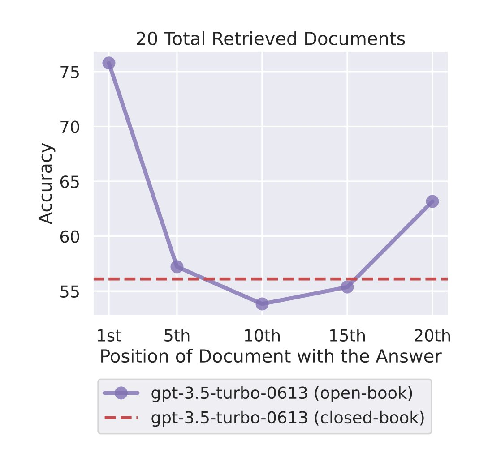

<!-- truncate -->

import { DownloadButton } from '/src/theme/Buttons';

Why do large language models pay more attention to and reason better over the beginning and end of what you tell them in prompts?🤔

Nelson Liu and Percy Liang's group at Stanford recently published a [paper](https://arxiv.org/abs/2307.03172) that discovered this "lost in the middle" effect. 

Greg Kamradt also ran great experiments and posted about how this very same pattern of underperformance exists in the new GPT-4 128K models from OpenAI. 

The point of the paper was to establish "how well LLMs use longer context" and ran experiments conducting QnA and key-value retrieval tasks on models from Mosaic, Anthropic and OpenAI and varied input context size and the position of the relevant information in the context.

The main discovery was that attention followed a U-shaped pattern where more importance was given to the beginning and end of the context window as opposed to the middle portion.

This is such a great paper with a wealth of knowledge gems💎- here are some details and reasons why this happens:

1. Due to Model Architecture: LLMs are transformers that scale poorly to long sequences (O(d^2)). As a result, language models are typically trained with relatively small context windows and thus perform better on these.

2. Tasks during supervised instruction-tuning are commonly placed at the beginning of the input context, which might lead these LLMs to place more weight on the start of the input context.

3. Encoder-decoder models perform better than decoder-only models, by making better use of their context windows because their bidirectional encoder allows processing each document in the context of future documents.

4. You can improve the performance of decoder-only models(can only attend to prior tokens at each timestep) by placing the query before and after the data, enabling query-aware contextualization of documents.

6. Based on the key-value retrieval experiments, let alone attending less to the middle, many models struggle to simply retrieve matching tokens that occur in the middle of their input context.

7. Even base language models (i.e., without instruction fine-tuning) show a U-shaped performance curve.

8. For open-domain QnA tasks, where none or many of the top k documents may contain the answer, models fail to effectively use more than 20 retrieved documents.

  <DownloadButton link={require('./download/2307.03172.pdf').default}>Download the paper - as a button</DownloadButton>

<!-- We could create a specific template for Paper Review's -->
import WhatNext from '/_includes/what-next.mdx'

<WhatNext />
