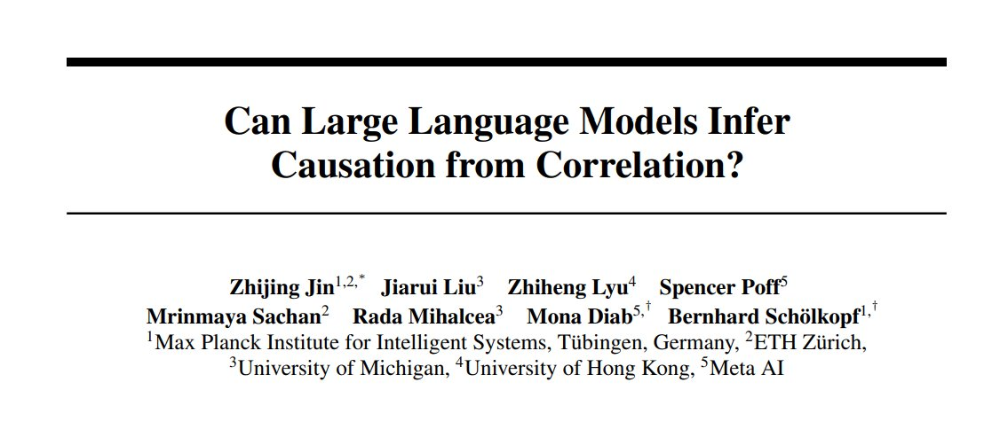

<!-- truncate -->

import { DownloadButton } from '/src/theme/Buttons';

Can large language models infer causation from correlation? 

And if they can't automatically bridge the gap from correlation to causation, then can we at least fine-tune them to improve at this task?

These two questions were addressed by researchers at the Max Planck Institute(https://arxiv.org/abs/2306.05836). 

We know that the success of LLM's arises from capturing a vast set of statistical correlations among words, but how well can these correlations be used to infer deeper causal relationships behind the words? 

They showed that this is a very big shortcoming of all of the LLMs they tested as of June 2023.

Some details:
1. Using a dataset, they created called Corr2Cause, they assessed an LLM's ability to take multiple correlational statements as input and accurately determine the causal relationships between these same variables.

2. Every model, out of 17 tested, provided a near-random performance on the task and was unable to perform pure causal reasoning. 

3. Furthermore, they tested that even if you finetune the model for this task, it still doesn't generalize and only performs well for the variable names and textual expressions found in the training set. When the variable names and text were paraphrased model accuracy in inferring causality dropped. 

An important point to make is that It's quite difficult to differentiate and assess actual reasoning from rote training set memorization - even more so now that we have ever-growing training sets and don't know what data the model was trained on and only have API access to the models. 

It'd be interesting to see if newer models since the date of publication can do better on paraphrased and renamed versions of this Corr2Cause dataset of ~400k datapoints.

  <DownloadButton link={require('./download/2306.05836.pdf').default}>Download the paper</DownloadButton>

<!-- We could create a specific template for Paper Review's -->
import WhatNext from '/_includes/what-next.mdx'

<WhatNext />
