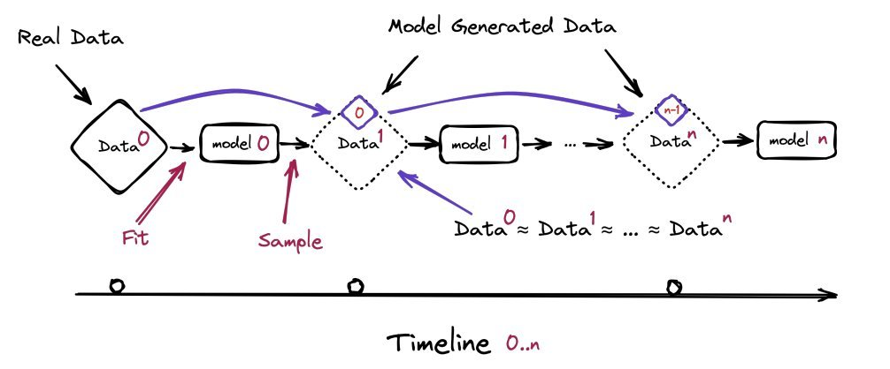
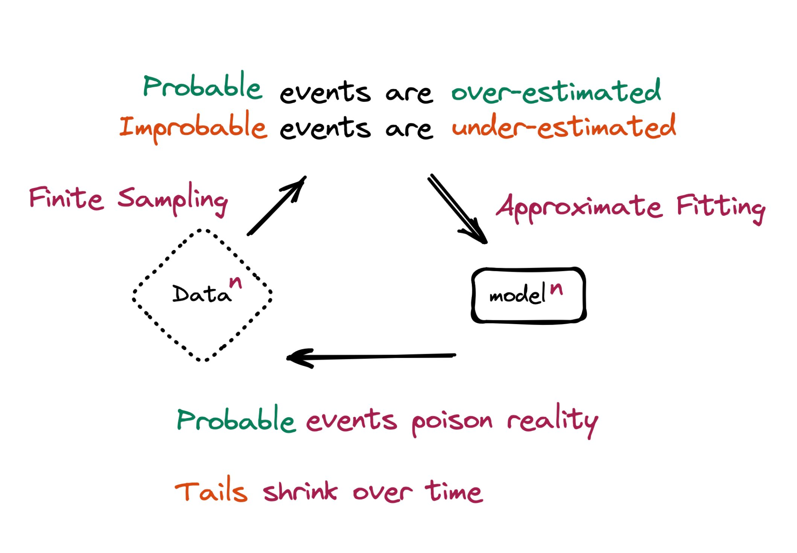

<!-- truncate -->

import { DownloadButton } from '/src/theme/Buttons';

Can we use synthetic, LLM generated, data to train the next generations of bigger and better LLMs? How far will synthetic data take us in the pursuit of AGI?🤔

A paper(https://arxiv.org/abs/2305.17493) from researchers at Oxford and Cambridge addressed these questions earlier this year.

Synthetic data is quite promising, but to see how far we can push the limit with it, this paper investigates what happens when text produced by a version of GPT forms most of the training dataset of following models. What happens to GPT versions GPT-{n} as generation n increases?

In short, it was found that "model-collapse" occurs – a degenerative process whereby, over time, models forget the true underlying data distribution. Over time, you start losing information about the true distribution, which first starts with tails disappearing, and over the generations learned behaviors start converging to a point estimate with very small variance.

In other words - using synthetic data works at first but relying on it to successively train better and better models generation after generation seems like a loosing bet. Access to the original data distribution is crucial: in learning where the tails of the underlying distribution matter you need access to real human-produced data.

Here are some more details:

1. Two sets of experiments were done: one in which all data is replaced with synthetic data produced by the last generation of LLM and another where only 90% is replaced(10% original human-produced data)

2. They found that preservation of the original data allows for better model fine-tuning and leads to only minor degradation of performance.

3. In early model collapse the model begins losing information about the tails of the distribution

4. In late model collapse model entangles different modes of the original distributions and converges to a distribution that carries little resemblance to the original one, often with very small variance.

5. This collapse occurs due to statistical approximation error(due to the number of samples being finite) and functional approximation error(comes from models being insufficiently expressive). A third source of error can also be computational error coming from floating point arithmetic.

  <DownloadButton link={require('./download/2305.17493.pdf').default}>Download the paper - as a button</DownloadButton>

<!-- We could create a specific template for Paper Review's -->
import WhatNext from '/_includes/what-next.mdx'

<WhatNext />
