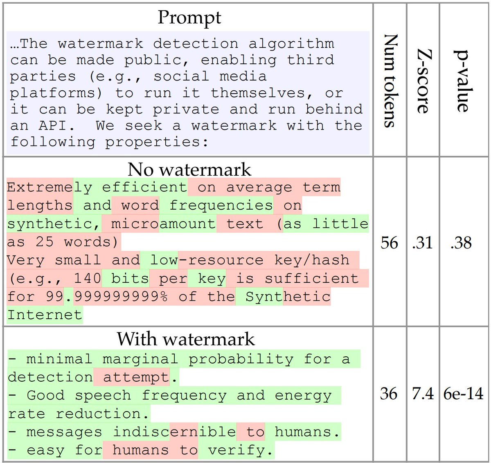

<!-- truncate -->

import { DownloadButton } from '/src/theme/Buttons';

Can you tell the difference between human-written language and AI-generated text?🤔 

To solve this problem we need watermarks!📃

Researchers at the University of Maryland(https://arxiv.org/abs/2301.10226) created a way for us to modify LLMs such that a watermark would automatically be applied to any content that LLM generates. This allows us to run a test for this watermark to identify synthetic content in the wild.

A watermark is a hidden pattern in text that is imperceptible to humans, but when the text is statistically analyzed it allows us to identify synthetic content. The watermark they created can be identified in as little as 25 tokens and has negligible impact on text quality.

The watermark works by selecting a randomized set of secret “green” tokens before a word is generated, and then softly incentivizing the LLM to use those green tokens by slightly nudging the output word probabilities during sampling. The more "green" tokens found in a chunk of text the higher the probability it was generated by an LLM.

The challenge here is that in order to apply this watermark the company owning the LLM (OpenAI, Cohere, Anthropic etc.) needs to promote the use of these random secret "green" tokens by slightly increasing their probability of being generated.

Yet, another problem is that the higher this "green" token probability the easier the watermark will be to detect however, this also lowers the quality of the text overall.

  <DownloadButton link='https://arxiv.org/abs/2301.10226'>🔗 arXiv Link</DownloadButton>

  <DownloadButton link='https://arxiv.org/pdf/2301.10226'>📜 Download paper</DownloadButton>

<!-- We could create a specific template for Paper Review's -->
import WhatNext from '/_includes/what-next.mdx'

<WhatNext />
