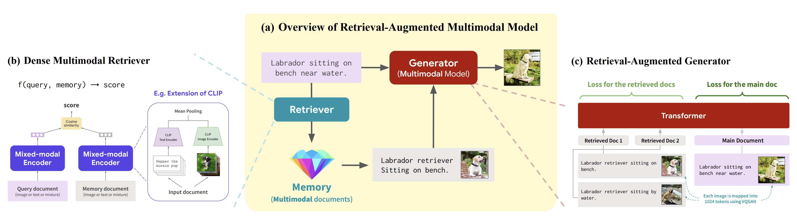

<!-- truncate -->

import { DownloadButton } from '/src/theme/Buttons';

What's better than retrieval augmented generation(RAG)? 🥁🥁🥁 

Multimodal RAG! 😎👌🔥

RAG allows you to pack retrieved context into a prompt so that a language model can read relevant information before generating a response - this function is critical and allows us to integrate knowledge in a more scalable and modular way into LLMs. 

But isn't a picture worth a thousand words? So why just stop at retrieving textual context??

This is where multimodal RAG(MM-RAG) comes into the picture!

If you have an external knowledge database that can represent and store multimedia like images, audio, and video, just as well as it can text, then you can retrieve these objects and provide them a richer context for Large Multimodal Models to generate with. 

Vector databases provide an ideal store from which multimedia knowledge can be retrieved and can capture the meaning of all of these modalities. 

A paper(https://arxiv.org/abs/2211.12561) earlier this year from @michiyasunaga at Stanford presented the first multimodal model that can retrieve and generate both text and images and discusses the advantages of MM-RAG.

They found that MM-RAG:

1. Significantly outperforms baseline multimodal models such as DALL-E and CM3 on both image and caption generation tasks

2. Require much less compute for training (<30% of DALLE)

3. MM-RAG capable models also generate images much more faithful to the retrieved context

4. Are capable of multimodal in-context learning (e.g., image generation from demonstrations)

  <DownloadButton link={require('./download/2211.12561.pdf').default}>Download the paper - as a button</DownloadButton>

<!-- We could create a specific template for Paper Review's -->
import WhatNext from '/_includes/what-next.mdx'

<WhatNext />
