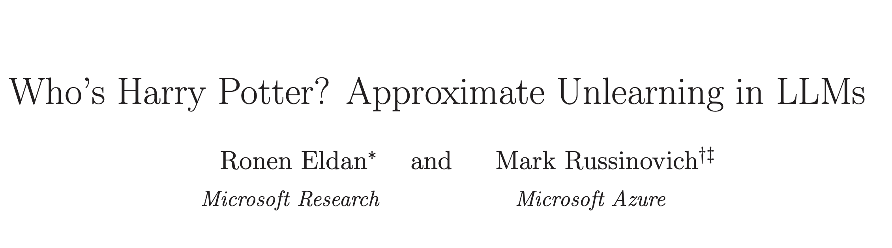

<!-- truncate -->

import { DownloadButton } from '/src/theme/Buttons';

Sure, you can train a LLM, perhaps you can even finetune one! But can you brainwash one into forgetting specific concepts?🧠

How would you erase a concept from a LLM's parametric memory?

This question was addressed by researchers at MicrosoftAI in their new paper(https://arxiv.org/abs/2310.02238) where they "propose a novel technique for unlearning a subset of the training data from a LLM" without adversely impacting performance on other benchmarks.

They propose "unlearning" or "un-training" as a three-step process:

1. First they finetune a model to always respond with some reference to the information they want to later erase. This "reinforced model" becomes a specialist in the information we eventually want to unlearn. This step is used to identify which tokens should be targeted in the unlearning step!

2. For each of these unlearning targets identified in step 1 they generate synthetic generic alternatives using GPT4. So for example a sentence that originally says "Harry went to the Gryffindor common room" should be turned into "Harry went to the gym".

3. Each block of text from the unlearn target is then replaced with the generic counterparts and this dataset is now used to finetune the base model, which effectively erases the original text from the model’s memory whenever it is prompted with its context.

For these experiments, they finetuned a Llama2-7b and it took about 1 GPU hour to implement this unlearning for a dataset that consisted of about 3.1M Harry Potter related tokens.

  <DownloadButton link={require('./download/2310.02238.pdf').default}>Download the paper - as a button</DownloadButton>

<!-- We could create a specific template for Paper Review's -->
import WhatNext from '/_includes/what-next.mdx'

<WhatNext />
