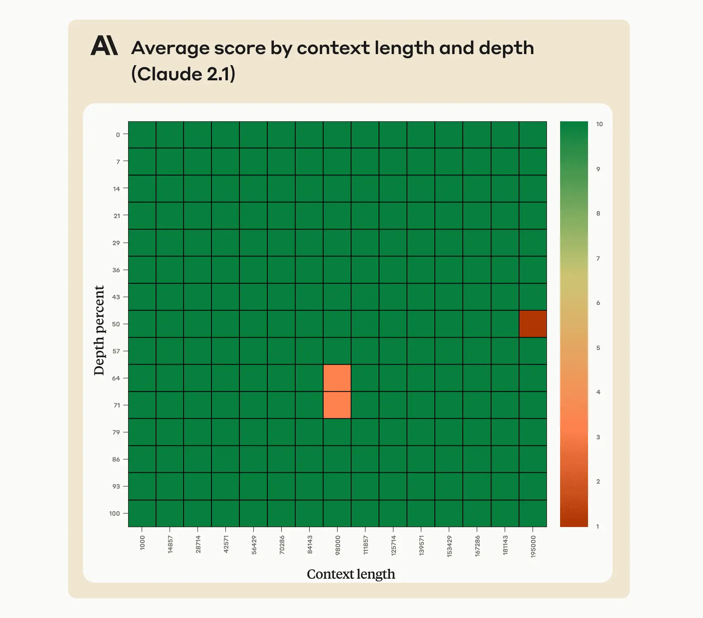

<!-- truncate -->

import { DownloadButton } from '/src/theme/Buttons';

Anthropic was able to solve the "lost in the middle" problem "by adding the sentence “Here is the most relevant sentence in the context:” to the start of Claude’s response. This was enough to raise Claude 2.1’s score from 27% to 98% on the original evaluation."

Does it just take a little bit of prompt engineering to solve low accuracy when needing to retrieve from the middle of a context window??

[Article here](https://anthropic.com/index/claude-2-1-prompting)

<!-- We could create a specific template for Paper Review's -->
import WhatNext from '/_includes/what-next.mdx'

<WhatNext />
